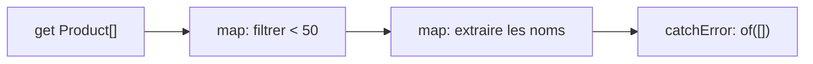

# Transformer le flux avec `pipe`

Un Observable se transforme en l'enchaînant dans `pipe(...)`. Chaque opérateur prend le flux et en renvoie un nouveau, sans muter l'original.

## `map` — transformer chaque valeur

```ts
import { map } from 'rxjs'

// keep only the names from the product list
getProductNames(): Observable<string[]> {
  return this.http.get<Product[]>('/api/products').pipe(
    map((products) => products.map((p) => p.name)),
  )
}
```

Attention à la double couche : `map` (RxJS) opère sur la **valeur émise** (ici le tableau entier) ; `products.map` (Array) opère sur les éléments du tableau.

## `filter` — laisser passer ou non une émission

```ts
import { filter } from 'rxjs'

// from a stream of click events, keep only left clicks
leftClicks$ = clicks$.pipe(
  filter((event) => event.button === 0),
)
```

> Pour garder/écarter des **éléments d'un tableau** émis en une fois, utilise `map(arr => arr.filter(...))`. `filter` de RxJS décide si **l'émission entière** passe.

## `catchError` — gérer une erreur

Une requête peut échouer (réseau, 404, 500). `catchError` intercepte et renvoie un flux de repli pour ne pas casser l'abonnement.

```ts
import { catchError, of } from 'rxjs'

getAllSafe(): Observable<Product[]> {
  return this.http.get<Product[]>('/api/products').pipe(
    catchError((err) => {
      console.error('failed to load products', err)
      return of([])        // fallback: emit an empty list instead of erroring
    }),
  )
}
```

`of([])` crée un Observable qui émet `[]` puis complète : l'UI affiche une liste vide plutôt que de planter.

## Enchaîner

```ts
this.http.get<Product[]>('/api/products').pipe(
  map((products) => products.filter((p) => p.price < 50)),  // cheap ones
  map((cheap) => cheap.map((p) => p.name)),                  // names only
  catchError(() => of([])),                                  // safety net
)
```



> **À retenir —** `pipe()` enchaîne les opérateurs. `map` transforme la valeur émise, `filter` décide si une émission passe, `catchError` rattrape l'erreur (souvent avec `of(fallback)`). Pour filtrer le contenu d'un tableau, c'est `map(arr => arr.filter(...))`.
