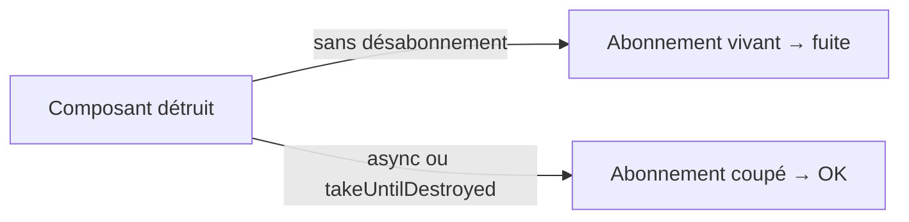

# Consommer proprement : `async` et désabonnement

S'abonner à la main, c'est aussi penser à se **désabonner** — sinon fuite mémoire. Deux bonnes pratiques évitent le piège.

## Le pipe `async` (la voie royale)

Plutôt que de `subscribe` dans la classe, on expose l'**Observable** et on laisse le template s'en occuper avec `| async`. Il s'abonne quand le composant s'affiche et **se désabonne automatiquement** à sa destruction.

```ts
import { Component, inject } from '@angular/core'
import { AsyncPipe } from '@angular/common'
import { ProductService, Product } from './product.service'
import { Observable } from 'rxjs'

@Component({
  standalone: true,
  selector: 'app-product-list',
  imports: [AsyncPipe],
  template: `
    @if (products$ | async; as products) {
      <ul>
        @for (p of products; track p.id) {
          <li>{{ p.name }} — {{ p.price }} €</li>
        }
      </ul>
    } @else {
      <p>Loading…</p>
    }
  `,
})
export class ProductListComponent {
  private service = inject(ProductService)
  products$: Observable<Product[]> = this.service.getAll()   // no manual subscribe
}
```

`products$ | async` s'abonne, met la valeur dans `products` (via `as`), et nettoie tout seul. Pas de `ngOnInit`, pas de `subscribe`, pas de fuite. C'est le défaut à privilégier.

## Quand on s'abonne manuellement : `takeUntilDestroyed`

Parfois on doit `subscribe` dans la classe (déclencher un effet de bord). Il faut alors couper l'abonnement à la destruction du composant. L'outil moderne (Angular 16+) est `takeUntilDestroyed` :

```ts
import { Component, inject } from '@angular/core'
import { takeUntilDestroyed } from '@angular/core/rxjs-interop'
import { ProductService } from './product.service'

@Component({ /* ... */ })
export class ProductListComponent {
  private service = inject(ProductService)

  constructor() {
    this.service.getAll()
      .pipe(takeUntilDestroyed())     // auto-unsubscribe when the component is destroyed
      .subscribe((products) => {
        console.log('loaded', products.length, 'products')
      })
  }
}
```

Appelé **dans le constructeur** (contexte d'injection), `takeUntilDestroyed()` lie l'abonnement au cycle de vie du composant. En dehors du constructeur, passe-lui un `DestroyRef` : `takeUntilDestroyed(this.destroyRef)`.

## Pourquoi se soucier des fuites ?



Un abonnement qui survit au composant continue de tourner (et de retenir le composant en mémoire). Sur un flux HTTP unique le risque est faible, mais sur un flux continu (intervalle, événements) c'est une vraie fuite.

> **À retenir —** privilégie le pipe `async` (`obs$ | async`) : zéro `subscribe`, zéro désabonnement à gérer. Quand tu t'abonnes à la main, ajoute `.pipe(takeUntilDestroyed())` pour couper proprement à la destruction du composant.
