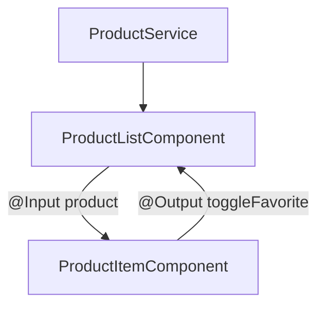

# Projet fil rouge : une liste de produits filtrable

Place à la pratique : on assemble tout le parcours (composants, binding, `@if`/`@for`,
`@Input`/`@Output`, service + DI, et un peu de RxJS) pour construire une **vraie petite
vue Angular** : une liste de produits qu'on peut **rechercher** et **filtrer**.

> **Comment suivre —** les composants Angular ne s'exécutant pas dans le bac à sable de la
> plateforme, ce module est en **mode reveal** : chaque étape donne un énoncé, tu réfléchis
> au code, puis tu déplies la **correction** (un composant complet et commenté). Recopie-le
> dans un vrai projet Angular (`ng new`) pour le voir tourner.

## Ce qu'on va construire, étape par étape

1. **Le service** : un `ProductService` qui fournit les données (et la logique pure).
2. **Afficher** la liste (`@for` + `track`).
3. **Rechercher** par nom (`[(ngModel)]` + une liste dérivée).
4. **Filtrer** par disponibilité (`@if`, boutons, état).
5. **Extraire** une ligne en composant enfant (`@Input` / `@Output`).
6. **À toi de jouer** : étendre le projet.

À la fin, tu auras une vue complète, structurée comme une vraie feature Angular : un
service pour la donnée, un composant conteneur, un composant de présentation.
