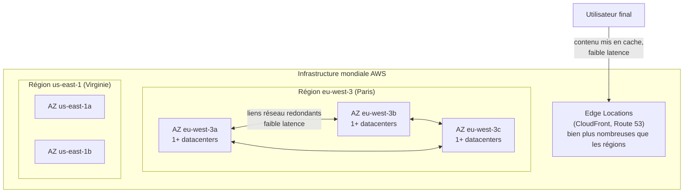
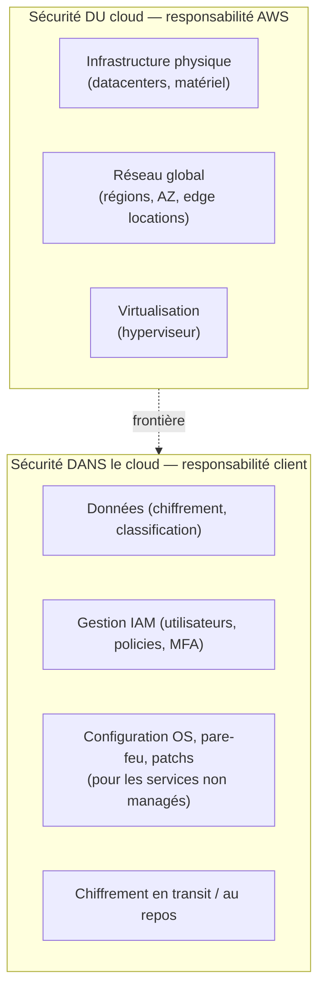

# L'infrastructure mondiale d'AWS

Avant IAM, EC2 ou S3, il faut comprendre **où** tourne un compte AWS. C'est un point d'examen récurrent (SAA-C03) : choisir la bonne région, comprendre pourquoi une architecture doit tenir sur plusieurs AZ, et savoir qui — d'AWS ou de toi — est responsable de quoi.

> **Repère pour un dev Symfony/Docker —** pense « région » comme un datacenter géographique complet (ex. un cluster Kubernetes multi-cloud géré par AWS), et « AZ » comme une salle serveur physiquement isolée à l'intérieur de ce datacenter, reliée aux autres salles par un réseau très rapide.

## Région, Availability Zone, Edge Location

- **Région** — une zone géographique (« eu-west-3 » = Paris, « us-east-1 » = Virginie du Nord) composée de plusieurs Availability Zones. Chaque région est **totalement indépendante** : les ressources ne sont pas répliquées automatiquement d'une région à l'autre.
- **Availability Zone (AZ)** — un ou plusieurs datacenters distincts, avec alimentation électrique, refroidissement et réseau redondants, physiquement séparés des autres AZ de la région (pour éviter qu'une inondation ou une coupure électrique n'affecte plusieurs AZ à la fois), mais reliés entre eux par un réseau privé à très faible latence.
- **Edge Location** — un point de présence utilisé par CloudFront (CDN) et Route 53 pour mettre du contenu en cache au plus près de l'utilisateur final. Il en existe **beaucoup plus** que de régions/AZ.

> 🎯 **Piège d'examen —** une architecture « hautement disponible » qui ne tient que sur **une seule AZ** n'est PAS hautement disponible, même avec 10 instances EC2 dedans : si l'AZ tombe, tout tombe. La haute disponibilité SAA-C03 = **au moins 2 AZ**.

## Comment choisir une région

Un scénario d'examen classique donne un contexte métier et demande la région la plus adaptée. Quatre critères à croiser :

| Critère | Question à se poser |
|---|---|
| **Conformité / souveraineté des données** | La loi ou le contrat client impose-t-il que les données restent dans un pays/une zone donnée (ex. RGPD → UE) ? |
| **Proximité des utilisateurs** | Où sont mes utilisateurs finaux ? Plus la région est proche, plus la latence réseau est faible. |
| **Services disponibles** | Tous les services AWS ne sont pas déployés dans toutes les régions (les nouveautés arrivent d'abord dans `us-east-1`). |
| **Coût** | Le prix d'un même service varie d'une région à l'autre (électricité, taxes locales, coûts fonciers). |

## Le modèle de responsabilité partagée

AWS et le client se partagent la sécurité — mais pas de la même façon selon le type de service.

- **AWS gère la sécurité *du* cloud** : les datacenters, le matériel, le réseau global, l'infrastructure des services managés.
- **Le client gère la sécurité *dans* le cloud** : ses données, la configuration IAM, le chiffrement, et — pour les services **non managés** — le système d'exploitation et les correctifs.

> 🎯 **Piège d'examen —** la frontière **se déplace selon le service**. Pour EC2 (IaaS, non managé) : AWS gère le hardware et l'hyperviseur, **toi** tu gères l'OS, les patchs, le pare-feu (security groups) et les données. Pour RDS (managé) : AWS gère aussi l'OS et les patchs de la base ; **toi** tu gères les données, les accès IAM et la configuration réseau (VPC/security groups). Plus un service est managé, plus AWS remonte dans la pile de responsabilité — mais **la sécurité des données et des accès reste toujours côté client**.

## À retenir

- Région = zone géographique indépendante ; AZ = datacenter isolé à l'intérieur d'une région ; Edge Location = point de cache CDN, bien plus nombreux.
- Haute disponibilité = **minimum 2 AZ**, jamais une seule.
- Choisir une région : conformité > proximité > services disponibles > coût.
- Responsabilité partagée : AWS sécurise *le* cloud (infrastructure), le client sécurise *ce qu'il met dans* le cloud (données, IAM, et OS/patchs pour les services non managés).
