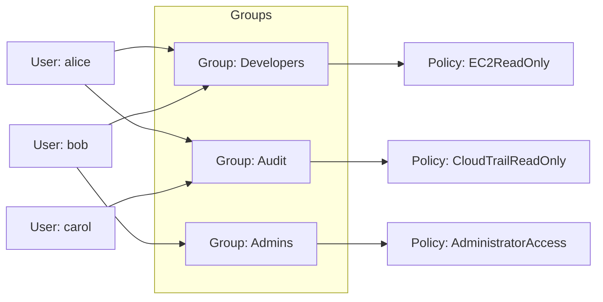
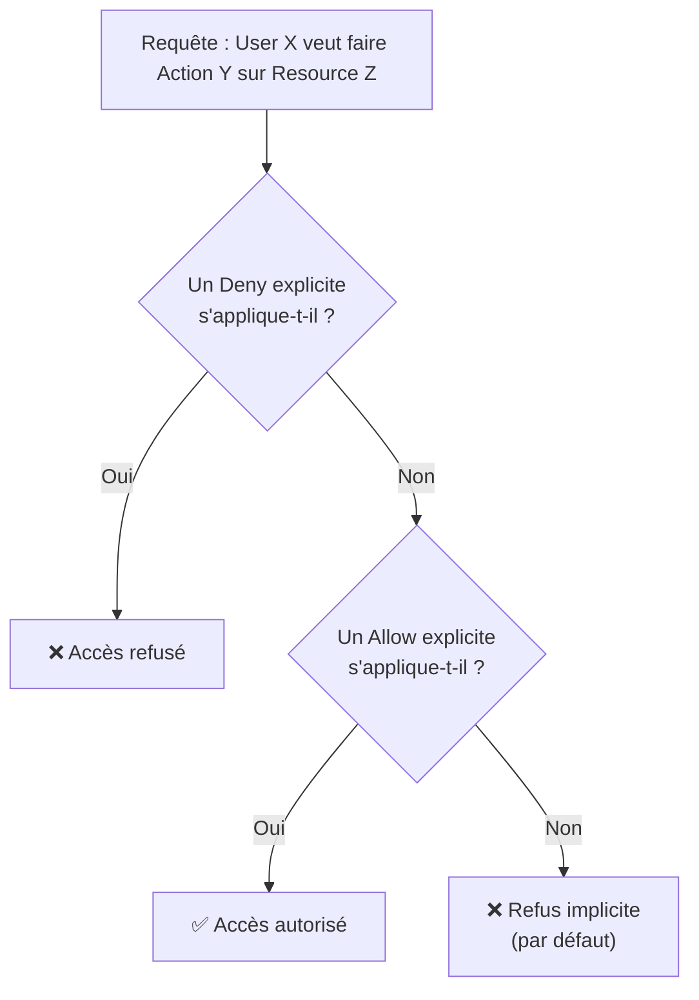

# IAM — qui a le droit de faire quoi

**IAM (Identity and Access Management)** est le service transversal d'AWS : il gère **qui** (utilisateur, service, application) peut faire **quoi** (action) sur **quelle ressource**. Aucun autre service AWS n'y échappe — IAM est toujours au centre.

> **Repère —** IAM te rappellera Symfony Security : des `users` (comme des `User` Doctrine), des `groups` (comme des rôles hiérarchiques `ROLE_ADMIN`), des `policies` (comme des `Voter`/`security.yaml` — des règles d'autorisation explicites), et bientôt des `roles` (comme des jetons d'emprunt d'identité temporaires, proches d'un JWT à courte durée de vie).

## Le compte root : à protéger, pas à utiliser

Le compte **root** est créé à l'ouverture du compte AWS (identifiant = l'email utilisé à la création). Il a **tous les droits, sans restriction possible**.

> 🎯 **Piège d'examen —** la bonne pratique n°1 est de **ne jamais utiliser le compte root** au quotidien : on active le MFA dessus, on le range, et on crée des utilisateurs IAM (ou des accès via un provider d'identité) pour le travail courant. Une question qui décrit un incident « le compte root a été utilisé pour une tâche de tous les jours » signale toujours une mauvaise pratique.

## Users, Groups : la hiérarchie

- **User** — représente une personne physique (ou une application) dans le compte AWS. Possède ses propres identifiants de connexion.
- **Group** — ne contient **que des users**, jamais d'autres groups (pas d'imbrication). Un user peut appartenir à **plusieurs** groups. Un group ne peut pas se connecter lui-même : ce n'est qu'un conteneur de permissions.



> 🎯 **Piège d'examen —** une **policy** peut être attachée directement à un **user**, mais la bonne pratique SAA-C03 est de **toujours passer par un group** : on attache les policies aux groups, on ajoute/retire des users des groups. Ça évite d'accumuler des permissions individuelles impossibles à auditer.

## L'anatomie d'une policy JSON

Une policy IAM est un document **JSON**. Le cœur de l'examen porte sur la lecture de ce document : sait-on dire si une action donnée est autorisée ou non ?

```json
{
  "Version": "2012-10-17",
  "Statement": [
    {
      "Sid": "AllowS3ReadOnEuBucket",
      "Effect": "Allow",
      "Action": [
        "s3:GetObject",
        "s3:ListBucket"
      ],
      "Resource": [
        "arn:aws:s3:::eu-sales-reports",
        "arn:aws:s3:::eu-sales-reports/*"
      ],
      "Condition": {
        "StringEquals": {
          "aws:RequestedRegion": "eu-west-3"
        }
      }
    }
  ]
}
```

| Champ | Rôle |
|---|---|
| `Version` | version du langage de policy (toujours `"2012-10-17"` en pratique, il n'y en a pas de plus récente). |
| `Sid` | identifiant lisible du statement (optionnel). |
| `Effect` | `Allow` ou `Deny`. |
| `Action` | liste des actions API concernées (`service:Action`, ex. `s3:GetObject`). Les jokers sont autorisés (`s3:Get*`). |
| `Resource` | liste d'ARN (Amazon Resource Name) sur lesquels s'applique le statement. |
| `Condition` | (optionnel) restreint encore le champ d'application (IP source, région, MFA actif, tag…). |

> 🎯 **Piège d'examen —** en IAM, **un `Deny` explicite gagne toujours**, même face à un `Allow`. L'ordre d'évaluation logique est : (1) `Deny` explicite dans n'importe quelle policy applicable → accès refusé, quoi qu'il arrive ; (2) sinon `Allow` explicite dans au moins une policy applicable → accès autorisé ; (3) sinon → refus implicite (**tout est refusé par défaut** tant qu'aucun `Allow` explicite n'existe).



## Policies gérées (managed) vs en ligne (inline)

- **AWS managed policy** — créée et maintenue par AWS (ex. `AmazonS3ReadOnlyAccess`), mise à jour automatiquement par AWS, réutilisable.
- **Customer managed policy** — créée par toi, réutilisable sur plusieurs users/groups/roles, versionnée.
- **Inline policy** — collée directement dans **un seul** user/group/role, relation 1-to-1, disparaît si l'entité est supprimée. À réserver aux cas où une permission ne doit **jamais** être réutilisée ailleurs.

## MFA (Multi-Factor Authentication)

Le MFA protège un compte même si le mot de passe est compromis : il faut *ce que tu sais* (le mot de passe) **et** *ce que tu possèdes* (un appareil).

- **Virtual MFA device** — application TOTP sur smartphone (ex. Google Authenticator, Authy) ; peut héberger plusieurs MFA virtuels sur un seul appareil.
- **Clé de sécurité matérielle (U2F/FIDO)** — clé USB physique.
- **Hardware Key Fob** — dispositif physique dédié (fourni par un partenaire AWS, utile en environnement isolé/gouvernemental).

> 🎯 **Piège d'examen —** le MFA doit être activé **au minimum sur le compte root**. Une bonne pratique attend aussi le MFA pour tout utilisateur ayant des permissions sensibles.

## Access Keys et CLI

Les **Access Keys** (Access Key ID + Secret Access Key) permettent de s'authentifier en ligne de commande (CLI) ou via le SDK — **jamais** via la console web (qui utilise login/mot de passe).

```bash
# Configure the CLI with a named profile
aws configure --profile sales-readonly
# AWS Access Key ID: AKIA...
# AWS Secret Access Key: ********
# Default region name: eu-west-3
# Default output format: json

# Verify which identity is currently used
aws sts get-caller-identity --profile sales-readonly
```

> 🎯 **Piège d'examen —** les Access Keys sont **générées une seule fois** (le secret n'est plus jamais réaffichable ensuite) et ne doivent **jamais** être commitées dans un dépôt Git ni codées en dur dans une application. Sur une instance EC2, la bonne pratique est d'utiliser un **IAM Role** (voir leçon suivante) plutôt que des Access Keys statiques.

## À retenir

- User = identité individuelle ; Group = conteneur de policies (jamais imbriqué) ; on attache les permissions aux groups, pas aux users directement.
- Une policy JSON = `Effect` + `Action` + `Resource` (+ `Condition` optionnelle). `Deny` explicite > `Allow` explicite > refus implicite par défaut.
- Root account : MFA activé, jamais utilisé au quotidien.
- Access Keys pour CLI/SDK uniquement, jamais commitées ; sur une ressource AWS, préférer un rôle IAM.
