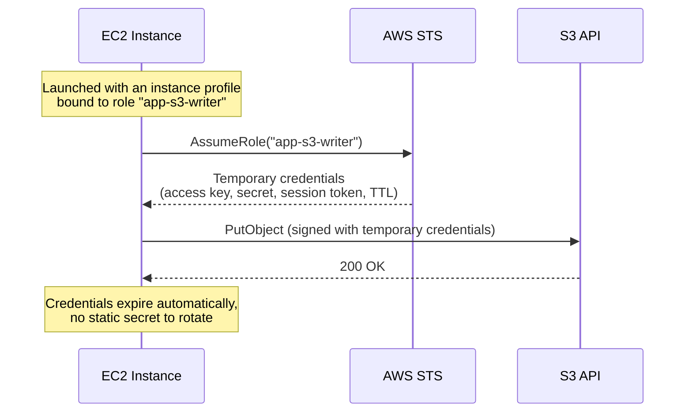
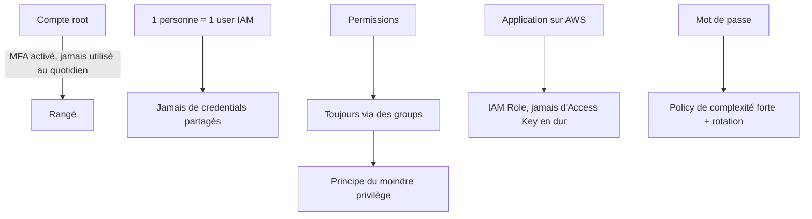

# Des identités pour les services, pas seulement pour les humains

Un **user IAM** représente une personne. Mais une application qui tourne sur EC2, une fonction Lambda, ou un pipeline CI/CD ont aussi besoin de permissions — sans qu'on leur donne des Access Keys statiques à gérer (et donc à sécuriser, faire tourner, risquer de fuiter). C'est le rôle des **IAM Roles**.

## IAM Roles : des permissions empruntées, temporaires

Un **IAM Role** est une identité que **n'importe quelle entité de confiance** peut « endosser » (assume) pour obtenir des **credentials temporaires**, délivrés par le service **STS** (Security Token Service). Pas de mot de passe, pas d'Access Key permanente : le jeton expire tout seul.

Cas d'usage typiques de rôles pour services :

| Rôle utilisé par | Exemple |
|---|---|
| **EC2 Instance Role** | une application sur EC2 doit lire/écrire dans un bucket S3. |
| **Lambda Execution Role** | une fonction Lambda doit écrire des logs CloudWatch et lire dans DynamoDB. |
| **Cross-account Role** | un compte AWS B doit accéder à des ressources du compte A (délégation). |
| **Service-linked Role** | un service AWS (ex. Auto Scaling) a besoin d'agir pour ton compte sur d'autres services. |

> 🎯 **Piège d'examen —** une question qui décrit une application EC2 avec des **Access Keys codées en dur** dans le code pour appeler S3 pointe **toujours** vers la mauvaise pratique. La réponse attendue est : **attacher un IAM Role à l'instance** (via un *instance profile*) et laisser le SDK récupérer les credentials temporaires automatiquement.

## Comparaison rapide : policy vs role

Ne pas confondre les deux : une **policy** est un document de permissions ; un **role** est une **identité** à laquelle on attache des policies, et que quelque chose (un service, un compte, un user) peut endosser temporairement.

## Outils de sécurité IAM

Deux outils à connaître pour l'examen, avec des granularités différentes :

- **IAM Credential Report** — un rapport **au niveau du compte** listant tous les users et l'état de leurs credentials (mot de passe utilisé récemment ? MFA actif ? dernière rotation d'Access Key ?). Utile pour un audit de sécurité global.
- **IAM Access Advisor** — un rapport **au niveau d'un user/role donné** : quels services ce user a-t-il la permission d'utiliser, et **quand les a-t-il utilisés pour la dernière fois** ? C'est l'outil clé pour appliquer le **principe du moindre privilège** : on repère les permissions accordées mais jamais utilisées, et on les retire.

> 🎯 **Piège d'examen —** Credential Report = vue **globale** du compte (tous les users). Access Advisor = vue **par identité** (services autorisés + dernier usage). Une question qui demande « comment identifier les permissions inutilisées d'un user pour les révoquer » attend **Access Advisor**, pas Credential Report.

## Bonnes pratiques IAM à connaître par cœur

- **Root** : MFA activé, jamais utilisé au quotidien (rangé pour les opérations exceptionnelles : facturation, fermeture de compte…).
- **1 utilisateur physique = 1 user IAM** — jamais de compte partagé entre plusieurs personnes (perte de traçabilité en cas d'incident).
- **Permissions via des groups**, jamais attachées individuellement à un user.
- **Principe du moindre privilège (least privilege)** — n'accorder que les permissions strictement nécessaires, à affiner avec Access Advisor.
- **MFA** pour les comptes à privilèges.
- **IAM Roles** pour tout ce qui tourne sur de l'infrastructure AWS (EC2, Lambda, ECS…) — jamais d'Access Keys statiques dans du code ou une image Docker.
- **Politique de mot de passe** forte (longueur minimale, complexité, rotation) définie au niveau du compte.

## À retenir

- Role = identité empruntable temporairement (via STS), pour des services ou des comptes — pas de secret statique à gérer.
- Sur une ressource AWS (EC2, Lambda…), toujours un **IAM Role**, jamais d'Access Keys codées en dur.
- Credential Report = audit **global** du compte ; Access Advisor = audit **par identité**, pour appliquer le moindre privilège.
- Root protégé + MFA, permissions par groups, 1 personne = 1 user : la check-list de base d'un compte AWS bien tenu.
