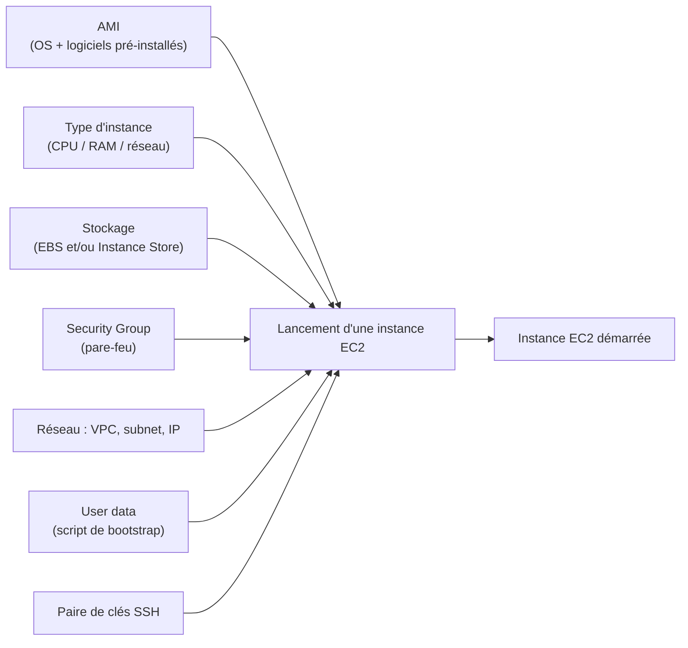

# EC2, la brique de calcul historique d'AWS

**EC2 (Elastic Compute Cloud)** loue des machines virtuelles à la demande. C'est le service le plus « bas niveau » d'AWS côté calcul (IaaS — Infrastructure as a Service), et le plus chargé au programme SAA-C03 : la moitié des questions de l'examen touchent, de près ou de loin, EC2 ou ce qui gravite autour (stockage, réseau, load balancing, scaling).

> **Repère —** une instance EC2, c'est une VM comparable à un conteneur Docker qu'on ferait tourner sur un hyperviseur plutôt qu'un noyau partagé : isolation plus forte, mais démarrage plus lent (secondes/minutes plutôt que millisecondes) et facturation à la ressource réservée.

## Ce qu'on configure au lancement d'une instance



- **AMI (Amazon Machine Image)** — l'image de départ : OS + logiciels pré-installés (détaillé dans le module Stockage).
- **Type d'instance** — la « taille » de la VM (CPU, RAM, réseau) — détaillé dans la leçon suivante.
- **Stockage** — un ou plusieurs volumes EBS et/ou de l'Instance Store (détaillé au module 3).
- **Security Group** — le pare-feu qui filtre le trafic entrant/sortant (détaillé dans la leçon suivante).
- **Réseau** — le VPC, le subnet, et l'adressage IP (public/privé/Elastic — vu en fin de module).
- **User data** — un script exécuté automatiquement au **premier démarrage**, avec les privilèges root.

## Le user data : bootstrap d'une instance

Le **user data** permet d'automatiser la configuration initiale d'une instance sans s'y connecter manuellement : installation de paquets, démarrage d'un service, récupération de code applicatif…

```bash
#!/bin/bash
# EC2 user data script — runs once, as root, on first boot
yum update -y
yum install -y httpd
systemctl enable httpd
systemctl start httpd
echo "<h1>Deployed via user data</h1>" > /var/www/html/index.html
```

> 🎯 **Piège d'examen —** le user data s'exécute **au premier démarrage** de l'instance (et non à chaque redémarrage), avec les privilèges **root**, mais il n'est **pas un mécanisme sécurisé pour stocker des secrets** (le script est lisible via l'API de métadonnées de l'instance par quiconque a accès à celle-ci). Pour des secrets, on utilise Secrets Manager ou Parameter Store, pas le user data en clair.

## Se connecter à une instance

```bash
# Connect to a Linux instance via SSH, using the key pair generated at launch
ssh -i my-key-pair.pem ec2-user@<public-ip-or-dns>

# List running instances via the CLI (useful to script deployments)
aws ec2 describe-instances \
  --filters "Name=instance-state-name,Values=running" \
  --query "Reservations[].Instances[].[InstanceId,PublicIpAddress]" \
  --output table
```

## À retenir

- EC2 = IaaS : tu choisis l'AMI, le type d'instance, le stockage, le réseau/security group, et optionnellement un script user data.
- User data = bootstrap **une seule fois**, au premier démarrage, en root — jamais un coffre-fort à secrets.
- Le détail des types d'instances, security groups, stockage et options d'achat fait chacun l'objet d'une leçon dédiée : EC2 est la fondation sur laquelle repose une grande partie de l'examen.
