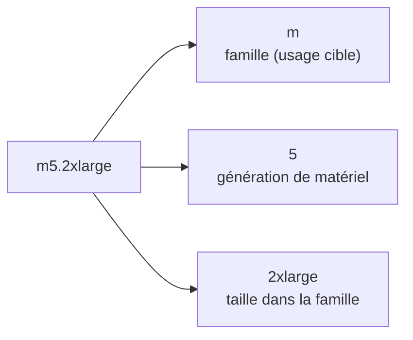
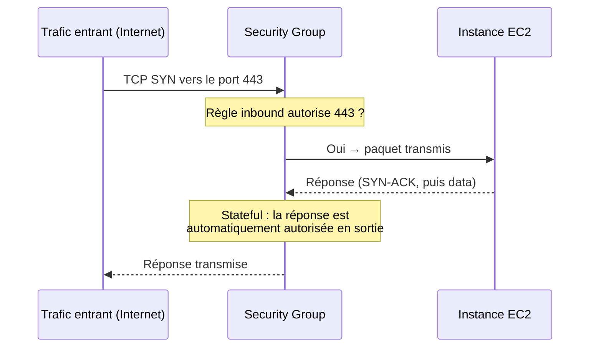

# Lire un nom d'instance, et sécuriser son accès réseau

## Décoder `m5.2xlarge`

Le nom d'un type d'instance encode trois informations. Savoir le lire évite de se tromper entre une famille orientée coût/mémoire/calcul.

- **`m`** — la **famille**, qui indique l'usage cible (voir tableau ci-dessous).
- **`5`** — la **génération** du matériel sous-jacent : plus le chiffre est élevé, plus le matériel est récent (meilleur rapport performance/prix, en général).
- **`2xlarge`** — la **taille** au sein de la famille (`nano`, `micro`, `small`, `medium`, `large`, `xlarge`, `2xlarge`…) : chaque palier double approximativement le CPU/RAM du précédent.

## Les familles à connaître pour l'examen

| Famille | Lettre(s) | Optimisée pour | Cas d'usage typiques |
|---|---|---|---|
| **General Purpose** | `M`, `A` | équilibre CPU/RAM/réseau | sites web, applications de taille moyenne, microservices |
| **Burstable** | `T` (T2/T3/T3a/T4g) | base CPU faible + crédits de burst | environnements de dev/test, sites à faible trafic constant avec pics ponctuels |
| **Compute Optimized** | `C` | rapport CPU/RAM élevé | traitement par lots, transcodage vidéo, serveurs web haute perf, calcul scientifique, inférence ML |
| **Memory Optimized** | `R`, `X`, `z1d` | grande quantité de RAM | bases de données en mémoire, caches distribués, traitement temps réel de gros volumes |
| **Storage Optimized** | `I`, `D`, `H` | I/O disque local très rapide | bases NoSQL à forte volumétrie, data warehousing, systèmes de fichiers distribués |

> 🎯 **Piège d'examen —** les instances **T** (burstable) fonctionnent avec des **crédits CPU** : elles ont une performance de base modeste, et « empruntent » des crédits accumulés pour absorber un pic. Si les crédits s'épuisent (usage soutenu, pas juste un pic), la performance **retombe brutalement** au niveau de base — un piège classique pour une charge qu'on pensait « occasionnelle » mais qui devient continue. Dans ce cas, il faut basculer vers une famille `M` ou `C`, pas continuer sur du `T`.

## Security Groups : le pare-feu d'une instance

Un **Security Group** contrôle le trafic réseau entrant et sortant d'une ou plusieurs instances EC2. C'est l'élément de sécurité réseau le plus testé à l'examen.

Caractéristiques à retenir :

- **Uniquement des règles `Allow`** — il n'existe pas de règle `Deny` explicite dans un Security Group (contrairement aux Network ACL, hors programme de ce module). Ce qui n'est pas explicitement autorisé est refusé.
- **Stateful** — si le trafic entrant est autorisé sur un port, le trafic de **réponse** est automatiquement autorisé en sortie, quelles que soient les règles outbound (et inversement pour un flux initié en sortant).
- **Tout le trafic entrant est bloqué par défaut** ; **tout le trafic sortant est autorisé par défaut**.
- Un Security Group peut être attaché à **plusieurs instances**, et référence soit des plages d'IP, soit **un autre Security Group** (utile pour autoriser « tout ce qui vient de l'ALB », par exemple, sans connaître ses IP).
- Rattaché à un couple région/VPC — pas transférable d'une région à l'autre.

> 🎯 **Piège d'examen —** si une connexion à une application **time out** (pas de réponse du tout), le coupable est presque toujours un **Security Group** (ou une NACL) trop restrictif. Si la connexion est **« refusée » activement** (connection refused), le problème est souvent applicatif : le service n'écoute pas sur ce port, ou n'est pas démarré — le Security Group, lui, laissait déjà passer le trafic.

## Ports classiques à connaître

| Port | Protocole/usage |
|---|---|
| 22 | SSH (administration Linux) |
| 3389 | RDP (administration Windows) |
| 80 | HTTP |
| 443 | HTTPS |
| 21 | FTP |
| 5432 / 3306 | PostgreSQL / MySQL (bases de données) |

## À retenir

- `m5.2xlarge` = famille (`m`) + génération (`5`) + taille (`2xlarge`).
- Familles clés : `M`/`T` généraliste, `C` calcul, `R` mémoire, `I`/`D` stockage. Les `T` tombent en performance dégradée une fois les crédits CPU épuisés.
- Security Group : que de l'`Allow`, **stateful**, tout entrant bloqué par défaut / tout sortant autorisé par défaut. Un timeout réseau pointe vers le Security Group ; un refus actif pointe vers l'application.
