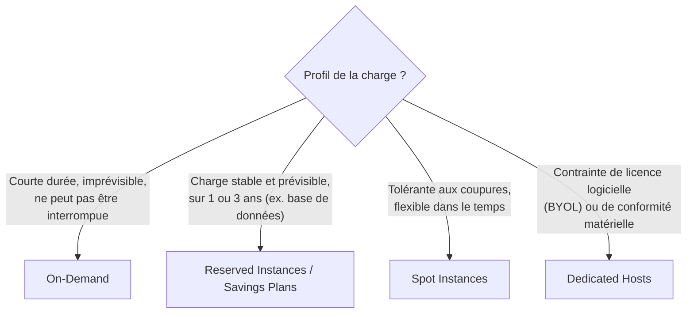

# Choisir la bonne option d'achat : LE sujet incontournable du SAA-C03

Chaque question « quelle option d'achat pour ce scénario » teste la même chose : as-tu identifié le **profil de charge** (constant, ponctuel, interruptible, spécifique à un matériel) ? C'est l'un des thèmes les plus rentables à maîtriser pour l'examen.

## On-Demand : la référence, sans engagement

- Facturation à la seconde/heure, **sans engagement**.
- Le tarif le plus élevé à l'heure, mais **aucun coût si on ne l'utilise pas**.
- Idéal pour une charge **courte, imprévisible, et qui ne peut pas être interrompue** (ex. un test ponctuel, un pic saisonnier non planifiable).

## Reserved Instances & Savings Plans : l'engagement qui paie

| Option | Engagement | Réduction (ordre de grandeur) | Flexibilité |
|---|---|---|---|
| **Standard Reserved Instance** | 1 ou 3 ans | jusqu'à ~70 % vs On-Demand | attributs figés (type, région) — la moins flexible |
| **Convertible Reserved Instance** | 1 ou 3 ans | un peu moins que Standard | peut changer de famille/type d'instance en cours de contrat |
| **Scheduled Reserved Instance** | fenêtre récurrente réservée | modérée | réservation sur une plage horaire répétée (ex. tous les jours 8h-18h) |
| **Savings Plans** (Compute ou EC2) | engagement en **$/heure** sur 1 ou 3 ans | comparable aux RI Standard | s'applique automatiquement à toute famille/taille/région (Compute Savings Plans va jusqu'à Lambda/Fargate) |

> 🎯 **Piège d'examen —** les **Savings Plans** engagent un **montant en dollars par heure**, pas une instance précise : ils s'appliquent automatiquement, peu importe le changement de famille ou de région, ce qui les rend **plus flexibles** qu'une Reserved Instance Standard. C'est la réponse attendue quand un scénario décrit une charge stable mais dont le type d'instance est **amené à changer**.

## Spot Instances : la remise la plus forte, au prix de l'interruption

- Remise pouvant aller jusqu'à environ **90 %** par rapport à On-Demand.
- AWS peut **reprendre l'instance à tout moment** si la capacité est nécessaire ailleurs (avec un court préavis, de l'ordre de 2 minutes).
- Fait pour des charges **tolérantes à l'interruption** : traitement par lots, rendu, CI/CD, analyse de données, workloads « stateless » qui reprennent où ils se sont arrêtés.

> 🎯 **Piège d'examen —** ne **jamais** proposer une instance Spot pour une base de données critique ou un service qui ne supporte pas d'être coupé sans préavis suffisant — c'est un piège classique où le scénario insiste sur le coût, mais la contrainte réelle (criticité/continuité) rend le Spot inadapté.

## Dedicated Hosts & Dedicated Instances : le matériel dédié

- **Dedicated Host** — un **serveur physique entier** réservé à ton compte, avec visibilité sur les sockets/cœurs physiques. Utile pour des **licences logicielles liées au matériel (BYOL — Bring Your Own License)** ou des contraintes de conformité strictes. L'option la **plus chère**.
- **Dedicated Instance** — les instances tournent sur du matériel dédié à ton compte, mais **sans visibilité/contrôle** sur le placement exact (peut changer après un stop/start).

## Vue d'ensemble comparative

| Option | Coût relatif | Engagement | Peut être interrompu ? | Cas d'usage type |
|---|---|---|---|---|
| On-Demand | élevé (à l'heure) | aucun | non | charge ponctuelle, imprévisible, critique |
| Reserved / Savings Plans | réduit (jusqu'à ~70 %) | 1 ou 3 ans | non | charge stable et prévisible (ex. base de données de prod) |
| Spot | très réduit (jusqu'à ~90 %) | aucun | oui, avec court préavis | batch, CI/CD, calcul tolérant aux coupures |
| Dedicated Host/Instance | le plus élevé | variable | non | licences BYOL, conformité matérielle stricte |

## À retenir

- Le mot-clé du scénario trahit toujours la bonne réponse : « imprévisible/ponctuel » → On-Demand ; « stable, prévisible, long terme » → Reserved/Savings Plans ; « tolérant à l'interruption, flexible » → Spot ; « licence liée au matériel/conformité » → Dedicated Host.
- Savings Plans = engagement en $/h, flexible sur le type d'instance ; Reserved Instance Standard = figée sur un type précis, mais rabais comparable.
