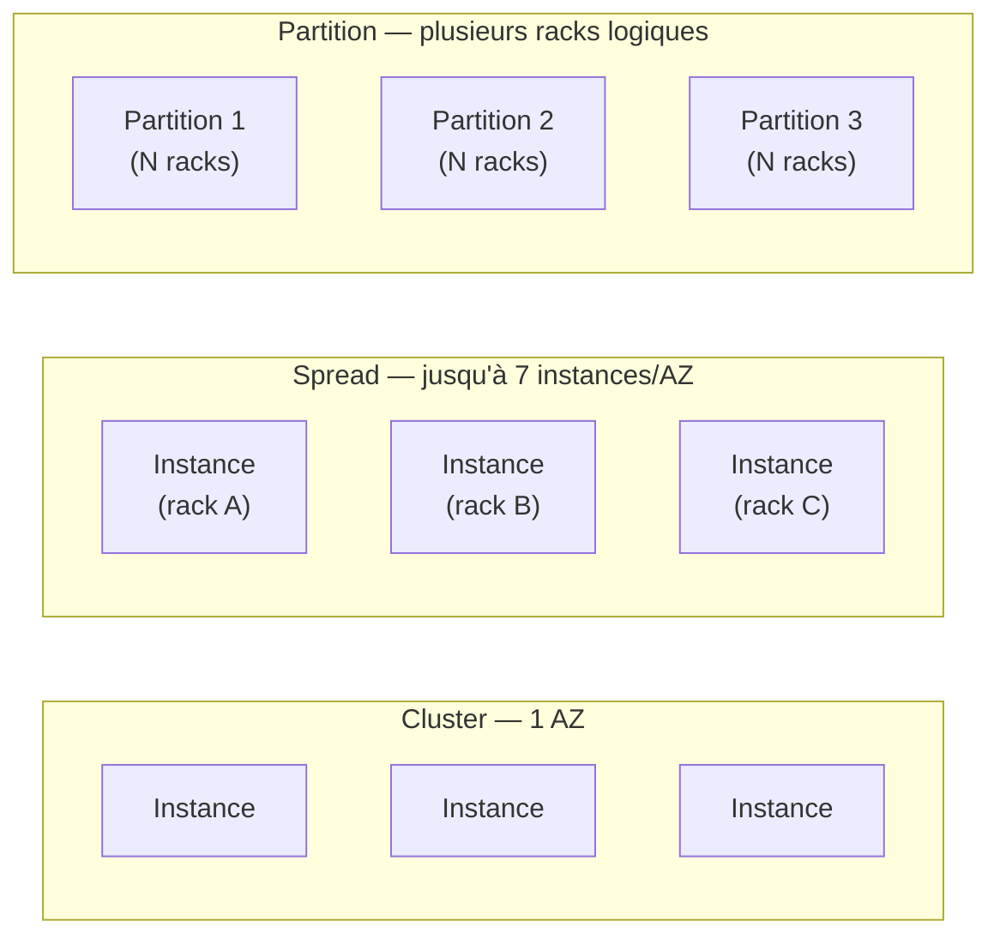

# Aller plus loin : flotte Spot, placement physique, carte réseau et IP

## Spot Fleet : automatiser un mélange d'instances Spot (et On-Demand)

Un **Spot Fleet** est un ensemble d'instances Spot (et optionnellement On-Demand) qu'AWS maintient à une **capacité cible**, en respectant une stratégie de prix et de placement que tu définis : plusieurs types d'instance, plusieurs AZ, un prix maximum par heure.

Stratégies d'allocation courantes :

| Stratégie | Comportement |
|---|---|
| `lowestPrice` | choisit systématiquement le pool le moins cher disponible |
| `diversified` | répartit sur plusieurs pools pour limiter l'impact d'une reprise de capacité |
| `capacityOptimized` | privilégie les pools où la capacité Spot est la plus stable (moins de risque d'interruption) |

> 🎯 **Piège d'examen —** un Spot Fleet n'élimine pas le risque d'interruption : il le **répartit** sur plusieurs pools pour qu'une seule reprise de capacité n'affecte pas toute la flotte d'un coup. Ce n'est pas un substitut à la tolérance aux pannes applicative.

## Placement Groups : contrôler le placement physique

Par défaut, AWS répartit les instances sur du matériel physique varié. Un **Placement Group** permet d'influencer ce placement pour trois objectifs différents.

| Type | Placement | Avantage | Risque | Cas d'usage |
|---|---|---|---|---|
| **Cluster** | toutes les instances proches, dans **une seule AZ** | latence très faible, débit réseau maximal entre instances | si l'AZ tombe, tout tombe ensemble | calcul haute performance (HPC), big data nécessitant une complétion rapide |
| **Spread** | chaque instance sur du matériel physique **distinct** (max ~7 par groupe et par AZ) | isole chaque instance d'une panne matérielle affectant les autres | limite basse du nombre d'instances par AZ | petit nombre d'instances critiques, chacune devant survivre à la panne des autres |
| **Partition** | instances réparties en plusieurs partitions, chacune sur des racks distincts (alimentation/réseau séparés) | isole des groupes d'instances entre eux, à grande échelle (centaines d'instances) | moins isolé qu'un Spread au niveau individuel | systèmes distribués type Hadoop, Cassandra, Kafka |

> 🎯 **Piège d'examen —** « faible latence entre instances » → **Cluster**. « Chaque instance doit survivre indépendamment à une panne matérielle » (petit nombre d'instances) → **Spread**. « Grand cluster distribué type Big Data, tolérance aux pannes à l'échelle du rack » → **Partition**. Confondre Spread et Partition est l'erreur la plus fréquente : Spread = **peu** d'instances, isolation individuelle ; Partition = **beaucoup** d'instances, isolation par groupes.

## ENI : la carte réseau virtuelle détachable

Une **Elastic Network Interface (ENI)** est une carte réseau virtuelle qu'on peut créer indépendamment d'une instance, y attacher une IP privée (+ éventuellement une Elastic IP), un ou plusieurs Security Groups, et une adresse MAC — puis la **détacher d'une instance et la rattacher à une autre** dans la même AZ, en conservant sa configuration réseau.

> 🎯 **Piège d'examen —** une ENI est liée à une **AZ précise** (pas transférable entre AZ), ce qui en fait un outil de **bascule rapide** en cas de panne d'instance dans la même AZ (on détache l'ENI de l'instance défaillante et on la rattache à une instance de secours), mais pas un mécanisme de reprise après sinistre inter-AZ.

## Hibernate : préserver l'état mémoire d'une instance

**EC2 Hibernate** sauvegarde le contenu de la **RAM** sur le volume racine EBS (qui doit être chiffré) lors de l'arrêt de l'instance, puis le recharge au redémarrage : le système redémarre bien plus vite qu'un reboot classique (pas de nouvelle phase de boot ni de réinitialisation de l'état applicatif).

- Utile pour des instances longues à initialiser (chargement de gros caches en mémoire, par exemple).
- Ne fonctionne pas avec de l'Instance Store (nécessite un volume racine EBS chiffré).
- Durée maximale d'hibernation limitée (plusieurs semaines), au-delà l'instance doit être redémarrée normalement.

## Adressage IP : public, privé, Elastic

| Type d'IP | Change au stop/start ? | Portée | Coût |
|---|---|---|---|
| **IP privée** | non, conservée pendant toute la vie de l'instance | interne au VPC | gratuite |
| **IP publique** | oui, réattribuée à chaque démarrage | Internet | gratuite tant qu'attachée à une instance en cours d'exécution |
| **Elastic IP** | non, fixe et réutilisable, à associer/dissocier manuellement | Internet | gratuite si attachée à une instance **en cours d'exécution** ; facturée sinon (IP inutilisée) |

> 🎯 **Piège d'examen —** une Elastic IP **non attachée**, ou attachée à une instance **arrêtée**, est **facturée** — c'est volontairement dissuasif pour éviter de « geler » des adresses IPv4 (ressource rare) sans les utiliser. Par ailleurs, la bonne pratique architecturale SAA-C03 est d'**éviter les Elastic IP** au profit d'un **Load Balancer** (DNS stable), qui masque la rotation des IP des instances derrière un nom de domaine fixe.

## À retenir

- Spot Fleet répartit le risque d'interruption sur plusieurs pools, il ne l'élimine pas.
- Cluster = latence mini, 1 AZ ; Spread = peu d'instances isolées entre elles ; Partition = beaucoup d'instances isolées par groupes de racks.
- ENI = carte réseau détachable/rattachable, mais **liée à une AZ**.
- Hibernate = RAM sauvegardée sur EBS chiffré, redémarrage rapide.
- Elastic IP inutilisée = facturée ; préférer un Load Balancer pour un point d'entrée stable plutôt que des Elastic IP éparpillées.
