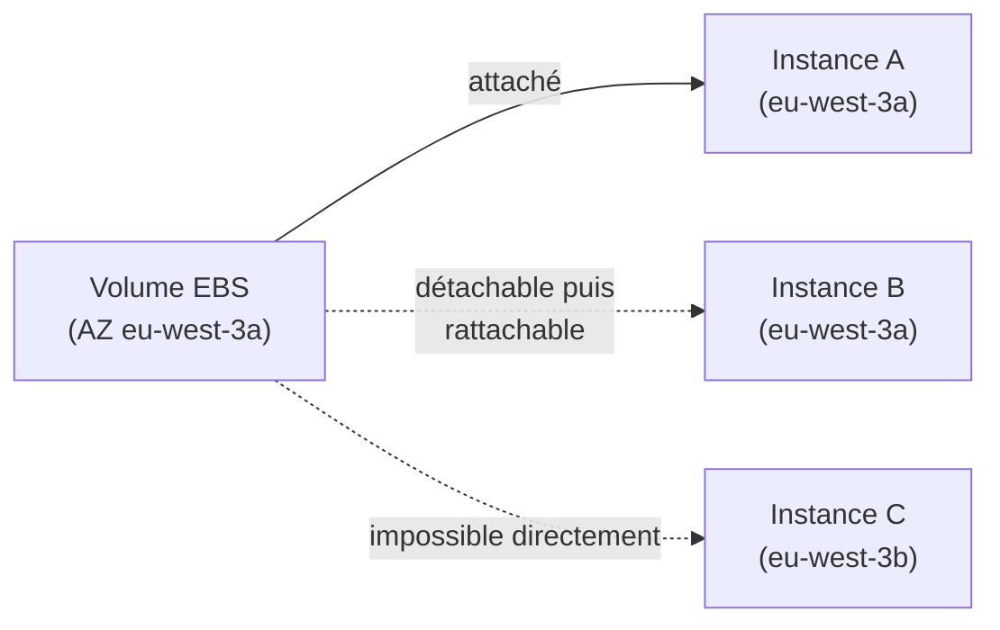
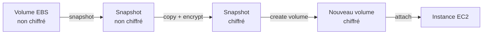

# EBS, le disque réseau d'une instance EC2

**EBS (Elastic Block Store)** est un volume de stockage **réseau** qu'on attache à une instance EC2. « Réseau » est le mot-clé : le volume n'est pas physiquement soudé à la machine — il peut être détaché et rattaché à une autre instance, mais **seulement dans la même Availability Zone**.

> **Repère —** pense à EBS comme un volume Docker persistant, mais dont la performance dépend du **type de volume** choisi (comme choisir entre un disque réseau NFS rapide ou lent).

> 🎯 **Piège d'examen —** un volume EBS est **lié à son Availability Zone** : impossible de l'attacher directement à une instance d'une autre AZ. Pour déplacer les données vers une autre AZ (ou région), il faut passer par un **snapshot**, qu'on peut ensuite restaurer où on veut.

## Les types de volumes EBS

| Type | Catégorie | Points forts | Piège à retenir |
|---|---|---|---|
| **gp3** | SSD généraliste | débit et IOPS **indépendants** de la taille du volume (base incluse, extensible séparément, moins cher que gp2 à perf égale) | le type par défaut recommandé pour la plupart des usages |
| **gp2** | SSD généraliste (génération précédente) | IOPS **liés à la taille** du volume (un petit volume a moins d'IOPS de base, avec un mécanisme de burst) | plus le volume est petit, plus les IOPS de base sont limitées — piège si on sous-dimensionne un volume gp2 pour une charge intensive |
| **io2 / io2 Block Express** | SSD IOPS provisionnées | IOPS très élevées et prévisibles, indépendantes de la taille, faible latence garantie | pensé pour les bases de données critiques à IOPS élevées et constantes ; seul type (avec io1) supportant le **multi-attach** |
| **st1** | HDD optimisé débit | faible coût, bon **débit séquentiel** (pas d'IOPS élevées) | ne peut **pas** servir de volume de démarrage (boot volume) |
| **sc1** | HDD « cold » | le moins cher, pour données rarement accédées | ne peut **pas** servir de volume de démarrage (boot volume) ; débit le plus faible |

> 🎯 **Piège d'examen —** IOPS et débit (throughput) ne mesurent pas la même chose : les **IOPS** comptent le nombre d'opérations par seconde (important pour des accès aléatoires — transactions de base de données), le **débit** mesure le volume de données par seconde (important pour de la lecture/écriture séquentielle — logs, data warehouse). Un scénario qui décrit une base de données transactionnelle demande des **IOPS élevées** (io2) ; un scénario de traitement de logs volumineux en lecture séquentielle demande du **débit** (st1) — proposer st1 pour une base transactionnelle, ou io2 pour du simple stockage de logs peu coûteux, est le piège classique.

## Multi-Attach : l'exception io1/io2

Par défaut, un volume EBS est attaché à **une seule instance à la fois**. Les familles **io1/io2** supportent le **Multi-Attach** : plusieurs instances (jusqu'à un nombre limité), **dans la même AZ**, peuvent lire/écrire simultanément sur le même volume — mais l'application doit gérer elle-même la cohérence des accès concurrents (EBS ne fait pas de verrouillage applicatif).

## Chiffrement EBS

Un volume EBS chiffré utilise **KMS** (AES-256) : le chiffrement s'applique aux données au repos, aux données en transit entre l'instance et le volume, et à tous les snapshots/volumes dérivés — sans surcoût de latence significatif.

> 🎯 **Piège d'examen —** on **ne peut pas chiffrer directement un volume EBS existant non chiffré**. La procédure attendue :
> 1. créer un **snapshot** du volume non chiffré ;
> 2. **copier ce snapshot** en cochant le chiffrement ;
> 3. créer un **nouveau volume** à partir du snapshot chiffré ;
> 4. attacher ce nouveau volume à l'instance (à la place de l'ancien).

## Snapshots EBS

Un **snapshot** est une sauvegarde ponctuelle d'un volume EBS, stockée sur S3 (de façon transparente), **incrémentale** après le premier snapshot complet. On peut copier un snapshot vers une autre AZ ou une autre région pour y recréer un volume.

- **EBS Snapshot Archive** — bascule un snapshot ancien vers un tier d'archivage nettement moins cher ; la restauration prend alors plusieurs heures (compromis coût/délai).
- **Recycle Bin (EBS Snapshots)** — permet de récupérer un snapshot supprimé par erreur pendant une période de rétention configurée, avant suppression définitive.
- **Fast Snapshot Restore (FSR)** — force l'initialisation complète d'un volume recréé depuis un snapshot, pour éliminer la latence du premier accès (au prix d'un coût additionnel) — utile quand un volume restauré doit être performant **immédiatement**.

## À retenir

- EBS = volume réseau, lié à une AZ ; on change d'AZ/région via un snapshot, pas en attachant directement.
- IOPS élevées et constantes → io2 ; débit séquentiel économique → st1 ; usage généraliste → gp3 ; le moins cher pour données froides → sc1 (mais ni st1 ni sc1 ne peuvent démarrer une instance).
- Multi-Attach : réservé à io1/io2, même AZ, cohérence à gérer côté application.
- Chiffrer un volume existant = snapshot → copie chiffrée → nouveau volume → attacher.
