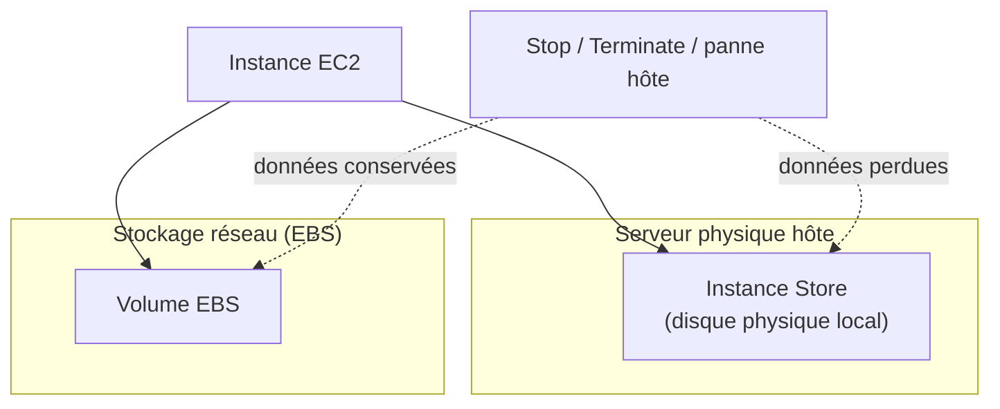

# Le disque physique éphémère, et l'image de démarrage

## Instance Store : la performance brute, au prix de la persistance

L'**Instance Store** est un disque **physiquement attaché** au serveur hôte qui exécute l'instance EC2 — contrairement à EBS, qui est un volume réseau. Cette proximité physique offre des performances I/O supérieures (débit, latence), mais avec une contrepartie majeure :

> 🎯 **Piège d'examen —** l'Instance Store est **éphémère** : les données sont **définitivement perdues** en cas d'arrêt (stop), de terminaison de l'instance, ou de panne matérielle de l'hôte physique — même un simple `stop`/`start` suffit à tout effacer (à la différence d'EBS, dont les données survivent à un stop). L'Instance Store convient donc à des données qu'on peut se permettre de perdre : cache temporaire, buffer de traitement, données de scratch régénérables — **jamais** une base de données ou un contenu qu'on ne peut pas reconstruire.

## AMI : l'image de départ d'une instance

Une **AMI (Amazon Machine Image)** définit ce qui est installé au lancement d'une instance : système d'exploitation, logiciels pré-configurés, agents de monitoring, configuration applicative.

Trois origines possibles pour une AMI :

| Origine | Description |
|---|---|
| **AMI publique** | fournie par AWS (Amazon Linux, Ubuntu officiel…) |
| **Ta propre AMI** | créée à partir d'une instance déjà configurée — permet de figer un état (packages installés, code déployé) pour démarrer plus vite et de façon reproductible |
| **AMI de l'AWS Marketplace** | fournie par un éditeur tiers, peut inclure des frais de licence additionnels |

Une AMI est construite pour une **région donnée**, mais peut être **copiée vers d'autres régions** si besoin (utile pour une stratégie multi-région).

> 🎯 **Piège d'examen —** créer sa propre AMI **avant** de configurer un Auto Scaling Group est une bonne pratique qui revient souvent à l'examen : une instance lancée depuis une AMI déjà pré-configurée (paquets installés, code applicatif présent) démarre **beaucoup plus vite** qu'une instance qui doit tout installer via un script user data à chaque lancement — ce qui réduit le temps de disponibilité lors d'un scale-out et raccourcit d'autant la période de cooldown perçue.

## À retenir

- Instance Store = performance brute, **éphémère** (perdu au stop/terminate/panne hôte) — réservé aux données non critiques et reconstructibles.
- AMI = image de démarrage (OS + logiciels), propre à une région (copiable vers d'autres), disponible en version publique, personnelle ou Marketplace.
- Construire sa propre AMI pré-configurée accélère le démarrage des instances — un vrai atout pour le scaling.
