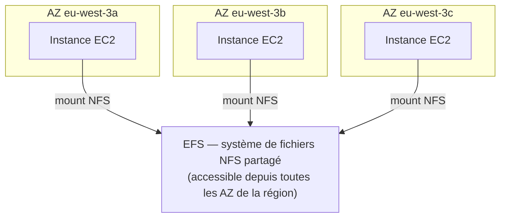

# EFS : un système de fichiers partagé entre plusieurs instances

**EFS (Elastic File System)** est un système de fichiers **réseau managé (NFS)**, monté simultanément sur **plusieurs instances EC2**, potentiellement réparties sur **plusieurs Availability Zones**. C'est la différence fondamentale avec EBS : un volume EBS s'attache à une instance à la fois (sauf multi-attach io1/io2, limité à une même AZ) ; EFS se **partage** nativement, à travers les AZ d'une région.

Caractéristiques clés :

- Protocole **NFSv4.1**, compatible **Linux uniquement** (pas Windows).
- Capacité qui **s'ajuste automatiquement** (pas de dimensionnement à l'avance, contrairement à EBS).
- Facturation à l'usage réel (au Go stocké), généralement plus coûteuse qu'EBS à volume égal.
- Sécurisé via des **Security Groups** (comme une instance EC2).

## Classes de stockage EFS

| Classe | Usage |
|---|---|
| **Standard** | fichiers consultés fréquemment |
| **Infrequent Access (EFS-IA)** | fichiers peu consultés : coût de stockage réduit, coût de récupération à l'accès — piloté par une politique de cycle de vie automatique (ex. « déplacer après 30 jours sans accès ») |
| **One Zone / One Zone-IA** | mêmes principes, mais dans une **seule** AZ (coût encore réduit, au prix de la résilience inter-AZ) |

> 🎯 **Piège d'examen —** un scénario qui décrit un besoin de partage de fichiers **entre plusieurs instances EC2 réparties sur plusieurs AZ, sous Linux** pointe presque toujours vers **EFS** — EBS ne peut pas remplir ce rôle (attaché à une seule AZ, et à une seule instance sauf cas io1/io2 limité).

## Le tableau à connaître par cœur : EBS vs EFS vs Instance Store

| Critère | EBS | EFS | Instance Store |
|---|---|---|---|
| **Type** | volume réseau (bloc) | système de fichiers réseau (NFS) | disque physique local |
| **Attachable à** | 1 instance (sauf io1/io2 multi-attach, même AZ) | plusieurs instances, plusieurs AZ | l'instance hôte uniquement |
| **Portée** | 1 Availability Zone | toute la région (multi-AZ) | 1 instance (physiquement liée à l'hôte) |
| **Persistance** | survit à un stop/start de l'instance | totalement indépendant du cycle de vie d'une instance | **perdu** au stop/terminate/panne hôte |
| **Performance** | bonne, dépend du type de volume | bonne, scalable, mais latence réseau NFS | la meilleure (accès local direct) |
| **OS supportés** | Linux et Windows | Linux uniquement | Linux et Windows |
| **Coût** | modéré | plus élevé qu'EBS à volume égal | inclus dans le prix de l'instance (pas de facturation séparée) |
| **Cas d'usage type** | disque système, base de données sur une instance | contenu partagé (CMS, rendu vidéo distribué, répertoires home partagés) | cache/scratch/buffer temporaire, haute performance non critique |

## À retenir

- EFS = NFS managé, multi-instances, **multi-AZ**, Linux uniquement — la solution dès qu'un système de fichiers doit être **partagé**.
- Le triptyque EBS (1 instance, 1 AZ, persistant) / EFS (partagé, multi-AZ, persistant) / Instance Store (local, 1 instance, éphémère) est directement testable : à chaque scénario correspond une seule bonne réponse selon le besoin de partage et de persistance.
