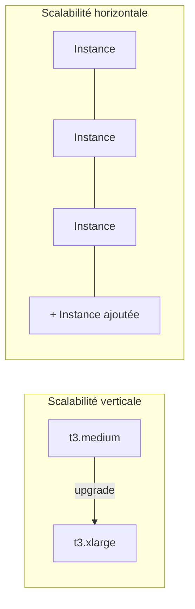
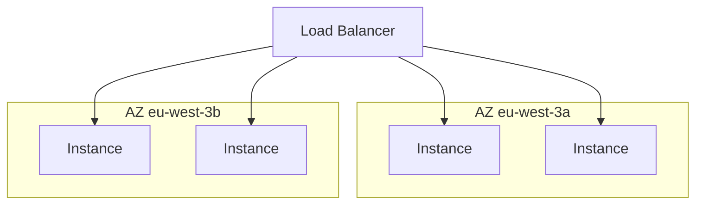

# Deux façons de grandir, un objectif de résilience

Ce module regroupe deux services qui vont toujours ensemble à l'examen : **Elastic Load Balancing (ELB)** distribue le trafic, **Auto Scaling Groups (ASG)** ajuste le nombre d'instances. Avant d'y entrer, il faut clarifier trois notions souvent confondues : scalabilité verticale, scalabilité horizontale, et haute disponibilité.

## Scalabilité verticale : agrandir une seule instance

**Scaler verticalement**, c'est augmenter la taille d'**une** instance existante — par exemple passer un `t3.medium` à un `t3.xlarge`. Très commun pour des systèmes **non distribués** comme une base de données unique.

> 🎯 **Piège d'examen —** la scalabilité verticale a une **limite matérielle** : il existe toujours une taille d'instance maximale au-delà de laquelle on ne peut plus grandir. Elle nécessite aussi généralement un **redémarrage** de l'instance (changement de type). Ce n'est **pas** une stratégie de haute disponibilité : une instance unique, même énorme, reste un point de défaillance unique.

## Scalabilité horizontale : ajouter des instances

**Scaler horizontalement** (ou « elasticity » côté cloud), c'est augmenter le **nombre** d'instances qui exécutent l'application — le principe même de l'Auto Scaling. Implique une architecture **distribuée** (l'application ne doit pas dépendre d'un état stocké localement sur une seule instance).

## Haute disponibilité : survivre à la perte d'une AZ

La **haute disponibilité (HA)** est un objectif de résilience, généralement obtenu **grâce à** la scalabilité horizontale : faire tourner l'application sur **au moins 2 Availability Zones**, pour que la perte d'une AZ n'interrompe pas le service.

> 🎯 **Piège d'examen —** scalabilité horizontale et haute disponibilité vont souvent ensemble, mais ne sont **pas identiques** : on peut avoir 10 instances qui scalent horizontalement... toutes dans la **même AZ** — ce n'est toujours pas de la haute disponibilité. La HA exige explicitement la répartition **multi-AZ**, pas seulement la multiplication du nombre d'instances.

## À retenir

- Vertical = agrandir une instance (limite matérielle, souvent un redémarrage, ne règle pas la disponibilité).
- Horizontal = ajouter des instances (implique une architecture distribuée sans état local critique).
- Haute disponibilité = répartition sur **plusieurs AZ**, distincte du simple fait de scaler horizontalement dans une seule AZ.
