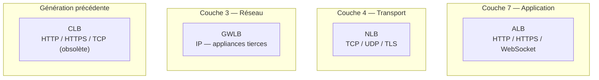

# Distribuer le trafic : quel Load Balancer pour quel besoin

Un **Load Balancer** répartit le trafic entrant vers plusieurs instances (ou d'autres cibles), fait des health checks réguliers, et expose un point d'entrée unique et stable. AWS propose **4 types**, chacun opérant à une couche réseau différente — c'est exactement ce que l'examen teste.



## Application Load Balancer (ALB) — couche 7

L'**ALB** comprend le protocole HTTP/HTTPS (et WebSocket) : il peut router selon le **chemin de l'URL**, le **nom d'hôte**, des **en-têtes**, ou une **query string** — vers des **target groups** différents.

- Cibles possibles : instances EC2, tâches ECS, fonctions Lambda, adresses IP privées.
- Idéal pour des **microservices** ou des architectures conteneurisées (une seule ALB peut router vers plusieurs applications/services selon le chemin).
- L'ALB ne transmet pas l'IP du client directement : elle est portée dans l'en-tête **`X-Forwarded-For`** (et `X-Forwarded-Proto`/`X-Forwarded-Port`).

```bash
# Register EC2 instances behind an ALB target group
aws elbv2 register-targets \
  --target-group-arn arn:aws:elasticloadbalancing:eu-west-3:123456789012:targetgroup/app-tg/abcd1234 \
  --targets Id=i-0123456789abcdef0 Id=i-0fedcba9876543210
```

## Network Load Balancer (NLB) — couche 4

Le **NLB** opère au niveau TCP/UDP/TLS, sans comprendre le contenu HTTP. Il vise la **performance extrême** : très faible latence, capacité à gérer un volume massif de connexions.

- Fournit une **IP statique par AZ** (et peut recevoir une Elastic IP), utile pour du whitelisting d'IP côté client.
- Cible typique : cas où la latence doit être minimale, ou où le protocole n'est pas HTTP (jeux en ligne, IoT, streaming).

## Gateway Load Balancer (GWLB) — couche 3

Le **GWLB** opère au niveau réseau (IP) : il sert à déployer, scaler et gérer des **appliances réseau tierces** (pare-feu, détection d'intrusion, inspection de paquets) de façon transparente, comme point d'entrée/sortie unique pour tout le trafic à inspecter.

> 🎯 **Piège d'examen —** l'ALB comprend le **contenu applicatif** (couche 7) et peut router selon l'URL ; le NLB ne voit que des flux TCP/UDP (couche 4), sans routage applicatif mais avec une latence minimale ; le GWLB (couche 3, réseau) sert à insérer des appliances de sécurité tierces dans le chemin réseau. Un scénario qui demande un **routage par chemin d'URL** exige l'**ALB** ; un scénario qui demande la **latence la plus faible possible sur du TCP brut** exige le **NLB** ; un scénario qui mentionne un **firewall/IDS tiers à insérer de façon transparente** exige le **GWLB**. Confondre couche 4 (NLB) et couche 7 (ALB) est l'erreur la plus fréquente.

## Classic Load Balancer (CLB) — génération précédente

Le **CLB** est l'ancienne génération (HTTP, HTTPS, TCP), aujourd'hui **obsolète** — il apparaît encore dans les options d'examen comme un choix à **écarter** au profit d'ALB ou NLB, sauf contexte legacy explicite.

## Sticky Sessions (session affinity)

Une **sticky session** force le Load Balancer à toujours rediriger un même client vers **la même instance** en back-end, via un cookie (durée configurable). Disponible sur ALB et CLB.

> 🎯 **Piège d'examen —** les sticky sessions résolvent un problème de session stockée localement sur une instance (utile en migration rapide), mais elles créent un **déséquilibre de charge** : certaines instances reçoivent plus de trafic que d'autres, car les clients « collants » y restent. La solution architecturale préférée reste de **sortir l'état de session** de l'instance (ex. stockage externalisé — cache partagé) plutôt que de s'appuyer durablement sur la stickiness.

## Cross-Zone Load Balancing

- **Activé** : chaque nœud du Load Balancer répartit le trafic sur **toutes** les instances enregistrées, dans **toutes** les AZ.
- **Désactivé** : chaque nœud ne répartit que sur les instances de **sa propre AZ**.

| Load Balancer | Comportement par défaut | Frais de données inter-AZ si activé |
|---|---|---|
| **ALB** | activé par défaut | aucun frais additionnel |
| **NLB / GWLB** | désactivé par défaut | facturé si activé manuellement |

## SSL/TLS et SNI

Le Load Balancer peut effectuer la **terminaison SSL/TLS** : le chiffrement s'arrête au Load Balancer (certificat géré via **ACM — AWS Certificate Manager**), qui communique ensuite en clair (ou re-chiffré) avec les instances back-end.

**SNI (Server Name Indication)** permet de servir **plusieurs certificats SSL** (donc plusieurs noms de domaine) sur un **seul** Load Balancer : le client indique le nom d'hôte visé dès la poignée de main SSL, ce qui permet au Load Balancer de présenter le bon certificat. Disponible sur ALB et NLB (pas sur le CLB, plus ancien).

> 🎯 **Piège d'examen —** SNI est ce qui permet d'héberger **plusieurs sites HTTPS avec des certificats différents** derrière un **seul** ALB/NLB, sans devoir créer un Load Balancer par domaine — une question qui décrit ce besoin pointe vers SNI sur ALB/NLB, jamais vers le CLB.

## Connection Draining

Aussi appelé **deregistration delay** sur ALB/NLB : quand une instance est retirée (unhealthy, ou désenregistrement volontaire), le Load Balancer lui laisse le temps de **terminer les requêtes en cours** avant de la couper complètement — nouvelles requêtes non envoyées, requêtes en vol autorisées à se terminer, jusqu'à un délai configurable (par défaut de l'ordre de 300 secondes, réductible pour des requêtes courtes).

## À retenir

- ALB = couche 7 (HTTP, routage par contenu) ; NLB = couche 4 (TCP/UDP, latence minimale, IP statique) ; GWLB = couche 3 (appliances réseau tierces) ; CLB = legacy, à éviter en réponse par défaut.
- Sticky sessions = pratique utile ponctuellement, mais risque de déséquilibre de charge.
- Cross-zone LB : activé par défaut (et gratuit) sur ALB ; désactivé par défaut (et payant si activé) sur NLB/GWLB.
- SNI = plusieurs certificats/domaines sur un seul ALB/NLB.
- Connection draining = laisser les requêtes en cours se terminer avant de couper une instance sortante.
