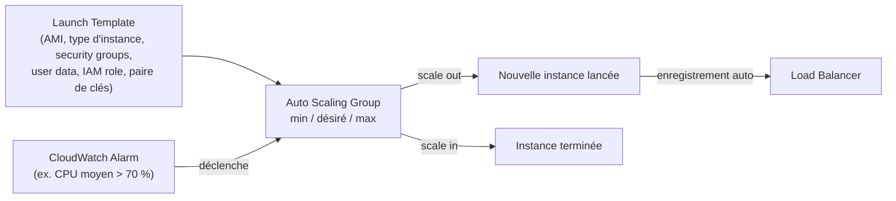
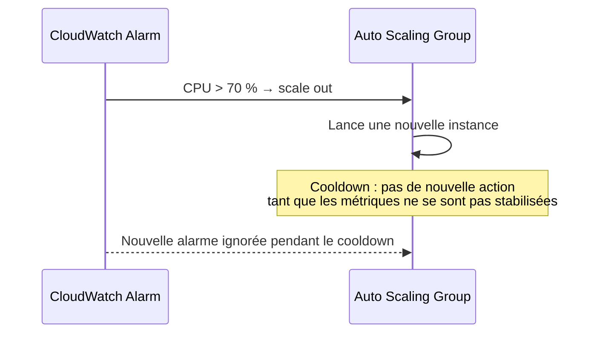

# ASG : ajuster automatiquement le nombre d'instances

Un **Auto Scaling Group (ASG)** maintient un nombre d'instances EC2 dans une fourchette définie (min/max/désiré), les remplace automatiquement si elles deviennent défaillantes, et les enregistre automatiquement auprès d'un Load Balancer.

## Le Launch Template : le modèle d'instance

Le **Launch Template** décrit tout ce qu'il faut pour lancer une instance : AMI, type d'instance, user data, security groups, paire de clés SSH, volumes EBS, rôle IAM, sous-réseau. L'ASG s'appuie dessus pour créer des instances **identiques** à chaque scale-out.

> 🎯 **Piège d'examen —** utiliser une **AMI pré-configurée** dans le Launch Template (plutôt que tout installer via user data à chaque lancement) réduit le temps nécessaire pour qu'une nouvelle instance devienne opérationnelle — un point souvent couplé à une question sur le cooldown ou la réactivité du scaling.

## Les politiques de scaling dynamique

| Politique | Principe | Exemple |
|---|---|---|
| **Target tracking** | la plus simple : on vise une valeur cible pour une métrique, l'ASG ajuste automatiquement | « maintenir le CPU moyen autour de 40 % » |
| **Step scaling (simple/par palier)** | des règles explicites déclenchées par des seuils d'alarme CloudWatch | « si CPU > 70 %, ajouter 2 instances » / « si CPU < 30 %, retirer 1 instance » |
| **Scheduled scaling** | anticipe une charge connue à l'avance, à une date/heure précise | « passer la capacité minimale à 10 tous les vendredis à 17h » |
| **Predictive scaling** | analyse en continu l'historique de charge pour **anticiper** et planifier le scaling à l'avance | prévoit un pic récurrent du lundi matin et scale **avant** qu'il n'arrive |

> 🎯 **Piège d'examen —** le **target tracking** est presque toujours la réponse recommandée quand un scénario ne précise **pas** de règle métier explicite complexe — c'est la politique la plus simple à maintenir. Le **scheduled scaling** est la bonne réponse quand un pic de charge est **connu à l'avance et récurrent** (ex. une opération commerciale planifiée) — inutile d'attendre qu'une alarme CloudWatch se déclenche si on **sait déjà** que la charge va monter à une heure précise.

## Cooldown : laisser le temps aux métriques de se stabiliser

Après une action de scaling (ajout ou retrait d'instances), l'ASG entre dans une période de **cooldown** (par défaut de l'ordre de 300 secondes) pendant laquelle il **ne déclenche pas** de nouvelle action de scaling — le temps que les métriques (CPU, requêtes…) se stabilisent avec la nouvelle capacité, et qu'on évite un effet de « yo-yo » (scale out puis scale in en boucle rapprochée).

> 🎯 **Piège d'examen —** utiliser une **AMI pré-configurée** raccourcit le temps qu'une instance met à devenir pleinement opérationnelle après un scale-out — ce qui permet de justifier un cooldown **plus court** sans risquer de scaler sur des métriques faussées par des instances pas encore prêtes. À l'inverse, un cooldown trop court avec des instances lentes à démarrer entraîne des décisions de scaling prises sur des données non représentatives.

## À retenir

- Launch Template = le « moule » à instances de l'ASG (AMI, type, user data, IAM role…).
- Target tracking = par défaut pour une cible simple ; step scaling = règles à seuils explicites ; scheduled = pic connu à l'avance ; predictive = anticipation continue basée sur l'historique.
- Cooldown = pause après une action de scaling, pour laisser les métriques se stabiliser et éviter les oscillations.
