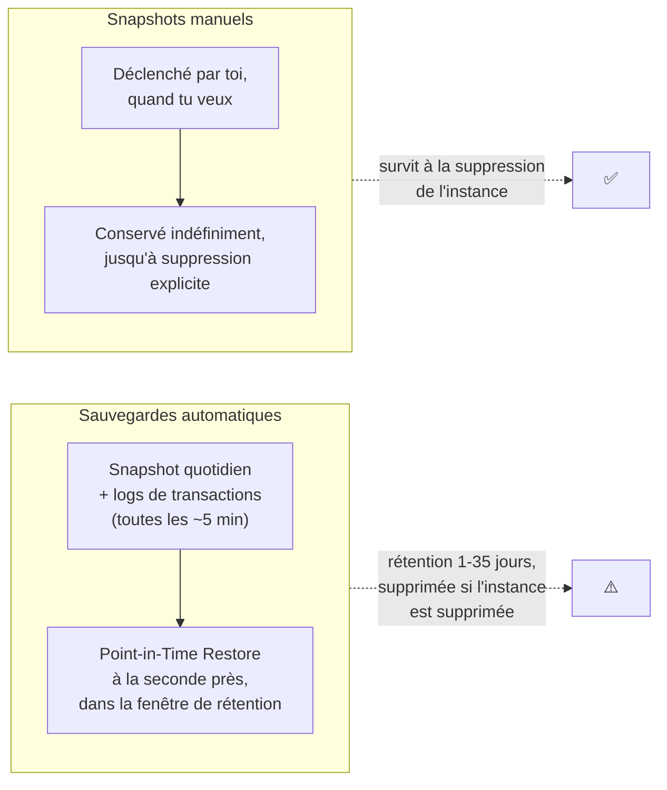

# RDS — des bases relationnelles managées

**RDS (Relational Database Service)** gère pour toi l'installation, les patchs, les sauvegardes et le scaling matériel d'un moteur relationnel classique. C'est un service **managé mais pas serverless** : tu choisis toujours une classe d'instance (comme pour EC2), qui tourne 24/7.

> **Repère —** RDS, c'est ta base MySQL/PostgreSQL habituelle (celle que tu lances en conteneur Docker à côté de ton appli Symfony), sauf qu'AWS gère l'hôte, les patchs de sécurité et les sauvegardes à ta place. Tu gardes la main sur le schéma, les requêtes, les index — comme d'habitude.

## Les moteurs supportés

RDS supporte six moteurs : **MySQL**, **MariaDB**, **PostgreSQL**, **Oracle**, **SQL Server**, et **Amazon Aurora** (compatible MySQL ou PostgreSQL, détaillé dans une leçon dédiée). Le choix du moteur dépend surtout de l'existant (licences, compatibilité applicative) — l'examen teste rarement « quel moteur choisir » mais beaucoup plus les mécanismes communs à tous : stockage, réplication, sauvegardes, sécurité.

## Stockage : EBS sous le capot, avec auto-scaling

Une instance RDS s'appuie sur du stockage EBS (General Purpose SSD ou Provisioned IOPS selon le besoin de performance). Deux points à connaître :

- **Storage Auto Scaling** — tu définis un seuil maximum, et RDS augmente automatiquement l'espace disque quand l'espace libre devient faible (et reste faible sur une durée soutenue), **sans interruption de service**. Ça évite de devoir surveiller manuellement le taux de remplissage du disque.
- Le stockage ne peut **que grandir** : impossible de réduire la taille d'un volume RDS après coup (il faut créer une nouvelle instance plus petite et migrer les données).

## Sauvegardes : automatiques vs manuelles

- **Sauvegardes automatiques** — activées par défaut, rétention configurable de **1 à 35 jours**. Elles permettent une restauration **point-in-time** (à la seconde près) grâce aux logs de transactions. Si tu supprimes l'instance, ces sauvegardes automatiques disparaissent avec elle (sauf si tu demandes un snapshot final à la suppression).
- **Snapshots manuels** — déclenchés à la demande, conservés **jusqu'à suppression explicite**, même après suppression de l'instance source. Copiables vers une autre région ou un autre compte (utile pour la reprise après sinistre ou le partage entre environnements).

> 🎯 **Piège d'examen —** restaurer un snapshot (automatique ou manuel) crée **toujours une nouvelle instance RDS**, avec un **nouvel endpoint**. Il n'existe pas de restauration « en place » qui garderait l'endpoint d'origine — il faut ensuite reconfigurer l'application (ou passer par un CNAME applicatif) pour pointer vers la nouvelle instance.

## Sécurité : chiffrement et authentification IAM

- **Chiffrement au repos** — via AWS KMS, activé au **stockage, aux sauvegardes, aux réplicas et aux snapshots**. Point important : le chiffrement se choisit **à la création de l'instance**, il n'existe pas de bouton pour chiffrer une instance existante en place. Pour chiffrer une instance non chiffrée : créer un snapshot, le copier **en activant le chiffrement** sur la copie, puis restaurer une nouvelle instance depuis ce snapshot chiffré.
- **Chiffrement en transit** — via SSL/TLS entre l'application et l'instance (certificat fourni par AWS, à valider côté client).
- **IAM Database Authentication** (MySQL et PostgreSQL uniquement) — remplace le mot de passe par un **jeton temporaire** généré via IAM, valable 15 minutes. Avantage : plus de mot de passe à faire tourner ni à stocker. Limite à connaître : ce mécanisme n'est **pas recommandé pour un très grand nombre de connexions par seconde** (quota de débit sur la génération de jetons) — pour une appli à très fort trafic, on reste sur une authentification classique via Secrets Manager avec rotation automatique.

## Ports classiques à connaître

| Moteur | Port par défaut |
|---|---|
| MySQL / MariaDB / Aurora (MySQL) | 3306 |
| PostgreSQL / Aurora (PostgreSQL) | 5432 |
| Oracle | 1521 |
| SQL Server | 1433 |

## À retenir

- RDS = base relationnelle managée (patchs, sauvegardes) mais pas serverless : tu choisis une classe d'instance.
- Storage Auto Scaling grandit tout seul, sans interruption ; jamais de réduction possible après coup.
- Sauvegardes automatiques (1-35 jours, PITR à la seconde, disparaissent avec l'instance) vs snapshots manuels (permanents, copiables cross-région/compte).
- Restaurer un snapshot = **toujours** une nouvelle instance, nouvel endpoint.
- Chiffrement at-rest à activer **à la création** (sinon : snapshot → copie chiffrée → restauration) ; IAM DB Auth = jetons 15 min, pas pour du très fort débit.
