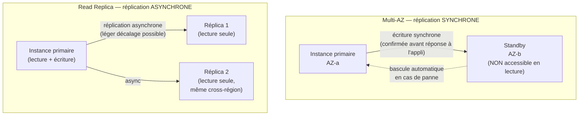

# Le piège que TOUT le monde confond au moins une fois

Si l'examen SAA-C03 devait être résumé en un seul point à ne jamais rater, ce serait celui-ci : **Multi-AZ** et **Read Replica** répondent à deux problèmes complètement différents, et pourtant se ressemblent sur le papier (« une deuxième copie de la base, ailleurs »). Confondre les deux fait perdre des points sur de nombreuses questions, directement ou indirectement (ELB/ASG, migration, DR…).

## La différence fondamentale, en une phrase

> **Multi-AZ = disponibilité** (survivre à une panne). **Read Replica = scalabilité en lecture** (absorber plus de trafic SELECT).

## Multi-AZ : la disponibilité, pas la performance

- Réplication **synchrone** vers un **standby** dans une **autre AZ** de la même région.
- Le standby **n'est pas interrogeable directement** en lecture (RDS classique — sur MySQL/PostgreSQL/MariaDB, l'option « Multi-AZ DB cluster » plus récente propose deux standbys lisibles, une variante à connaître mais moins fréquente à l'examen que le Multi-AZ « instance » classique).
- En cas de panne de la primaire (panne AZ, panne matérielle, maintenance), RDS **bascule automatiquement** vers le standby : l'**endpoint DNS ne change pas** (RDS effectue un CNAME flip en interne), typiquement en **1 à 2 minutes**.
- Objectif : **haute disponibilité et reprise après sinistre**, pas plus de débit en lecture.

## Read Replica : la scalabilité en lecture

- Réplication **asynchrone** — il peut exister un **léger décalage** (lag) entre la primaire et la réplica, surtout sous forte charge d'écriture.
- Une réplica est **interrogeable** — on y redirige les requêtes de lecture (reporting, dashboard, recherche) pour soulager la primaire.
- Jusqu'à **5 réplicas directes** par instance source (davantage pour Aurora, vu dans la prochaine leçon).
- Peut être créée **dans la même AZ, une autre AZ, ou une autre région** (cross-region) — utile pour rapprocher la lecture des utilisateurs d'une autre zone géographique, ou préparer un plan de reprise après sinistre géographique.
- Une réplica peut être **promue** en instance autonome (read + write) : la réplication est alors **définitivement rompue**, l'instance devient indépendante avec son propre endpoint. Utile pour une migration, un test d'exécution en isolation, ou une bascule manuelle après un sinistre régional.
- Une réplica peut elle-même être configurée en **Multi-AZ** (les deux mécanismes se combinent : scalabilité en lecture + disponibilité de cette réplica).

> 🎯 **Piège d'examen —** un scénario qui décrit « le site plante quand l'AZ tombe » ou « on veut garantir une continuité automatique en cas de panne » pointe vers **Multi-AZ**. Un scénario qui décrit « les rapports/dashboards ralentissent la production » ou « on veut absorber plus de trafic de lecture » pointe vers **Read Replica**. Un scénario qui dit « la réplication doit être synchrone, zéro perte de données » élimine d'office la Read Replica (asynchrone par nature).

## Tableau récapitulatif

| | Multi-AZ | Read Replica |
|---|---|---|
| **Objectif** | Disponibilité / reprise après sinistre | Scalabilité en lecture |
| **Réplication** | Synchrone | Asynchrone (lag possible) |
| **Lisible directement ?** | Non (instance classique) | Oui |
| **Bascule** | Automatique (failover RDS) | Manuelle (promotion) |
| **Localisation** | Toujours une autre AZ, même région | Même AZ, autre AZ, **ou autre région** |
| **Nombre** | 1 standby | Jusqu'à 5 (directes) |
| **Peut devenir autonome ?** | Non (c'est un mécanisme interne) | Oui, via promotion (rupture définitive du lien) |

## À retenir

- Multi-AZ : synchrone, standby non lisible, failover automatique, **disponibilité**.
- Read Replica : asynchrone, lisible, promotion manuelle, **scalabilité en lecture** — et seule option pour une réplication **cross-région**.
- Les deux se combinent : une Read Replica peut elle-même être Multi-AZ.
- Mot-clé de l'énoncé = la réponse : « panne/continuité » → Multi-AZ ; « rapports/trafic de lecture » → Read Replica.
