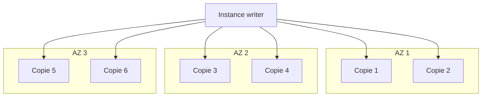
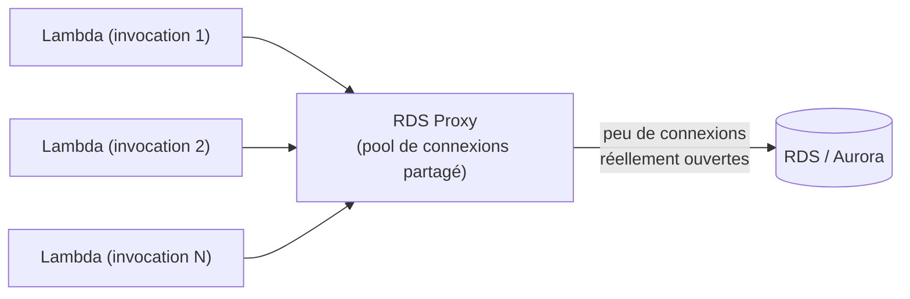

# Aurora — le moteur « cloud-native » d'AWS

**Aurora** est un moteur relationnel développé par AWS, compatible **MySQL** ou **PostgreSQL** au niveau du driver et du SQL (le code applicatif ne change pas), mais avec un moteur de stockage entièrement repensé pour le cloud. C'est l'option par défaut recommandée par AWS dès que le moteur (MySQL/PostgreSQL) est compatible avec le besoin.

## L'architecture de stockage : 6 copies, 3 AZ

Chaque volume de données Aurora est répliqué en **6 copies, réparties sur 3 Availability Zones** (2 copies par AZ) — c'est le cœur de sa résilience :

- Le stockage tolère la **perte de 2 copies sans impact sur les écritures**, et la **perte de 3 copies sans impact sur les lectures** (autoréparation continue des copies défaillantes en tâche de fond).
- Le stockage grandit automatiquement **par paliers**, sans intervention.
- Contrairement à RDS classique, la haute disponibilité **fait partie du moteur de stockage lui-même** : même avec une seule instance de calcul, les données survivent à la perte d'une AZ. Ajouter des instances (writer/reader) sert surtout à la disponibilité **de calcul** et à la scalabilité en lecture — pas à protéger les données, déjà répliquées par le stockage.

## Endpoints Aurora : writer, reader, custom

Un cluster Aurora expose plusieurs types d'endpoints, pour ne jamais coder en dur l'adresse d'une instance précise :

| Endpoint | Rôle |
|---|---|
| **Cluster (writer) endpoint** | pointe toujours vers l'instance **primaire** courante (écriture + lecture). Bascule automatiquement en cas de failover. |
| **Reader endpoint** | répartit la charge de lecture entre **toutes les réplicas Aurora** disponibles (load balancing automatique). |
| **Custom endpoint** | sous-ensemble d'instances choisi par toi (ex. isoler des instances plus puissantes pour l'analytique). |
| **Instance endpoint** | pointe vers **une** instance précise (rarement utilisé directement par l'application). |

> 🎯 **Piège d'examen —** contrairement à une Read Replica RDS classique (jusqu'à 5), un cluster Aurora supporte jusqu'à **15 réplicas Aurora**, avec un **lag de réplication très faible** (de l'ordre de la dizaine de millisecondes). En cas de panne de l'instance writer, Aurora peut **promouvoir une réplica existante en quelques secondes** — bien plus rapide qu'un failover Multi-AZ RDS classique, car il n'y a pas de resynchronisation de stockage à faire (le stockage est déjà partagé).

## Aurora Serverless : la capacité à la demande

**Aurora Serverless** (v1 puis v2) ajuste automatiquement la capacité de calcul en fonction de la charge, avec une facturation à la ressource consommée. Cas d'usage typiques :

- Charges **imprévisibles ou intermittentes** (application interne peu utilisée, environnement de dev/test qui ne tourne pas 24/7).
- Nouvelles applications dont le profil de charge est encore inconnu.
- Éviter le sur-provisionnement (et le sous-provisionnement) d'une capacité fixe.

## Aurora Global Database : la réplication multi-région

**Aurora Global Database** réplique les données au niveau du **stockage** (pas du calcul) vers jusqu'à plusieurs régions secondaires, avec un lag typiquement **inférieur à la seconde**. Cas d'usage :

- Lectures à faible latence pour des utilisateurs répartis mondialement (chaque région lit localement).
- **Reprise après sinistre** au niveau **région entière** : en cas de panne régionale majeure, une région secondaire peut être **promue en primaire** en moins d'une minute typiquement.

> 🎯 **Piège d'examen —** ne pas confondre une **Read Replica cross-région RDS classique** (réplication SQL standard, lag plus élevé, promotion plus lente) avec **Aurora Global Database** (réplication au niveau du stockage, lag sub-seconde, conçue spécifiquement pour le DR multi-région à grande échelle).

## RDS Proxy : le pooling de connexions managé

**RDS Proxy** est un proxy managé placé entre l'application et une base RDS ou Aurora.

- **Pooling et partage de connexions** — au lieu qu'une base reçoive une connexion par instance/exécution applicative (ce qui l'épuise vite), RDS Proxy mutualise un petit nombre de connexions **réellement ouvertes** vers la base.
- Cas d'usage phare : **AWS Lambda**. Chaque invocation Lambda pouvant ouvrir sa propre connexion, une base peut vite atteindre sa limite de connexions sous forte concurrence — RDS Proxy absorbe ce pic en réutilisant un pool restreint.
- **Failover plus rapide** — RDS Proxy maintient les connexions applicatives ouvertes pendant qu'il redirige en interne vers la nouvelle instance primaire après un failover Multi-AZ, réduisant le temps d'interruption perçu par l'application.
- Accessible **uniquement depuis l'intérieur du VPC** (jamais exposé publiquement), avec support de l'authentification IAM et du chiffrement en transit.

## À retenir

- Aurora : 6 copies sur 3 AZ, tolère la perte de 2 copies (écriture) / 3 copies (lecture), jusqu'à 15 réplicas, failover en quelques secondes.
- Endpoints : writer (primaire), reader (load balancing lecture), custom (sous-ensemble), instance (une seule instance).
- Aurora Serverless = capacité à la demande, charges imprévisibles. Aurora Global Database = réplication stockage multi-région, DR sub-minute.
- RDS Proxy = pooling de connexions managé, indispensable avec Lambda, accélère aussi le failover — toujours dans un VPC.
