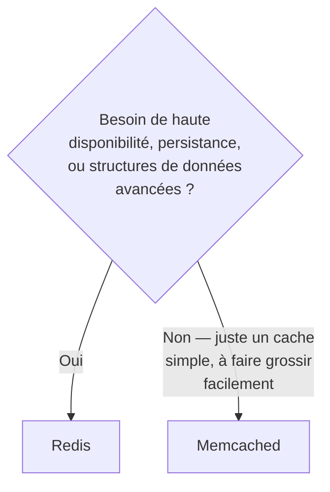
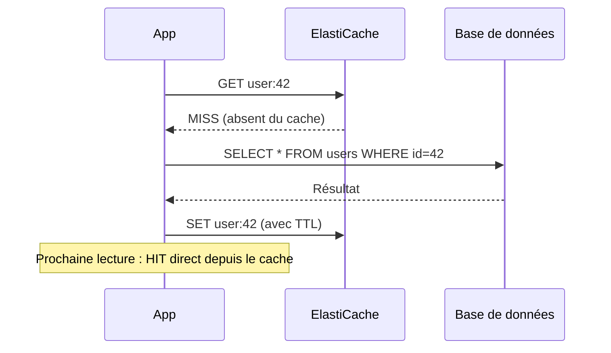

# ElastiCache — mettre un cache en mémoire devant la base

**ElastiCache** gère un cluster en mémoire (Redis ou Memcached) managé par AWS, pour réduire la charge sur une base de données et accélérer les lectures répétées.

> **Repère —** ElastiCache Redis, c'est le Redis que tu utilises déjà comme cache de session Symfony ou comme backend du cache pool (`cache.adapter.redis`) — sauf qu'AWS gère le cluster, les patchs et la réplication à ta place.

## Redis vs Memcached : lequel choisir

| Critère | Redis | Memcached |
|---|---|---|
| **Persistance** | Oui (snapshots vers S3, AOF) | Non — tout est perdu si le nœud redémarre |
| **Haute disponibilité** | Oui — réplication Multi-AZ avec **failover automatique** | Non — pas de réplication native |
| **Structures de données** | Riches : listes, sets, sorted sets, hashes, pub/sub, transactions | Simple clé/valeur uniquement |
| **Scaling horizontal (sharding)** | Oui (Redis Cluster mode) | Oui, plus simple — architecture **multi-threadée**, nœuds indépendants |
| **Cas d'usage typique** | Cache de session, leaderboard (sorted sets), file de messages légère, verrous distribués | Cache pur et simple, objets facilement reconstructibles, forte parallélisation |

> 🎯 **Piège d'examen —** un scénario qui insiste sur « le cache doit survivre à un redémarrage » ou « on veut un failover automatique en cas de panne d'un nœud » élimine Memcached d'office (aucune persistance, aucune réplication native) → **Redis**. Un scénario qui dit « on veut juste un cache multi-thread facile à scaler horizontalement, pas de notion de perte de données critique » pointe vers **Memcached**, souvent moins cher à opérer pour ce cas simple.

## Ports classiques à connaître

| Moteur | Port par défaut |
|---|---|
| Redis | 6379 |
| Memcached | 11211 |

## Stratégies de mise en cache

### Lazy loading (cache-aside)

- L'application vérifie **d'abord** le cache ; en cas d'absence (*miss*), elle lit la base puis **écrit** le résultat dans le cache.
- **Avantage** — seules les données réellement demandées finissent en cache (pas de gaspillage mémoire).
- **Inconvénient** — chaque *miss* ajoute une latence supplémentaire (aller-retour base + écriture cache) ; les données en cache peuvent devenir **périmées** si la base change sans invalider le cache.

### Write-through

- Chaque écriture en base est **immédiatement répercutée** dans le cache (au lieu d'attendre une lecture).
- **Avantage** — le cache est **toujours à jour**, jamais de *miss* sur une donnée déjà écrite.
- **Inconvénient** — chaque écriture coûte une écriture supplémentaire dans le cache (latence d'écriture), et le cache se remplit de données **jamais relues** (gaspillage), en particulier juste après le déploiement initial d'un cache vide (aucune donnée pré-existante tant qu'elle n'a pas été (ré)écrite).

### Le rôle du TTL

Un **TTL (Time To Live)** fixe une durée de vie à une entrée de cache, après laquelle elle expire automatiquement. C'est le filet de sécurité qui borne la **péremption** des données — en particulier utile avec du lazy loading, où rien ne garantit qu'une entrée soit invalidée activement quand la donnée source change.

> 🎯 **Piège d'examen —** le lazy loading et le write-through sont **complémentaires**, pas concurrents : beaucoup d'architectures combinent write-through (fraîcheur des données actives) avec un **TTL** (filet de sécurité contre les entrées orphelines jamais réécrites) et du lazy loading pour les données non pré-chargées.

## À retenir

- Redis = persistance + HA (failover Multi-AZ) + structures riches. Memcached = simple, multi-threadé, aucune persistance/HA, scaling horizontal facile.
- Ports : Redis 6379, Memcached 11211.
- Lazy loading (cache-aside) : lit d'abord le cache, écrit après un miss — risque de données périmées, mitigé par un TTL.
- Write-through : écrit dans le cache à chaque écriture base — toujours frais, mais peut gaspiller de la mémoire sur des données jamais relues.
