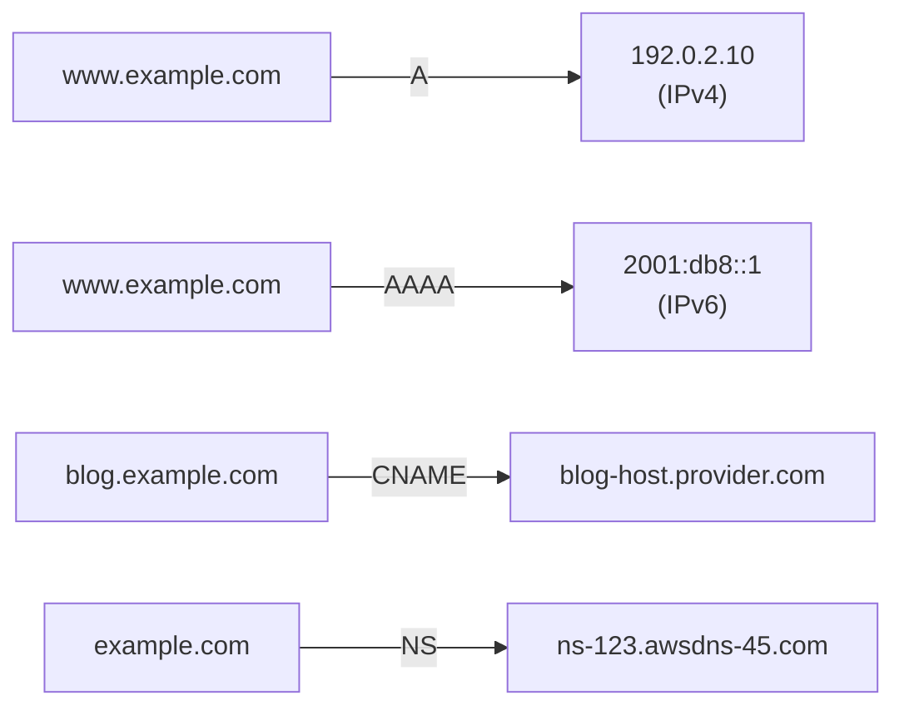
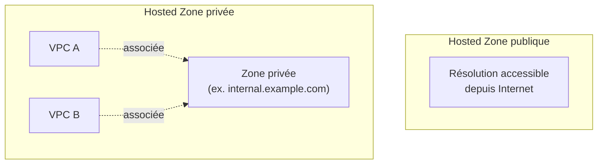

# Route 53 — le DNS managé d'AWS

**Route 53** est le service DNS managé d'AWS (le nom vient du port 53, celui du protocole DNS). Avant de voir ses fonctionnalités avancées, il faut maîtriser les bases du DNS lui-même — l'examen part du principe que tu sais lire un enregistrement DNS couramment.

> **Repère —** un hosted zone Route 53, c'est l'équivalent managé d'un fichier de zone BIND (`example.com.zone`) que tu éditerais à la main sur un serveur DNS traditionnel — sauf qu'ici c'est une API/console, avec de la haute disponibilité intégrée et des fonctionnalités de routage avancées.

## Les types d'enregistrements essentiels

| Type | Rôle | Exemple |
|---|---|---|
| **A** | nom de domaine → adresse **IPv4** | `example.com → 192.0.2.10` |
| **AAAA** | nom de domaine → adresse **IPv6** | `example.com → 2001:db8::1` |
| **CNAME** | nom de domaine → **un autre nom de domaine** (pas une IP directement) | `blog.example.com → myblog.provider.com` |
| **NS** | serveurs de noms **faisant autorité** sur la zone | délègue la résolution de `example.com` aux serveurs Route 53 |

Un enregistrement a aussi un **TTL (Time To Live)** : la durée (en secondes) pendant laquelle les résolveurs DNS **mettent en cache** la réponse avant de la redemander. Un TTL court (ex. 60s) permet de propager rapidement un changement (utile avant une bascule planifiée), au prix de plus de requêtes DNS ; un TTL long réduit la charge de résolution mais ralentit la propagation d'un changement.

## Hosted Zones : publiques vs privées

- **Hosted zone publique** — contient les enregistrements résolus **depuis Internet**. C'est ce qu'on utilise pour un site web public, une API exposée, etc.
- **Hosted zone privée** — associée à un ou plusieurs **VPC**, ne résout que pour les ressources **à l'intérieur de ces VPC**. Utile pour un DNS interne (ex. `internal.example.com` pointant vers des IP privées de microservices), sans jamais exposer ces noms sur Internet.

> 🎯 **Piège d'examen —** une zone privée n'est **pas** accessible en dehors des VPC associés — même avec le bon nom de domaine, une requête venant d'Internet ou d'un VPC non associé ne résoudra rien. Pour un DNS interne partagé entre plusieurs VPC (voire un compte on-premise), il faut associer explicitement chaque VPC à la zone privée (et gérer le peering/Transit Gateway pour la connectivité réseau sous-jacente).

## À retenir

- A = IPv4, AAAA = IPv6, CNAME = alias vers un autre nom de domaine, NS = délégation d'autorité.
- Le TTL arbitre entre vitesse de propagation d'un changement et charge de résolution.
- Hosted zone publique = résolution Internet ; hosted zone privée = résolution limitée aux VPC associés, jamais visible depuis l'extérieur.
