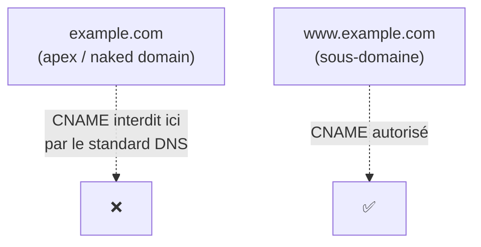

# Pourquoi Route 53 invente son propre type d'enregistrement

Route 53 propose un type d'enregistrement qui n'existe **pas** dans le standard DNS : l'**Alias**. Comprendre pourquoi il existe — et surtout la limite précise du CNAME qu'il contourne — est un classique quasi garanti de l'examen.

## Le problème : le CNAME ne peut pas être utilisé à l'apex

L'**apex** (ou zone apex, ou « naked domain ») est le nom de domaine **racine**, sans sous-domaine : `example.com`, par opposition à `www.example.com`.

La règle vient du standard DNS lui-même (RFC) : un nom qui a un enregistrement **CNAME** ne peut avoir **aucun autre enregistrement** (pas de NS, pas de MX, pas de SOA…) à ce même nom. Or l'apex d'une zone **doit obligatoirement** porter des enregistrements **SOA** et **NS** (ce sont les enregistrements qui définissent la zone elle-même). Un CNAME à l'apex entrerait donc en conflit direct avec ces enregistrements obligatoires — c'est **interdit**, quel que soit le fournisseur DNS.

Concrètement : impossible de faire `example.com → CNAME → mon-load-balancer.elb.amazonaws.com`. Seul un sous-domaine (`www.example.com`) peut utiliser un CNAME.

## La solution AWS : l'enregistrement Alias

L'**Alias** est une extension propriétaire de Route 53, qui se comporte comme un CNAME (pointe vers un nom de domaine, pas une IP) mais **sans cette restriction** : il **peut** être utilisé à l'apex.

| | CNAME | Alias |
|---|---|---|
| **Standard** | DNS standard (RFC) | Spécifique à Route 53 |
| **Utilisable à l'apex ?** | **Non** | **Oui** |
| **Cible** | N'importe quel nom de domaine | Uniquement des ressources AWS (ALB, CloudFront, S3 website endpoint, API Gateway, Global Accelerator, Elastic Beanstalk…) ou un autre enregistrement Route 53 de la même zone — jamais un domaine externe arbitraire |
| **Coût des requêtes** | Facturé normalement | **Gratuit** pour les requêtes vers des ressources AWS |
| **TTL** | Configurable manuellement | Géré automatiquement par Route 53 (non configurable) |
| **Détection de changement de cible** | Non — le CNAME renvoie le nom, à charge du client de le résoudre encore | Oui — Route 53 suit automatiquement le changement d'IP de la ressource cible (ex. IP d'un ALB qui change) |

> 🎯 **Piège d'examen —** un scénario qui décrit « on veut pointer `example.com` (sans `www.`) vers un Application Load Balancer » **élimine d'office le CNAME** (impossible à l'apex) — la réponse attendue est un **enregistrement Alias**. C'est l'un des pièges les plus fréquents du SAA-C03 : dès que l'énoncé mentionne l'apex/naked domain avec une ressource AWS, pense Alias.

## Quand utiliser CNAME quand même

Pour un sous-domaine (`www.example.com`, `api.example.com`) pointant vers une ressource **externe** à AWS (ex. un service tiers hors AWS), le CNAME classique reste tout à fait valide — l'Alias n'est utile que pour tirer parti des avantages listés ci-dessus (apex, gratuité, suivi automatique), en particulier vers des ressources AWS.

## À retenir

- Un CNAME ne peut **jamais** être posé à l'apex d'une zone (conflit avec les enregistrements SOA/NS obligatoires) — restriction du standard DNS, pas d'AWS.
- L'Alias est une extension Route 53 : utilisable à l'apex, gratuit vers des ressources AWS, suit automatiquement les changements d'IP de la cible.
- Réflexe d'examen : « apex/naked domain + ressource AWS » = **Alias**, jamais CNAME.
