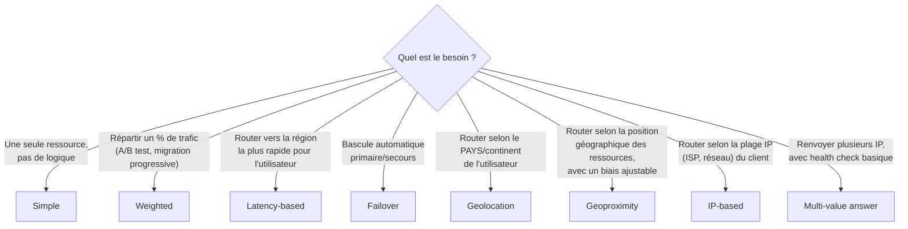

# Choisir comment Route 53 répond à une requête DNS

Une **routing policy** définit **comment** Route 53 choisit quelle réponse renvoyer parmi plusieurs enregistrements possibles pour un même nom. C'est un chapitre dense mais très rentable : chaque policy a un cas d'usage précis, et l'examen aime décrire un scénario métier pour te faire deviner laquelle s'applique.

## Les huit routing policies

| Policy | Logique | Cas d'usage typique |
|---|---|---|
| **Simple** | Une seule ressource (ou plusieurs valeurs choisies au hasard côté client, sans health check ni logique de bascule) | Un site avec un seul serveur, pas de besoin de répartition ni de failover |
| **Weighted** | Répartit le trafic selon un **poids** attribué à chaque enregistrement | A/B testing, migration progressive vers une nouvelle version (ex. 90 %/10 %), test canari |
| **Latency-based** | Renvoie la ressource dans la **région AWS** offrant la **latence réseau la plus faible** mesurée pour l'utilisateur | Application multi-région, on veut la meilleure expérience de latence pour chaque utilisateur, indépendamment de sa position géographique exacte |
| **Failover** | Actif/passif : sert la ressource **primaire** tant qu'un **health check** la juge saine, bascule sur la **secondaire** sinon | Site de secours (disaster recovery), page statique de maintenance en cas de panne |
| **Geolocation** | Route selon la **localisation géographique** de l'utilisateur (continent, pays, voire état US) | Restriction de contenu par pays (conformité, licences), localisation de contenu (langue), conformité réglementaire |
| **Geoproximity** | Route selon la position géographique des **ressources**, avec un **biais** ajustable pour étendre/réduire la zone couverte par une région | Ajuster finement quelle région sert quelle zone géographique, au-delà d'un découpage strict par pays (nécessite Route 53 Traffic Flow) |
| **IP-based** | Route selon la **plage IP (CIDR)** du client | Optimiser le routage pour un FAI/réseau d'entreprise précis, réduire les coûts réseau vers un fournisseur spécifique |
| **Multi-value answer** | Renvoie **jusqu'à 8** enregistrements sains (avec health check) dans la réponse DNS ; le client en choisit un | Répartition de charge simple côté client **avec** vérification de santé — **pas un substitut** à un Load Balancer, mais un plus par rapport à Simple |

## Zoom sur les distinctions les plus testées

> 🎯 **Piège d'examen —** **Geolocation** route selon la localisation de **l'utilisateur** (pays/continent) — utile pour de la conformité ou du contenu localisé, MÊME si la ressource la plus proche n'est pas la plus rapide. **Latency-based** route selon la **latence réseau mesurée**, sans notion de pays — utile pour la performance pure. Un énoncé qui parle de « restriction de contenu selon le pays » ou de conformité géographique pointe vers **Geolocation** ; un énoncé qui parle de « meilleure expérience utilisateur, la plus rapide possible » pointe vers **Latency-based**.

> 🎯 **Piège d'examen —** **Multi-value answer** n'est **pas** un Elastic Load Balancer : elle renvoie plusieurs adresses IP (max 8) avec un health check basique, mais ne fait ni répartition pondérée fine, ni terminaison SSL, ni routage applicatif (L7). C'est un plus par rapport à Simple (ajout du health check), pas un remplacement d'ALB/NLB.

> 🎯 **Piège d'examen —** **Geolocation** exige de définir un enregistrement **« Default »** pour couvrir les utilisateurs dont la localisation ne correspond à aucune règle explicite — sans lui, ces utilisateurs ne reçoivent **aucune réponse**.

## À retenir

- Simple = pas de logique. Weighted = répartition en %. Failover = actif/passif avec health check.
- Latency-based = performance réseau ; Geolocation = pays/conformité — ne pas confondre les deux.
- Geoproximity = position des ressources + biais ajustable (Traffic Flow) ; IP-based = plage CIDR du client.
- Multi-value answer = jusqu'à 8 IP avec health check, mais **pas** un substitut à un Load Balancer.
