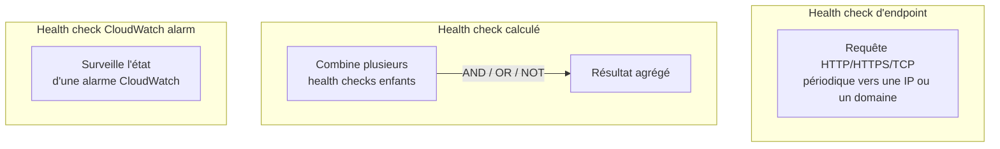
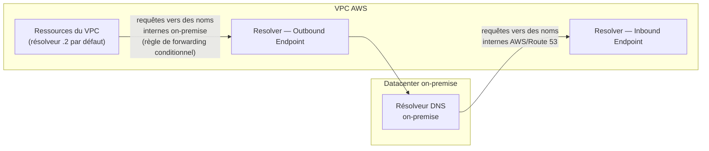

# Health checks : la brique derrière Failover et Multi-value

Plusieurs routing policies (Failover, Multi-value answer, et indirectement d'autres) s'appuient sur des **health checks** Route 53 pour savoir si une ressource est saine avant de la proposer en réponse DNS.

## Les trois types de health checks

| Type | Fonctionnement | Cas d'usage |
|---|---|---|
| **Endpoint health check** | Route 53 envoie des requêtes régulières (HTTP, HTTPS ou TCP) depuis un réseau mondial de vérificateurs vers une IP ou un nom de domaine, et attend un code de réponse sain | Vérifier qu'un serveur web ou une API répond correctement (souvent sur une route dédiée `/health`) |
| **Health check calculé** | Combine plusieurs health checks « enfants » avec une logique **AND / OR / NOT** ; jusqu'à 256 enfants | Ne considérer une ressource en panne que si **plusieurs** composants échouent en même temps (éviter un failover trop agressif sur un seul souci mineur) |
| **CloudWatch alarm health check** | Suit l'état (OK/ALARM) d'une **alarme CloudWatch** existante, plutôt que d'interroger un endpoint directement | Surveiller une ressource **non joignable directement** en HTTP/TCP depuis l'extérieur (ex. une base de données privée, une métrique applicative custom) |

> 🎯 **Piège d'examen —** pour surveiller une ressource qui n'a **pas d'endpoint HTTP/TCP public interrogeable** (ex. une instance RDS privée, une métrique métier comme un taux d'erreur applicatif remonté en CloudWatch), la réponse attendue est un **health check basé sur une alarme CloudWatch**, pas un endpoint health check classique (qui exige une adresse joignable directement par les vérificateurs Route 53).

## DNS hybride : Route 53 Resolver

Dans une architecture hybride (VPC + datacenter on-premise connectés via VPN/Direct Connect), il faut souvent que la résolution DNS **traverse la frontière** dans les deux sens : le réseau on-premise doit résoudre des noms internes AWS, et les ressources dans le VPC doivent résoudre des noms internes du datacenter.

- **Résolveur VPC par défaut** — chaque VPC dispose d'un résolveur DNS interne (souvent noté « adresse .2 du CIDR du VPC »), qui répond nativement pour les hosted zones privées et la résolution publique standard.
- **Route 53 Resolver Inbound Endpoint** — permet aux résolveurs **on-premise** d'envoyer des requêtes DNS **vers** le VPC (ex. résoudre le nom d'une hosted zone privée AWS depuis le réseau interne de l'entreprise).
- **Route 53 Resolver Outbound Endpoint** — permet aux ressources **du VPC** d'envoyer des requêtes DNS **vers** des résolveurs on-premise, via des **règles de forwarding conditionnel** (ex. « tout ce qui se termine par `.corp.local` part vers le résolveur interne de l'entreprise »).

> 🎯 **Piège d'examen —** un scénario de migration ou d'architecture hybride qui demande une résolution DNS **bidirectionnelle** entre VPC et datacenter on-premise pointe vers **Route 53 Resolver** avec ses endpoints **inbound** (entrant vers le VPC) **et** **outbound** (sortant du VPC) — pas vers un simple hosted zone classique, qui ne gère pas nativement la connectivité vers un résolveur externe.

## À retenir

- Endpoint health check = sonde HTTP/HTTPS/TCP directe. Calculé = agrège plusieurs checks (AND/OR/NOT). CloudWatch alarm = pour une ressource non directement joignable.
- Route 53 Resolver permet une résolution DNS hybride : Inbound Endpoint (on-prem → VPC), Outbound Endpoint (VPC → on-prem, via forwarding conditionnel).
- Failover et Multi-value answer s'appuient tous deux sur des health checks pour écarter une ressource défaillante des réponses DNS.
