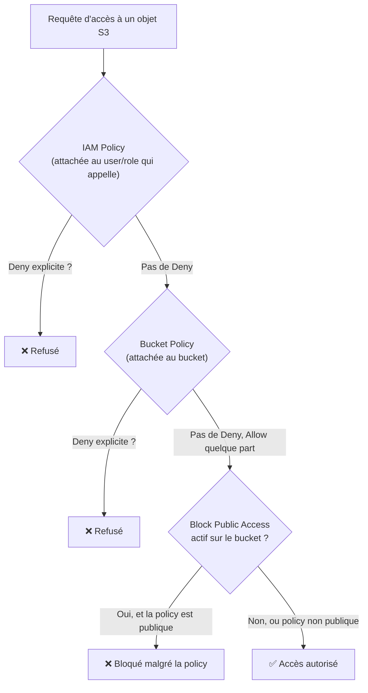

# S3 — le stockage objet universel d'AWS

**S3 (Simple Storage Service)** stocke des **objets** (fichiers, quelle que soit leur taille) dans des **buckets**. C'est probablement le service le plus transversal de l'examen : il apparaît en origine CloudFront, en cible de sauvegarde RDS, en datalake, en hébergement de site statique, en cible de réplication Storage Gateway…

> **Repère —** un bucket S3 n'est pas un système de fichiers hiérarchique : c'est un espace de clé/valeur plat. `photos/2024/vacances.jpg` n'est pas un vrai dossier `photos/2024/` — c'est une seule **clé** qui contient des `/`, affichée comme une arborescence dans la console pour le confort visuel (un peu comme un store Redis qui simule des « namespaces » avec des préfixes de clé).

## Buckets, objets, clés

- **Bucket** — un conteneur d'objets. Son **nom doit être unique globalement** (dans tout AWS, tous comptes confondus), mais les **données** d'un bucket sont physiquement stockées dans **une seule région** (celle choisie à la création).
- **Objet** — un fichier, identifié par une **clé** (le chemin complet, `dossier/fichier.ext`) au sein d'un bucket. Taille maximale d'un objet : **5 To**.
- Il n'existe pas de vraie notion de dossier : c'est un espace de noms **plat**, où le `/` dans une clé sert juste à la présentation.

## Contrôle d'accès : trois mécanismes, pas un seul



| Mécanisme | Portée | Usage typique |
|---|---|---|
| **IAM Policy** | Attachée à un **user/group/role** | Contrôler ce qu'une identité **AWS** peut faire, sur **plusieurs** buckets potentiellement |
| **Bucket Policy** | Attachée au **bucket lui-même** (JSON, comme une policy IAM mais côté ressource) | Autoriser un **accès public**, un accès **cross-account**, ou centraliser des règles au niveau du bucket |
| **ACL (Access Control List)** | Héritage historique, granularité par objet/bucket, très limité | **Déconseillé** par AWS aujourd'hui — préférer IAM/bucket policy dans la quasi-totalité des cas |

> 🎯 **Piège d'examen —** **Block Public Access** est une couche de sécurité **par-dessus** tout le reste : même si une bucket policy autorise explicitement un accès public, Block Public Access peut **bloquer quand même** cet accès si l'option correspondante est activée. C'est le garde-fou anti-erreur-de-configuration qu'AWS recommande de laisser activé par défaut, sauf besoin réel et assumé d'un bucket public (site statique, par exemple).

## Accès temporaire : les presigned URLs

Une **presigned URL** est une URL signée cryptographiquement, générée par une identité qui a déjà les permissions IAM nécessaires, donnant un accès **temporaire** (GET ou PUT) à un objet précis, à quelqu'un qui n'a **pas** de credentials AWS.

```bash
# Generate a presigned URL valid for 1 hour, using the caller's IAM credentials
aws s3 presign s3://sales-reports/2024/q1-report.pdf --expires-in 3600
```

Cas d'usage typiques : donner un lien de téléchargement temporaire à un client externe, permettre à une application front-end d'uploader directement vers S3 sans transiter par le backend.

## CORS : autoriser les appels cross-origin depuis un navigateur

Si une page web hébergée sur un domaine (`app.example.com`) doit appeler l'API S3 d'un bucket dans un contexte de navigateur (upload direct en JavaScript, chargement de police/font, requête XHR/fetch), il faut une configuration **CORS** sur le bucket, qui déclare les origines, méthodes et en-têtes autorisés — sans quoi le navigateur bloque la requête (règle du même-origin standard, pas spécifique à AWS).

## À retenir

- Nom de bucket unique globalement, mais données stockées dans **une seule région**. Espace de clés plat, pas une vraie arborescence.
- Trois mécanismes de contrôle d'accès : IAM Policy (identité), Bucket Policy (ressource), ACL (déprécié, à éviter).
- Block Public Access peut bloquer un accès **même si** la bucket policy l'autorise — c'est voulu.
- Presigned URL = accès temporaire sans credentials AWS côté client. CORS = indispensable pour un appel navigateur cross-origin.
