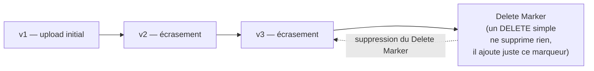
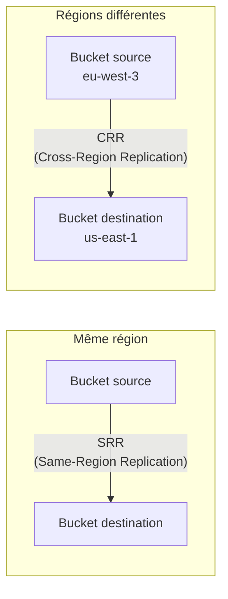

# Protéger les objets contre la suppression ou l'écrasement

Un bucket S3 sans protection particulière est vulnérable à une erreur humaine banale : un `DELETE` ou un `PUT` qui écrase la mauvaise version d'un fichier. S3 propose plusieurs couches de protection, indépendantes et cumulables.

## Versioning : garder l'historique des objets

Le **versioning** conserve **toutes les versions** d'un objet à chaque écrasement, au lieu de perdre l'ancienne version.

- Un `DELETE` sans préciser de version **n'efface rien physiquement** : il ajoute un **delete marker**, qui fait disparaître l'objet des listings normaux. Supprimer ce marqueur restaure l'objet.
- Pour supprimer **définitivement** une version précise, il faut un `DELETE` en visant explicitement son `versionId`.
- Une fois activé, le versioning ne peut être que **suspendu**, jamais désactivé rétroactivement (les versions déjà créées restent).

> 🎯 **Piège d'examen —** le versioning est un **prérequis obligatoire** pour la réplication (CRR/SRR) et pour Object Lock : impossible d'activer l'un sans l'autre.

## MFA Delete : une double authentification pour supprimer

**MFA Delete** exige un code MFA valide pour :
- supprimer **définitivement** une version d'objet,
- ou changer l'état de versioning du bucket lui-même (le suspendre).

Ne peut être activé/désactivé que par le **compte root**, via CLI/API (pas via la console). Protège contre une suppression accidentelle **ou** malveillante par un compte compromis n'ayant pas le second facteur.

## Object Lock : le WORM (Write Once, Read Many)

**Object Lock** empêche la suppression ou la modification d'une version d'objet pendant une période définie — nécessite le versioning activé.

| Mode | Qui peut outrepasser la protection ? | Cas d'usage |
|---|---|---|
| **Governance mode** | Un utilisateur avec une permission IAM spéciale (`s3:BypassGovernanceRetention`) peut lever la protection | Protection contre les suppressions accidentelles, avec une échappatoire pour les cas exceptionnels |
| **Compliance mode** | **Personne**, pas même le compte root, ne peut lever la protection avant expiration | Conformité réglementaire stricte (archivage légal, rétention obligatoire) |
| **Legal Hold** | Indépendant d'une durée : reste actif jusqu'à levée explicite | Blocage indéfini (ex. litige juridique en cours), sans date de fin connue à l'avance |

> 🎯 **Piège d'examen —** un scénario évoquant une **obligation réglementaire stricte** (santé, finance) où **même un administrateur AWS root** ne doit pas pouvoir supprimer les données avant l'échéance légale pointe vers le mode **Compliance**, pas Governance (qui garde toujours une échappatoire).

Pour un besoin équivalent sur **S3 Glacier** (hors S3 standard), il existe **Glacier Vault Lock** : une politique de rétention WORM qu'on peut **verrouiller définitivement**, non modifiable ensuite.

## Réplication : CRR et SRR

- **CRR (Cross-Region Replication)** — réplique vers un bucket d'une **autre région** : conformité géographique, latence de lecture réduite pour des utilisateurs distants, reprise après sinistre.
- **SRR (Same-Region Replication)** — réplique vers un bucket de la **même région** : agrégation de logs entre comptes, environnements de test à partir de la prod, exigence de séparation de compte.
- **Prérequis commun** : versioning activé **des deux côtés** (source et destination), et un rôle IAM autorisant S3 à répliquer.

> 🎯 **Piège d'examen —** la réplication S3 n'est **pas rétroactive** par défaut : seuls les objets créés **après** la mise en place de la règle sont répliqués. Pour répliquer les objets **déjà existants** au moment de la création de la règle, il faut lancer un job **S3 Batch Replication** séparément. Un scénario qui dit « on a activé la réplication mais les anciens fichiers n'apparaissent pas dans le bucket destination » décrit ce comportement attendu, pas un bug.

## À retenir

- Versioning : un DELETE simple pose un delete marker, il ne détruit rien ; prérequis pour réplication et Object Lock.
- MFA Delete : protège la suppression de version et le changement d'état de versioning, géré uniquement via le compte root.
- Object Lock : Governance (échappatoire IAM possible) vs Compliance (aucune échappatoire, même pour root) ; Legal Hold = durée indéfinie.
- CRR (autre région) / SRR (même région) : nécessitent le versioning des deux côtés, et ne sont **pas rétroactives** sans S3 Batch Replication.
