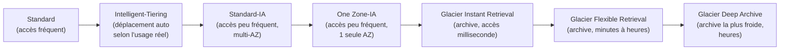
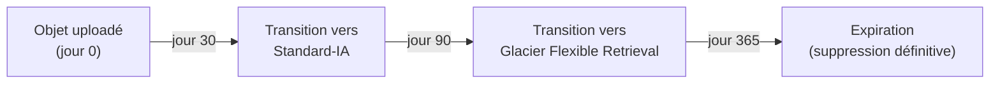

# Le sujet S3 le plus rentable de tout l'examen

Presque chaque session SAA-C03 contient une question « quelle classe de stockage pour ce scénario de coût/accès », et souvent une deuxième sur les **lifecycle rules** qui automatisent la transition entre classes. C'est un investissement à très haut rendement.

## Les classes de stockage, du plus chaud au plus froid

| Classe | Disponibilité | Répartition | Récupération | Coût de stockage | Cas d'usage |
|---|---|---|---|---|---|
| **Standard** | Très haute | Multi-AZ (≥3) | Immédiate | Le plus élevé des classes « chaudes » | Données consultées fréquemment, sans profil d'accès prévisible |
| **Intelligent-Tiering** | Très haute | Multi-AZ | Immédiate (tiers fréquent/instantané) | Petit frais de surveillance par objet, mais pas de frais de récupération | Profil d'accès **imprévisible/changeant** — laisser AWS déplacer automatiquement l'objet entre tiers selon l'usage réel |
| **Standard-IA** | Haute | Multi-AZ | Immédiate | Stockage moins cher que Standard, mais **frais de récupération** à l'accès | Données peu consultées mais devant rester disponibles **immédiatement** en cas de besoin (ex. sauvegardes de secours) |
| **One Zone-IA** | Haute, mais **une seule AZ** | 1 AZ | Immédiate | Moins cher que Standard-IA | Données peu consultées, **recréables** facilement (une perte d'AZ perd les données), ou copies secondaires |
| **Glacier Instant Retrieval** | Haute | Multi-AZ | **Millisecondes** | Très bas | Archive consultée rarement mais nécessitant un accès **instantané** si besoin (ex. imagerie médicale archivée) |
| **Glacier Flexible Retrieval** | Haute | Multi-AZ | Minutes (expedited) à heures (standard/bulk) | Plus bas encore | Archive, restauration **planifiable**, pas d'urgence à la milliseconde |
| **Glacier Deep Archive** | Haute | Multi-AZ | Heures (12h standard, jusqu'à 48h bulk) | Le plus bas de tous | Archivage **légal/réglementaire** de très longue durée, quasiment jamais consulté |

> 🎯 **Piège d'examen —** chaque classe **IA** (Standard-IA, One Zone-IA) et **Glacier** impose une **durée minimale de stockage facturée** (de l'ordre de 30 jours pour les IA, plus long pour les classes Glacier) : supprimer ou transitionner un objet **avant** cette durée minimale entraîne quand même des frais correspondant à la durée minimale. C'est un piège classique sur des scénarios de données à cycle de vie très court.

## Lifecycle rules : automatiser la transition et l'expiration

Une **lifecycle rule** applique automatiquement, selon l'**âge** d'un objet (ou de ses versions non courantes), deux types d'actions :

- **Transition actions** — déplacer l'objet vers une classe moins chère après un nombre de jours donné (ex. Standard → Standard-IA à J+30 → Glacier à J+90).
- **Expiration actions** — supprimer définitivement l'objet (ou ses versions non courantes / delete markers orphelins) après un délai.
- Applicable aussi aux **versions non courantes** d'un objet (utile pour ne garder l'historique complet qu'un temps limité, plutôt que pour toujours).

> 🎯 **Piège d'examen —** une lifecycle rule ne peut pas faire remonter un objet d'une classe froide vers une classe plus chaude (ex. Glacier → Standard) — ce sens de transition **n'existe pas**. Pour ré-accéder à un objet archivé en Glacier Flexible Retrieval ou Deep Archive, il faut lancer une opération de **restauration** (temporaire, avec un délai selon le tier de récupération choisi), qui crée une copie accessible pendant une durée limitée — l'objet reste stocké en Glacier, seule une copie temporaire redevient lisible.

## À retenir

- Ordre du plus chaud au plus froid : Standard → Intelligent-Tiering → Standard-IA → One Zone-IA → Glacier Instant → Glacier Flexible → Glacier Deep Archive.
- Intelligent-Tiering = laisser AWS gérer un profil d'accès imprévisible, sans frais de récupération.
- Chaque classe IA/Glacier a une **durée minimale de stockage facturée** — attention aux cycles de vie très courts.
- Lifecycle rules automatisent transitions + expirations, mais uniquement du chaud vers le froid — remonter au chaud nécessite une restauration explicite, pas une lifecycle rule.
