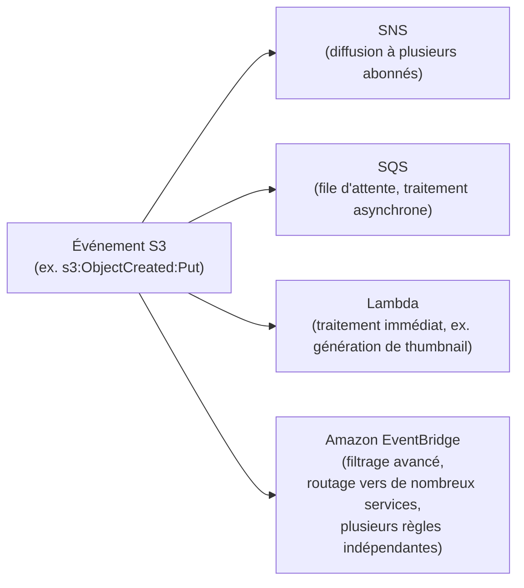

# Chiffrer, notifier, accélérer

Cette leçon regroupe trois familles de fonctionnalités S3 souvent testées ensemble : comment chiffrer les objets, comment réagir à un événement S3, et comment tirer le meilleur débit d'un bucket à fort trafic.

## Les quatre modes de chiffrement côté serveur

| Mode | Qui gère la clé ? | Particularité |
|---|---|---|
| **SSE-S3** | AWS, entièrement (clé gérée et tournée par S3) | Chiffrement **par défaut** sur tout nouveau bucket (AES-256), zéro configuration |
| **SSE-KMS** | AWS KMS (clé gérée par toi ou par AWS dans KMS) | Piste d'audit détaillée via CloudTrail (chaque usage de la clé est loggé) ; **soumis au quota d'appels API KMS** |
| **SSE-C** | **Toi**, entièrement (la clé est fournie à chaque requête, jamais stockée par AWS) | Responsabilité totale de la clé côté client ; AWS ne la conserve jamais |
| **DSSE-KMS** | AWS KMS, avec **double chiffrement** | Conformité renforcée (exigences réglementaires nécessitant deux couches de chiffrement indépendantes) |

> 🎯 **Piège d'examen —** SSE-KMS ajoute une dépendance aux **quotas d'appels API de KMS** (limite de requêtes par seconde, par région) : sur un bucket à **très fort trafic** (des milliers de GET/PUT par seconde), ce quota peut devenir un **goulot d'étranglement** et générer des erreurs de throttling. La parade recommandée est d'activer les **S3 Bucket Keys**, qui réduisent drastiquement le nombre d'appels à KMS (une clé de données mise en cache au niveau du bucket, réutilisée pour plusieurs opérations, plutôt qu'un appel KMS par objet).

Le **chiffrement par défaut** peut être forcé au niveau du bucket (tout objet uploadé sans en-tête explicite est chiffré automatiquement, selon le mode choisi).

## Notifications d'événements

S3 peut déclencher une notification à chaque événement (création, suppression, restauration d'objet…), vers trois destinations directes, ou vers EventBridge pour aller plus loin :

- **SNS / SQS / Lambda** — cibles directes historiques, simples à mettre en place pour un besoin ponctuel (ex. Lambda qui génère une miniature à chaque upload d'image).
- **EventBridge** — recommandé dès qu'on a besoin de **filtrage avancé** (par préfixe, par métadonnée), de **plusieurs règles indépendantes** sur les mêmes événements, ou de router vers des services non supportés directement par les notifications S3 classiques (Step Functions, etc.).

## Performance : upload et transfert

- **Multipart upload** — découpe un objet en plusieurs parties uploadées en parallèle. **Recommandé** au-delà d'environ 100 Mo, **obligatoire** au-delà de 5 Go (taille max d'un objet en un seul PUT). Accélère l'upload et permet de reprendre après échec d'une seule partie, sans tout recommencer.
- **S3 Transfer Acceleration** — route l'upload via le réseau d'**edge locations CloudFront**, optimisé pour les transferts longue distance (utilisateur loin de la région du bucket). Utilise une URL dédiée (`<bucket>.s3-accelerate.amazonaws.com`).
- **Préfixes de clé** — S3 partitionne automatiquement le stockage pour absorber une forte charge ; répartir les objets sur des **préfixes variés** (plutôt qu'un unique préfixe séquentiel comme un horodatage) aide S3 à monter en débit plus rapidement pour un trafic très intense.

> 🎯 **Piège d'examen —** un scénario qui décrit des utilisateurs uploadant depuis des zones géographiques **éloignées** de la région du bucket, avec une plainte sur la **lenteur d'upload**, pointe vers **Transfer Acceleration** — pas vers CloudFront classique (qui accélère surtout la **lecture**, pas l'écriture vers un bucket).

## Fonctionnalités complémentaires à connaître

| Fonctionnalité | Rôle |
|---|---|
| **Access Points** | Points d'accès nommés, chacun avec sa propre policy et son propre nom DNS — simplifie la gestion d'accès à un même bucket partagé par de nombreuses équipes/applications |
| **S3 Object Lambda** | Transforme la donnée **à la volée** au moment de la lecture (ex. masquage de données sensibles, redimensionnement d'image), sans dupliquer physiquement les objets |
| **Requester Pays** | Les frais de transfert/requête sont facturés au **demandeur**, pas au propriétaire du bucket — utile pour partager de gros jeux de données publiquement sans en supporter le coût |
| **S3 Storage Lens** | Tableau de bord d'analyse à l'échelle de l'organisation : usage, tendances, recommandations d'optimisation de coût (buckets sans lifecycle rule, par exemple) |

## À retenir

- SSE-S3 (par défaut, géré par AWS) / SSE-KMS (audit fin, mais quota API — S3 Bucket Keys pour limiter l'impact) / SSE-C (clé côté client) / DSSE-KMS (double chiffrement, conformité renforcée).
- Notifications directes (SNS/SQS/Lambda) pour un besoin simple ; EventBridge pour du filtrage avancé et plusieurs règles.
- Multipart upload conseillé >100 Mo, obligatoire >5 Go ; Transfer Acceleration pour des uploads longue distance.
- Access Points (accès partagé multi-équipes), Object Lambda (transformation à la volée), Requester Pays (facturer le demandeur), Storage Lens (visibilité et optimisation de coût).
