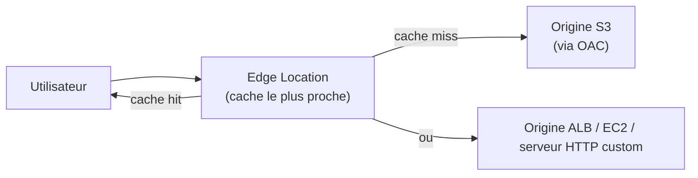

# CloudFront — rapprocher le contenu de l'utilisateur

**CloudFront** est le CDN (Content Delivery Network) d'AWS : il met en cache du contenu (statique ou dynamique) sur un réseau mondial d'**edge locations**, bien plus nombreuses que les régions AWS, pour réduire la latence perçue par l'utilisateur final.

> **Repère —** CloudFront devant S3 ou un ALB, c'est l'équivalent d'un **Varnish/reverse-proxy de cache** que tu placerais devant ton appli Symfony — sauf qu'ici, les caches sont déployés mondialement, gérés par AWS, avec de l'invalidation à la demande.

## Origines : S3 ou serveur HTTP custom

- **Origine S3** — pour du contenu statique (images, vidéos, site statique). L'accès direct au bucket doit être **bloqué publiquement**, et seul CloudFront doit pouvoir le lire, via **OAC (Origin Access Control)** — le mécanisme recommandé aujourd'hui (il remplace l'ancien OAI, Origin Access Identity, encore présent dans des architectures existantes).
- **Origine ALB / EC2 / serveur HTTP custom** — pour du contenu dynamique généré par une application.

> 🎯 **Piège d'examen —** sans OAC (ou OAI), un utilisateur pourrait contourner CloudFront et accéder **directement** à l'URL du bucket S3, en évitant totalement la couche de cache et de contrôle. OAC garantit que **seul CloudFront** peut lire le bucket — le bucket lui-même reste privé (Block Public Access activé).

## Cache et invalidation

- Chaque **cache behavior** (règle basée sur le chemin de la requête, ex. `/images/*` vs `/api/*`) définit sa propre politique de cache : TTL min/max/défaut, et éventuellement le cache selon des **en-têtes**, **cookies** ou **query strings** spécifiques.
- **Invalidation** — force le rafraîchissement d'un contenu déjà en cache avant l'expiration naturelle du TTL. Un certain volume d'invalidations est inclus gratuitement chaque mois, au-delà c'est facturé **par chemin invalidé**.

> 🎯 **Piège d'examen —** invalider systématiquement à chaque déploiement peut devenir coûteux et lent à grande échelle. L'alternative recommandée est le **cache-busting par nom de fichier versionné** (ex. `app.a1b2c3.js` au lieu de `app.js`) : un nouveau nom de fichier = une nouvelle clé de cache, sans jamais avoir besoin d'invalider quoi que ce soit.

## Restriction géographique et contenu protégé

- **Geo restriction** — au niveau de CloudFront, en liste blanche (whitelist) ou liste noire (blacklist) de pays, pour restreindre l'accès à un contenu selon la géolocalisation IP du visiteur. Plus simple à gérer qu'une restriction équivalente au niveau applicatif.
- **Signed URLs** — accès temporaire à **un seul fichier**, signé avec une clé privée associée à un **trusted key group**.
- **Signed Cookies** — accès temporaire à **plusieurs fichiers** (ex. tous les segments d'une vidéo en streaming), sans avoir à signer chaque URL individuellement — le cookie autorise l'accès à un ensemble de ressources.
- **Field-Level Encryption** — chiffre des champs spécifiques et sensibles (ex. numéro de carte bancaire) dès la saisie côté visiteur, avec une clé publique, de sorte que seuls certains composants applicatifs détenant la clé privée puissent les déchiffrer — une couche de défense en profondeur en plus du HTTPS classique, pour protéger des champs précis même si un composant intermédiaire est compromis.

## À retenir

- CloudFront cache du contenu (statique via S3, ou dynamique via ALB/EC2) au plus près de l'utilisateur, via les edge locations.
- OAC (remplace OAI) : seul CloudFront peut lire un bucket S3 origine, resté privé.
- Invalidation = coûteuse à grande échelle ; préférer le cache-busting par nom de fichier versionné.
- Signed URL (un fichier) vs Signed Cookies (plusieurs fichiers, ex. streaming) ; Field-Level Encryption protège des champs sensibles précis de bout en bout.
