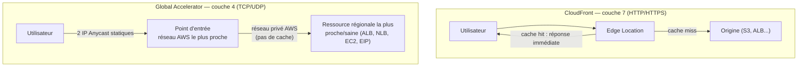

# Deux services qui « accélèrent », pour deux besoins différents

CloudFront et **Global Accelerator** sont souvent présentés côte à côte dans l'examen car les deux réduisent la latence perçue par l'utilisateur — mais ils n'agissent **pas à la même couche réseau**, et ne servent pas le même besoin.

## La différence fondamentale

| | CloudFront | Global Accelerator |
|---|---|---|
| **Couche réseau** | Application (L7 — HTTP/HTTPS) | Transport (L4 — TCP/UDP) |
| **Mise en cache** | **Oui** — c'est sa raison d'être | **Non** — aucun cache, juste du routage réseau optimisé |
| **Protocoles** | HTTP/HTTPS uniquement | **N'importe quel protocole TCP/UDP** (jeu vidéo, VoIP, IoT, protocoles propriétaires) |
| **Adresses IP** | Nom de domaine CloudFront (`d123.cloudfront.net`), IP variables | **2 adresses IP Anycast statiques**, fixes dans le temps |
| **Cas d'usage type** | Contenu statique/dynamique cacheable, streaming vidéo, API avec réponses cacheables | Contenu **non cacheable**, allow-listing d'IP en pare-feu, failover rapide multi-région pour du trafic non-HTTP, gaming/voix en temps réel |

> 🎯 **Piège d'examen —** un scénario qui mentionne le besoin d'**IP statiques à whitelister** dans un pare-feu d'entreprise partenaire élimine CloudFront (dont les IP ne sont pas garanties fixes) → **Global Accelerator**, qui fournit précisément 2 IP Anycast fixes. Un scénario qui parle de **contenu qui se met en cache** (assets statiques, vidéos, API à réponses cacheables) pointe vers **CloudFront**. Un scénario qui décrit un protocole **non-HTTP** (jeu multijoueur, VoIP) élimine CloudFront d'office (HTTP/HTTPS uniquement) → **Global Accelerator**.

## Comment Global Accelerator accélère, concrètement

Le trafic entre dans le **réseau privé backbone AWS** dès le point d'entrée le plus proche de l'utilisateur (via les mêmes edge locations que CloudFront), puis voyage sur ce réseau privé optimisé jusqu'à la ressource régionale la plus proche/saine — au lieu de transiter sur l'Internet public de bout en bout. Global Accelerator surveille aussi la santé des endpoints (ALB, NLB, EC2, Elastic IP) dans chaque région, et peut **rediriger automatiquement** le trafic vers une autre région saine en cas de panne, en quelques secondes, sans changement d'IP côté client (les 2 IP Anycast restent identiques).

## À retenir

- CloudFront = cache HTTP/HTTPS (L7). Global Accelerator = routage réseau optimisé, sans cache, tout protocole TCP/UDP (L4).
- Global Accelerator fournit 2 IP Anycast **statiques** — clé si un besoin de whitelisting d'IP est mentionné.
- Contenu cacheable/HTTP → CloudFront. Protocole non-HTTP, IP fixes, ou failover rapide multi-région sans cache → Global Accelerator.
