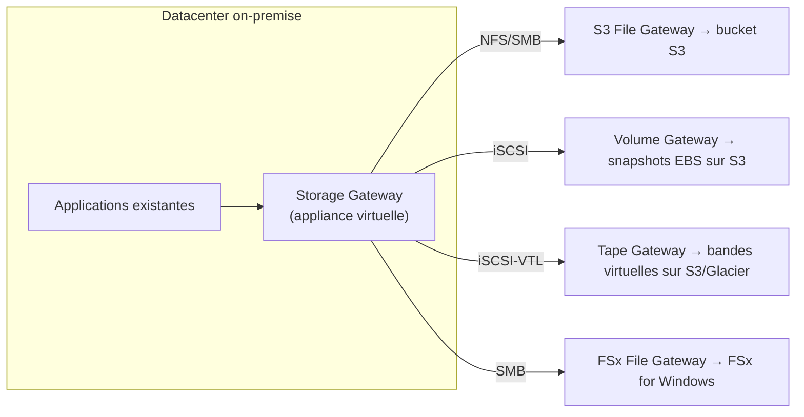

# Les briques du stockage hybride et spécialisé

Après S3 (stockage objet universel) et EBS/EFS (vus au module EC2), il reste une famille de services pour des besoins plus spécifiques : systèmes de fichiers spécialisés (**FSx**) et passerelles hybrides on-premise ↔ AWS (**Storage Gateway**, **Transfer Family**, **DataSync**).

## FSx : des systèmes de fichiers managés, par cas d'usage

| Variante | Protocole | Cas d'usage |
|---|---|---|
| **FSx for Windows File Server** | SMB | Applications **Windows** nécessitant un partage de fichiers natif, avec intégration **Active Directory** et ACL Windows |
| **FSx for Lustre** | POSIX (Lustre) | **Calcul haute performance (HPC)** : machine learning, rendu vidéo, modélisation financière — peut se lier directement à un bucket S3 comme dépôt de données (chargement paresseux depuis S3, réécriture vers S3) |
| **FSx for NetApp ONTAP** | NFS / SMB / iSCSI (multi-protocole) | Migration (« lift-and-shift ») de charges de travail **NetApp on-premise** existantes, avec leurs fonctionnalités habituelles (snapshots, clonage) |
| **FSx for OpenZFS** | NFS | Charges de travail **Linux** nécessitant les fonctionnalités ZFS (snapshots, clonage rapide) avec une **faible latence** |

> 🎯 **Piège d'examen —** un scénario mentionnant explicitement **Windows + Active Directory + partage SMB** pointe vers **FSx for Windows File Server** ; un scénario mentionnant **HPC/ML avec S3 comme source de données** pointe vers **FSx for Lustre** ; un scénario mentionnant une migration depuis une infrastructure **NetApp existante** pointe vers **FSx for NetApp ONTAP**. Le nom du cas d'usage dans l'énoncé trahit presque toujours la variante attendue.

## Storage Gateway : ponter le on-premise et AWS

**Storage Gateway** connecte une infrastructure **on-premise** à du stockage AWS, en présentant une interface familière (fichier, bloc, ou bande) côté datacenter.

| Type de gateway | Interface côté on-premise | Ce qu'elle expose côté AWS |
|---|---|---|
| **S3 File Gateway** | Partage de fichiers NFS/SMB | Objets dans un bucket **S3** (avec cache local des données les plus utilisées) |
| **FSx File Gateway** | Partage de fichiers SMB | Accès **faible latence** à un système de fichiers **FSx for Windows** géré |
| **Volume Gateway** | Disque iSCSI | Deux modes : **Cached** (donnée principale dans S3, cache local des données actives) ou **Stored** (donnée principale on-premise, sauvegarde asynchrone en snapshots EBS vers S3) |
| **Tape Gateway** | Bibliothèque de bandes virtuelle (iSCSI-VTL) | Remplace des bandes physiques par du stockage **S3/Glacier**, compatible avec les logiciels de sauvegarde existants sans migration d'outillage |

> 🎯 **Piège d'examen —** une entreprise qui utilise encore un logiciel de sauvegarde legacy pensé pour des **bandes physiques**, et qui veut migrer vers le cloud **sans changer son outillage de sauvegarde**, pointe vers **Tape Gateway** — la seule variante qui simule une bibliothèque de bandes.

## Transfer Family et DataSync : les deux à ne pas confondre

- **AWS Transfer Family** — expose des **endpoints managés SFTP/FTPS/FTP**, adossés à S3 ou EFS. Utile pour des workflows **B2B existants** basés sur ces protocoles historiques, sans avoir à héberger et maintenir son propre serveur FTP.
- **AWS DataSync** — **transfert de données automatisé** (pas un accès permanent) entre un stockage on-premise (NFS/SMB) et AWS (S3, EFS, FSx), ou même entre deux services AWS. Fonctionne via un **agent** installé on-premise, avec planification, chiffrement en transit, et validation d'intégrité automatique.

> 🎯 **Piège d'examen —** ne pas confondre **Storage Gateway** (fournit un **accès continu**, façon système de fichiers/volume/bande, à du stockage AWS depuis le on-premise) et **DataSync** (effectue un **transfert ponctuel ou planifié**, façon synchronisation en masse, sans exposer d'interface de fichier permanente). Un scénario qui parle de « migrer une fois pour toutes » ou « synchroniser régulièrement un dossier vers S3 » pointe vers **DataSync** ; un scénario qui parle d'un « accès quotidien continu façon partage réseau » pointe vers **Storage Gateway**.

## Le tableau final : toutes les options de stockage comparées

| Service | Type | Accès | Cas d'usage clé |
|---|---|---|---|
| **S3** | Objet | HTTP(S) / API | Stockage universel, statique, datalake, sauvegardes, origine CloudFront |
| **EBS** | Bloc | Attaché à **une** instance EC2, dans **une** AZ | Disque d'une base de données, d'un système de fichiers d'instance |
| **EFS** | Fichier (NFS) | Partagé par **plusieurs** instances/AZ simultanément | Stockage de fichiers partagé, Linux, élastique |
| **FSx for Windows** | Fichier (SMB) | Partagé, intégré Active Directory | Applications Windows, partages d'entreprise |
| **FSx for Lustre** | Fichier (POSIX) | Partagé, très haute performance | HPC, ML, traitement massivement parallèle |
| **FSx for NetApp ONTAP** | Fichier multi-protocole | Partagé | Migration depuis une infra NetApp existante |
| **FSx for OpenZFS** | Fichier (NFS) | Partagé, faible latence | Charges Linux avec snapshots ZFS |
| **Storage Gateway** | Hybride (fichier/bloc/bande) | On-premise ↔ AWS, accès continu | Ponter une infra existante vers AWS sans réécrire les applications |
| **Snow Family** | Transport physique | Appareil physique expédié | Migration massive quand le réseau est trop lent/absent |
| **Transfer Family** | Fichier (SFTP/FTPS/FTP) | Endpoint managé adossé à S3/EFS | Workflows B2B legacy sans héberger de serveur FTP |
| **DataSync** | Transfert automatisé | Synchronisation planifiée/ponctuelle | Migration ou synchro récurrente on-premise ↔ AWS (ou AWS ↔ AWS) |

## À retenir

- FSx se choisit par le mot-clé métier : Windows/AD → Windows File Server ; HPC/ML + S3 → Lustre ; NetApp existant → ONTAP ; Linux/ZFS → OpenZFS.
- Storage Gateway = accès **continu** on-premise vers AWS (fichier/bloc/bande) ; DataSync = transfert **automatisé, planifié**, pas un accès permanent.
- Tape Gateway est la seule variante pensée pour un outillage de sauvegarde legacy basé sur des bandes.
- Snow Family reste la référence quand le volume rend le transfert réseau trop long — le tableau final ci-dessus sert de rappel transversal pour tout choix de stockage à l'examen.
