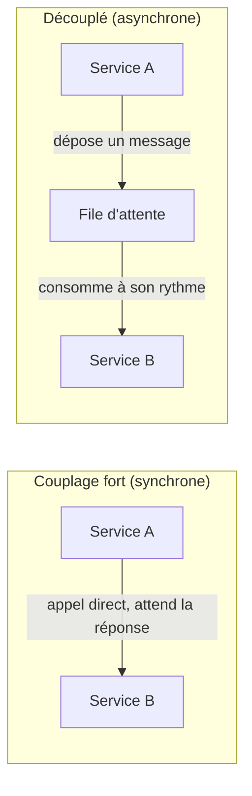
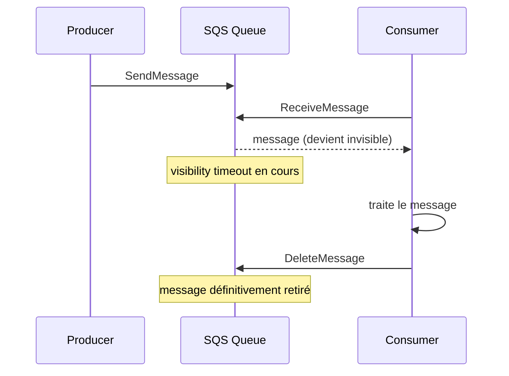

# Découpler une architecture : de synchrone à asynchrone

Dans une architecture **synchrone**, un service appelle directement un autre et **attend sa réponse** : si le service appelé est lent, en panne, ou reçoit un pic de trafic, l'appelant est bloqué — et l'échec se propage en cascade. Une architecture **découplée** insère une **file d'attente** entre producteur et consommateur : le producteur dépose un message et continue son travail, le consommateur traite à son rythme.

Les bénéfices du découplage : **absorber les pics** (la file joue le rôle de tampon), **isoler les pannes** (une panne du consommateur ne bloque pas le producteur), et **scaler indépendamment** chaque côté.

## SQS : la file d'attente managée

**Amazon SQS** (Simple Queue Service) est un service de file d'attente entièrement managé, en mode **pull** : les consommateurs interrogent activement la file (`ReceiveMessage`) pour récupérer des messages — SQS ne pousse rien.

- Taille max d'un message : **256 KB**.
- Rétention par défaut : **4 jours**, configurable de **1 minute à 14 jours** — passé ce délai, un message non traité est perdu définitivement.
- Livraison **at-least-once** : un message peut, dans de rares cas, être délivré plus d'une fois. Le traitement côté consommateur doit donc être **idempotent**.

## Le visibility timeout : LE piège de l'examen

Quand un consommateur récupère un message via `ReceiveMessage`, SQS ne le **supprime pas** immédiatement — il le rend **invisible** aux autres consommateurs pendant une durée appelée **visibility timeout** (30 secondes par défaut). Le consommateur doit appeler `DeleteMessage` une fois le traitement terminé avec succès.

> 🎯 **Piège d'examen —** si le **traitement du message dure plus longtemps que le visibility timeout**, SQS considère le message comme non traité et le rend à nouveau visible : un **autre consommateur peut le récupérer et le traiter en double**, pendant que le premier travaille toujours dessus. La correction n'est **pas** de réduire le timeout, mais de le **dimensionner au-dessus du temps de traitement maximum attendu**, ou d'appeler `ChangeMessageVisibility` pour l'étendre dynamiquement si le traitement prend plus de temps que prévu.

## Long polling : réduire le coût et la latence

Par défaut, un `ReceiveMessage` répond **immédiatement**, même s'il n'y a aucun message (réponse vide) — c'est le **short polling**, qui multiplie les appels inutiles. En activant le **long polling** (`ReceiveMessageWaitTimeSeconds` jusqu'à **20 secondes**), SQS **attend** qu'un message soit disponible avant de répondre (ou jusqu'à expiration du délai), ce qui réduit le nombre d'appels API vides et donc le coût, sans perte de réactivité notable.

## Dead-Letter Queue (DLQ) : isoler les messages qui échouent

Un message qui échoue de façon répétée (bug applicatif, donnée invalide) reste sinon indéfiniment retraité — un « **poison pill** » qui bloque la file. En configurant une **DLQ** avec un `maxReceiveCount`, SQS redirige automatiquement un message vers cette file séparée après le nombre d'échecs de traitement défini, permettant de l'analyser hors du flux normal sans bloquer les autres messages.

## SQS + Auto Scaling Group : scaler sur la profondeur de la file

Pour une flotte de workers qui consomment une file (traitement asynchrone en arrière-plan, sans utilisateur en attente direct), la bonne métrique de scaling n'est **pas** le CPU mais la **profondeur de la file** — typiquement `ApproximateNumberOfMessagesVisible` divisé par le nombre d'instances (backlog per instance), publiée comme métrique CloudWatch personnalisée et utilisée par une politique de scaling de l'ASG.

## À retenir

- SQS = file **pull**, at-least-once, message max 256 KB, rétention 1 min à 14 jours (défaut 4 jours).
- Visibility timeout : doit couvrir le **temps de traitement réel**, sinon double traitement — jamais l'inverse.
- Long polling (jusqu'à 20 s) réduit le coût des appels vides. DLQ isole les messages qui échouent en boucle (`maxReceiveCount`).
- Un worker fleet consommant une file scale sur la **profondeur de la file** (backlog per instance), pas sur le CPU.
