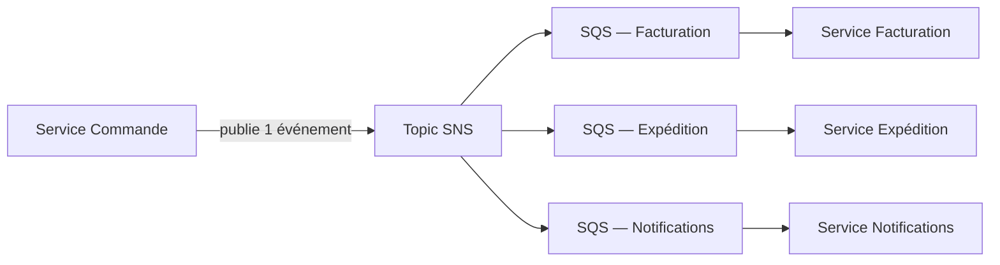

# SQS FIFO : quand l'ordre compte

Une file **SQS standard** garantit un traitement **at-least-once**, mais **ne garantit pas l'ordre** strict des messages, et un même message peut occasionnellement être délivré plusieurs fois. Pour des cas où l'ordre et l'unicité sont critiques (ex. traiter les transactions d'un compte dans l'ordre chronologique), on utilise une **file FIFO** (suffixe obligatoire `.fifo` dans le nom).

| Caractéristique | SQS Standard | SQS FIFO |
|---|---|---|
| Ordre | best-effort, non garanti | garanti **au sein d'un même Message Group ID** |
| Livraison | at-least-once (doublons possibles) | **exactly-once processing** (dédoublonnage automatique) |
| Débit | quasiment illimité | limité (jusqu'à ~3 000 messages/s avec batching, par groupe) — un ordre de grandeur bien inférieur au Standard |
| Déduplication | non | fenêtre de **5 minutes**, via un `MessageDeduplicationId` explicite ou en **content-based dedup** (hash du corps du message) |

- Le **Message Group ID** permet de paralléliser : l'ordre est garanti **à l'intérieur** d'un groupe, mais des groupes différents peuvent être traités en parallèle par des consommateurs différents.

> 🎯 **Piège d'examen —** un scénario qui insiste sur un **débit très élevé sans besoin d'ordre strict** pointe vers **Standard**. Un scénario qui insiste sur « traiter dans l'ordre exact » ou « éviter les doublons de traitement » (ex. transactions financières séquentielles) pointe vers **FIFO** — au prix d'un débit plus limité.

## SNS : la diffusion publish/subscribe

**SNS** (Simple Notification Service) fonctionne en mode **push**, à l'opposé du pull de SQS : un producteur publie un message sur un **topic**, et SNS le **pousse immédiatement** vers tous les abonnés (SQS, Lambda, HTTP/S, email, SMS, notifications mobiles).

- Un topic peut avoir de **multiples abonnés**, chacun recevant une copie du message.
- Le **message filtering** (via une *filter policy* JSON sur chaque abonnement) permet à chaque abonné de ne recevoir **que les messages qui l'intéressent**, sans avoir à filtrer lui-même côté consommateur — le filtrage se fait **côté SNS**, avant l'envoi.

## Le fan-out SNS + SQS : LE pattern d'examen

Le pattern **fan-out** combine SNS et SQS : un seul message publié sur un topic SNS est **répliqué vers plusieurs files SQS** abonnées, chacune consommée indépendamment par un système différent.

Pourquoi ce pattern plutôt qu'un envoi direct SNS → Lambda/HTTP vers chaque système, ou qu'une seule file SQS lue par plusieurs consommateurs ?

- **Durabilité par abonné** : si le service Expédition est en panne, ses messages **s'accumulent dans sa propre file SQS** sans rien perdre, et sans affecter Facturation ou Notifications.
- **Traitement indépendant** : chaque système consomme à son propre rythme, avec son propre visibility timeout, sa propre DLQ.
- Contrairement à une file SQS **unique** partagée par plusieurs consommateurs (où chaque message n'est traité **qu'une fois**, par un seul consommateur), le fan-out garantit que **chaque système reçoit sa propre copie** de **tous** les messages.

> 🎯 **Piège d'examen —** un énoncé du type « un événement de commande doit déclencher **plusieurs traitements indépendants** (facturation, expédition, notification), chacun devant continuer à fonctionner même si un autre système est en panne » décrit très précisément le fan-out SNS + SQS. Une seule file SQS ne suffit pas ici : elle ne délivrerait le message **qu'à un seul** des trois systèmes.

Il existe aussi des **topics SNS FIFO**, pouvant être associés à des files SQS FIFO en aval, pour un fan-out qui préserve l'ordre de bout en bout.

## À retenir

- SQS FIFO : ordre garanti par Message Group ID, exactly-once (dédup 5 min), débit plus limité que Standard.
- SNS : push, pub/sub, message filtering côté abonnement (chaque abonné ne reçoit que ce qui le concerne).
- Fan-out SNS + SQS : un événement, plusieurs systèmes indépendants, chacun avec sa file durable — LE pattern à reconnaître à l'examen.
