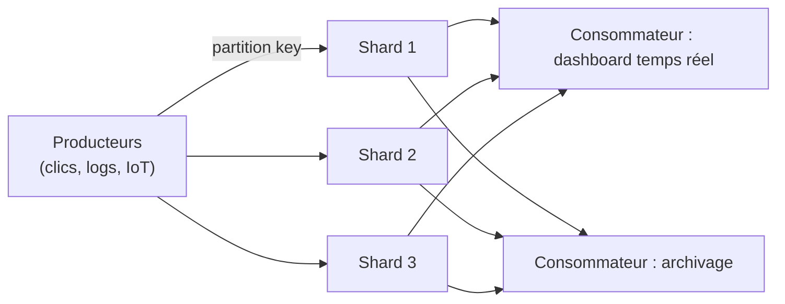

# Kinesis Data Streams : le streaming temps réel

**Kinesis Data Streams** ingère un flux continu et massif de données (logs applicatifs, clics, métriques IoT) et permet à **plusieurs consommateurs indépendants** de lire — et **relire** — les mêmes données, dans une fenêtre de rétention configurable.

- La capacité s'organise en **shards** : chaque shard supporte en écriture ~1 MB/s (ou 1 000 records/s), et en lecture ~2 MB/s en mode standard (ou un débit dédié par consommateur en **enhanced fan-out**).
- L'**ordre n'est garanti qu'au sein d'un même shard**, déterminé par la **partition key** de chaque enregistrement : tous les enregistrements portant la même clé vont systématiquement dans le même shard, et y sont lus dans l'ordre d'écriture.
- **Rétention** : 24 heures par défaut, extensible jusqu'à 365 jours — contrairement à SQS, les données **restent lisibles** par plusieurs consommateurs tant qu'elles n'ont pas expiré (pas de suppression à la lecture).
- Plusieurs applications consommatrices peuvent lire le **même flux en parallèle**, indépendamment les unes des autres (ex. une application d'analytics temps réel et une application d'archivage lisent le même stream sans interférer).

> 🎯 **Piège d'examen —** un événement avec la même **partition key** (ex. un `user_id`) va **toujours** dans le même shard : c'est ce qui garantit l'ordre **par utilisateur**, mais **pas** l'ordre global entre utilisateurs différents. Si un scénario exige un ordre strict et global, il faut concentrer les données sur un seul shard (ou repenser la clé) — ce qui limite fortement le débit.

## Kinesis Data Firehose : livraison managée, sans code de consommateur

**Data Firehose** ingère aussi un flux, mais avec un objectif différent : **livrer automatiquement** les données vers une destination de stockage/analytics (S3, Redshift via S3, OpenSearch, endpoints tiers), **sans qu'il soit nécessaire d'écrire un consommateur**.

- Firehose **bufferise** les données (par taille ou par durée, avec un minimum de l'ordre de la minute) avant de les livrer — c'est du **quasi temps réel** (near real-time), pas du temps réel strict comme Data Streams.
- Peut invoquer une **fonction Lambda** pour transformer les enregistrements avant livraison (ex. format JSON → Parquet).
- **Aucune gestion de shard** : Firehose scale automatiquement selon le débit.
- Les données livrées **ne sont pas rejouables** depuis Firehose lui-même (une fois écrites dans la destination, il n'y a plus de fenêtre de relecture côté Firehose).

> 🎯 **Piège d'examen —** si l'énoncé demande d'écrire du **code de traitement personnalisé en temps réel** avec la possibilité de **relire l'historique**, c'est **Data Streams**. Si l'énoncé demande simplement de **charger un flux dans S3/Redshift/OpenSearch** sans logique de traitement complexe, c'est **Firehose** — plus simple à opérer, sans infrastructure de consommateur à gérer.

## SQS vs SNS vs Kinesis : LE tableau d'examen

| Critère | SQS | SNS | Kinesis Data Streams |
|---|---|---|---|
| Modèle | file d'attente, **pull** | pub/sub, **push** | flux ordonné, **pull** (multi-consommateurs) |
| Qui consomme un message | **un seul** consommateur (le message disparaît après traitement) | **tous** les abonnés (chacun reçoit sa copie) | **plusieurs** consommateurs indépendants, en parallèle |
| Ordre | best-effort (Standard) / garanti par groupe (FIFO) | non garanti (best-effort) / FIFO topic disponible | garanti **par shard** (partition key) |
| Rejeu possible | non (message supprimé une fois traité) | non (pas de stockage, livraison immédiate) | **oui**, tant que dans la fenêtre de rétention (24h à 365j) |
| Débit | quasi illimité (Standard) | quasi illimité | dépend du nombre de shards (scalable en ajoutant des shards) |
| Cas d'usage typique | découpler un traitement asynchrone, buffer de charge | notifier plusieurs systèmes/personnes d'un événement | streaming temps réel, analytics, agrégation de logs/clics à grande échelle |

## Amazon MQ : quand SQS/SNS ne suffisent pas

**Amazon MQ** est un broker de messages managé qui supporte des **protocoles standards ouverts** — **JMS, AMQP, MQTT, STOMP, WebSocket** — contrairement à SQS/SNS qui exposent des API **propriétaires AWS**.

> 🎯 **Piège d'examen —** Amazon MQ est la réponse quand l'énoncé décrit une **application existante qui utilise déjà un broker traditionnel** (ActiveMQ, RabbitMQ) via des protocoles standards, et qu'on veut **migrer vers le cloud sans réécrire le code applicatif**. Si l'application est **nouvelle** (green-field), SQS/SNS restent le choix par défaut, plus scalables et moins coûteux à opérer.

## À retenir

- Kinesis Data Streams : shards, ordre par partition key, plusieurs consommateurs indépendants, rejouable (24h-365j).
- Data Firehose : livraison managée near real-time vers S3/Redshift/OpenSearch, pas de code consommateur, pas rejouable.
- SQS = un seul consommateur par message ; SNS = tous les abonnés ; Kinesis = plusieurs consommateurs, ordonné, rejouable.
- Amazon MQ = protocoles standards (JMS/AMQP/MQTT), pour migrer une appli existante — sinon SQS/SNS par défaut.
