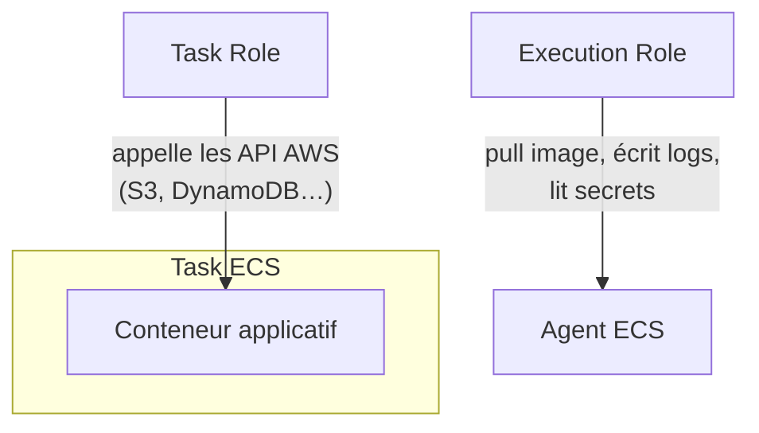
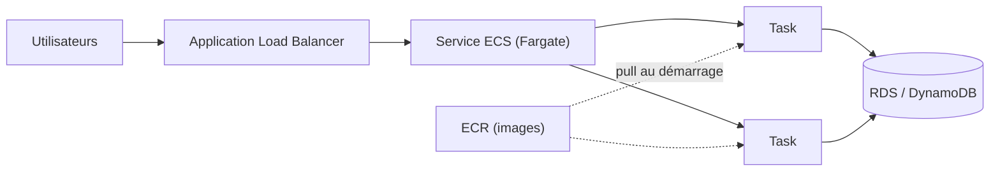

# ECS : orchestrer des conteneurs sur AWS

**Amazon ECS** (Elastic Container Service) est le service d'orchestration de conteneurs natif d'AWS. Trois notions clés :

- **Task definition** : un plan décrivant un ou plusieurs conteneurs (image, CPU/mémoire, ports, variables d'environnement, rôles IAM) — l'équivalent d'un `docker-compose.yml` versionné.
- **Task** : une instance en cours d'exécution d'une task definition.
- **Service** : maintient un **nombre désiré** de tasks en permanence (relance une task qui plante), et s'intègre à un **Load Balancer** pour répartir le trafic entrant.

## EC2 vs Fargate : deux launch types

| | Launch type EC2 | Launch type Fargate |
|---|---|---|
| Qui gère les serveurs ? | **toi** (instances EC2, AMI optimisée ECS, patching) | **AWS** — aucun serveur à gérer |
| Facturation | à l'instance EC2 sous-jacente, qu'elle soit pleinement utilisée ou non | à la **tâche**, au vCPU/mémoire réellement alloués, à la seconde |
| Contrôle | fin (choix du type d'instance, Spot possible pour réduire les coûts) | limité (pas d'accès à l'hôte) |
| Cas d'usage | optimiser le coût à grande échelle, besoins spécifiques (GPU, instance store) | simplicité opérationnelle, charges variables, équipes qui ne veulent pas gérer de serveurs |

> 🎯 **Piège d'examen —** un énoncé qui insiste sur « **sans gérer de serveurs** » ou « **sans provisionner d'infrastructure** » pointe vers **Fargate**. Un énoncé qui insiste sur le **contrôle fin des coûts avec des instances Spot** ou un besoin **matériel spécifique** (GPU, instance store local) pointe vers le launch type **EC2**.

## Task role vs execution role : LE piège de confusion

- **Task role** : le rôle IAM assumé par le **code applicatif** à l'intérieur du conteneur pour appeler des API AWS pendant son exécution (ex. lire/écrire dans S3, DynamoDB).
- **Execution role** : le rôle utilisé par **l'agent ECS lui-même** (pas ton code) pour les actions d'infrastructure nécessaires au démarrage de la task : **tirer l'image depuis ECR**, écrire les logs vers CloudWatch Logs, récupérer des secrets depuis Secrets Manager/SSM Parameter Store référencés dans la task definition.

> 🎯 **Piège d'examen —** si une task ECS échoue à **démarrer** avec une erreur de type « impossible de tirer l'image » ou « impossible d'écrire les logs », le problème vient presque toujours de l'**execution role**. Si l'application démarre correctement mais échoue à **appeler une API AWS pendant son exécution** (ex. `AccessDenied` sur un `PutObject` S3), le problème vient du **task role**. Confondre les deux est l'erreur la plus fréquente sur ce sujet.

## Service Auto Scaling

Un service ECS peut scaler automatiquement son nombre de tasks via **Application Auto Scaling**, en fonction :
- du **CPU/mémoire moyen** du service,
- ou d'une métrique **CloudWatch personnalisée**, comme le nombre de requêtes par target d'un ALB (`ALBRequestCountPerTarget`) — utile pour scaler sur la charge **réellement perçue par utilisateur**, pas seulement la charge machine.

## ECR : le registre d'images

**Amazon ECR** (Elastic Container Registry) est un registre Docker privé et managé : stockage des images, **scan de vulnérabilités** intégré, permissions via IAM (qui peut pousser/tirer quelle image), intégration native avec ECS/EKS/Fargate sans configuration supplémentaire.

## EKS : quand choisir Kubernetes managé

**Amazon EKS** (Elastic Kubernetes Service) est le **control plane Kubernetes managé** par AWS. Les tasks/pods peuvent tourner sur des nœuds EC2 **ou** en Fargate (EKS supporte aussi le launch type serverless).

> 🎯 **Piège d'examen —** choisir **EKS** plutôt qu'**ECS** se justifie quand : l'équipe a déjà une **expertise Kubernetes** ou des workloads existants sur K8s ; l'organisation vise le **multi-cloud** ou la **portabilité** (Kubernetes est un standard open-source, ECS est propriétaire AWS) ; ou le projet dépend d'outils spécifiques à l'écosystème K8s (Helm, opérateurs, CRDs). En dehors de ces besoins précis, **ECS** reste plus simple à opérer et suffit à la grande majorité des cas — c'est le choix par défaut sur AWS quand rien dans l'énoncé ne mentionne Kubernetes explicitement.

## Architecture conteneur classique

Un service ECS Fargate derrière un ALB, les images versionnées dans ECR, les tasks accédant à une base via leur **task role**, et l'ensemble scalé automatiquement sur la charge — c'est l'architecture conteneur la plus fréquemment décrite à l'examen.

## À retenir

- ECS : task definition (plan), task (instance), service (maintient N tasks + intégration ALB).
- EC2 launch type = tu gères les serveurs (coût optimisable, Spot possible) ; Fargate = serverless, facturé à la tâche.
- Task role = permissions de l'appli ; execution role = permissions de l'agent ECS (pull image, logs, secrets) — piège classique.
- ECR = registre d'images managé avec scan de vulnérabilités. EKS = Kubernetes managé, pour expertise K8s existante ou besoin de portabilité — sinon ECS par défaut.
