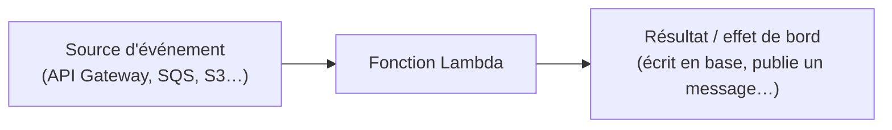

# Lambda : exécuter du code sans gérer de serveur

**AWS Lambda** exécute une fonction en réponse à un **événement** (requête API Gateway, message SQS, upload S3, planification CloudWatch Events…), dans un **environnement d'exécution éphémère**, sans qu'aucun serveur ne soit à provisionner ou patcher. La facturation se fait à l'**invocation** et à la **durée d'exécution** (à la milliseconde).

## Limites à connaître (ordres de grandeur)

| Ressource | Limite |
|---|---|
| Timeout maximum | **15 minutes** |
| Mémoire | de 128 MB à **10 GB**, configurable (le CPU alloué **augmente proportionnellement** à la mémoire) |
| Stockage éphémère `/tmp` | jusqu'à 10 GB, configurable |
| Concurrence par défaut (compte/région) | de l'ordre du millier d'exécutions simultanées (augmentable sur demande) |

> 🎯 **Piège d'examen —** Lambda n'est **pas** adapté à un traitement qui dépasse **systématiquement** 15 minutes (batch long, traitement vidéo lourd) — il faut alors se tourner vers ECS/Fargate ou un job Batch. C'est une confusion fréquente : « serverless » ne veut pas dire « sans limite ».

## Concurrence : reserved vs provisioned

- **Reserved concurrency** : réserve (et **plafonne**) un nombre d'exécutions simultanées pour une fonction précise — garantit de la capacité à une fonction critique tout en **l'empêchant** de dépasser ce plafond (protection contre l'emballement, mais aussi limite dure).
- **Provisioned concurrency** : maintient un nombre défini d'environnements d'exécution **déjà initialisés et prêts** — élimine le cold start pour ce volume d'invocations, au prix d'une facturation même en l'absence de trafic.

## Cold start : le prix de l'élasticité

Quand Lambda doit créer un **nouvel environnement d'exécution** (première invocation, ou montée en charge nécessitant plus d'instances concurrentes), une phase d'**initialisation** (téléchargement du code, démarrage du runtime, exécution du code hors handler) s'ajoute avant le traitement — c'est le **cold start**, qui ajoute de la latence perçue.

- **Provisioned concurrency** supprime le cold start pour la capacité pré-chauffée.
- **SnapStart** (disponible pour certains runtimes, notamment Java) réduit drastiquement le cold start en **restaurant** l'environnement depuis un **instantané mémoire** pré-initialisé, plutôt qu'en redémarrant le runtime à froid à chaque fois.

## Lambda@Edge vs CloudFront Functions

| | CloudFront Functions | Lambda@Edge |
|---|---|---|
| Langage | JavaScript uniquement, très restreint | Node.js / Python, plus complet |
| Latence d'exécution | de l'ordre de la microseconde | plus élevée (ordre de la milliseconde) |
| Événements CloudFront | viewer request / viewer response uniquement | viewer **et** origin request/response |
| Appels réseau externes | non | oui |
| Cas d'usage | réécriture d'URL/headers simple, redirections, contrôle d'accès basique, manipulation de la cache key | logique plus riche : appel à une API externe, transformation de contenu, A/B testing avancé |

> 🎯 **Piège d'examen —** si l'énoncé décrit une transformation **simple et ultra-rapide** au niveau de la requête/réponse **viewer** (ex. rediriger selon un header), la réponse attendue est **CloudFront Functions** — moins cher, plus rapide, suffisant. Si l'énoncé exige de modifier la requête/réponse **origin**, ou d'appeler un service externe, il faut **Lambda@Edge**.

## Lambda dans un VPC : accéder à RDS

Par défaut, une fonction Lambda s'exécute **hors** de tout VPC et n'a donc pas accès à une base **RDS placée dans un sous-réseau privé**. Pour y accéder, il faut configurer la Lambda pour qu'elle s'exécute **à l'intérieur du VPC** (attachement d'ENI aux sous-réseaux voulus).

> 🎯 **Piège d'examen —** placer une Lambda dans un VPC lui fait **perdre l'accès Internet** par défaut (elle n'a alors accès qu'aux ressources du VPC) — il faut un **NAT Gateway** (sous-réseau privé) pour l'accès Internet sortant, ou des **VPC Endpoints** pour atteindre d'autres services AWS (S3, DynamoDB…) sans sortir sur Internet. Par ailleurs, une Lambda dans un VPC qui ouvre beaucoup de connexions concurrentes vers RDS peut épuiser les connexions disponibles — le réflexe est alors d'ajouter **RDS Proxy** entre les deux (vu au module 5, « Bases relationnelles »).

## À retenir

- Timeout max 15 min, mémoire jusqu'à 10 GB (CPU lié à la mémoire), concurrence par défaut de l'ordre du millier.
- Reserved concurrency = garantit ET plafonne. Provisioned concurrency = élimine le cold start (facturé même à vide).
- SnapStart = cold start réduit par restauration d'un instantané (notamment Java).
- CloudFront Functions = viewer only, ultra-léger. Lambda@Edge = origin + appels réseau, plus riche mais plus lourd.
- Lambda dans un VPC = accès RDS privé possible, mais perd Internet sans NAT Gateway ; penser RDS Proxy si beaucoup de connexions.
