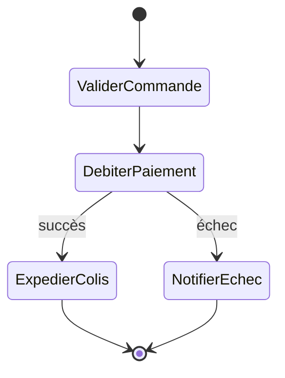
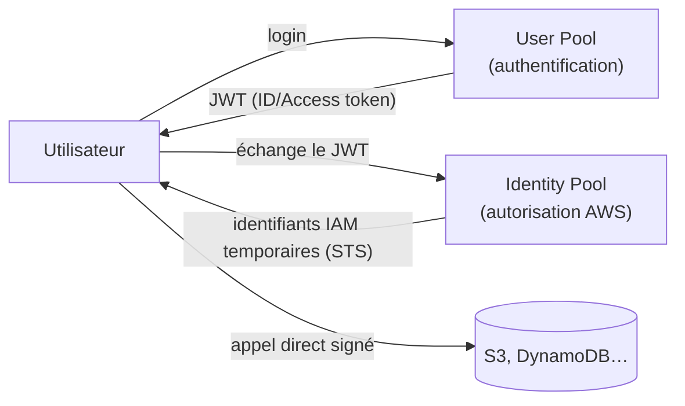

# API Gateway : la porte d'entrée des API serverless

**Amazon API Gateway** expose une API HTTP/REST managée devant des backends (le plus souvent Lambda), avec authentification, throttling, transformation de requêtes, et monitoring intégrés.

## Types d'endpoints

| Type | Où sont routées les requêtes | Cas d'usage |
|---|---|---|
| **Edge-optimized** | via le réseau de points de présence **CloudFront** | clients **géographiquement dispersés**, latence réduite pour tous |
| **Regional** | directement dans la région | clients dans la **même région**, ou besoin de placer **son propre** CloudFront devant (contrôle du cache, WAF personnalisé) |
| **Private** | accessible **uniquement depuis un VPC**, via un VPC endpoint d'interface | API **internes** à l'entreprise, jamais exposées publiquement |

## Throttling et quotas

API Gateway applique un **throttling** par défaut au niveau du compte, à ajuster par méthode/stage (un débit soutenu + un burst, sur le principe du **token bucket**). Pour un contrôle **par client**, on combine des **usage plans** et des **clés API** : chaque client reçoit une clé, avec son propre quota (requêtes/jour, débit max) — utile pour un modèle de facturation par palier ou pour protéger le backend d'un client trop gourmand.

## Authentification : trois options

- **Cognito User Pools authorizer** : valide un **JWT** émis par un User Pool Cognito (voir plus bas) — le cas le plus courant pour une application avec ses propres comptes utilisateurs.
- **Lambda authorizer** : logique **personnalisée** (vérifier un token propriétaire, une clé API tierce…), la fonction renvoie une politique IAM autorisant ou non l'accès.
- **Autorisation IAM (SigV4)** : les requêtes doivent être **signées** avec des identifiants IAM — adapté à des appels **service à service** au sein du même compte (ou en cross-account via des rôles), pas à des utilisateurs finaux.

## REST API vs HTTP API

| | REST API | HTTP API |
|---|---|---|
| Coût / latence | plus cher, latence plus élevée | moins cher, latence réduite |
| Fonctionnalités | complètes (usage plans, clés API, validation de requête, endpoints privés, intégration WAF native) | plus restreintes (pas de clés API/usage plans natifs, transformations limitées) |
| Auth supportée | Cognito, Lambda authorizer, IAM | JWT natif, Lambda authorizer, IAM |

> 🎯 **Piège d'examen —** si l'énoncé demande une API **simple** avec Lambda, priorité au **coût et à la latence**, sans besoin de clés API ni de validation avancée : **HTTP API**. Si l'énoncé exige des **usage plans/clés API**, un **endpoint privé**, ou une intégration **WAF** : **REST API** — seule à couvrir ces besoins.

## Step Functions : orchestrer plusieurs services

**Step Functions** décrit un **workflow** (machine à états) qui enchaîne des appels à Lambda et d'autres services AWS, avec gestion native des **retries**, des **erreurs**, des branches **parallèles** et des **attentes**, le tout visualisable comme un graphe.

| | Standard Workflows | Express Workflows |
|---|---|---|
| Sémantique d'exécution | **exactly-once** | **at-least-once** |
| Durée max | jusqu'à **1 an** | jusqu'à **5 minutes** |
| Débit | plus modéré | **très élevé** (fort volume d'événements) |
| Tarification | par **transition d'état** | par **requête + durée** (à la manière de Lambda) |
| Cas d'usage | workflows **longs, auditables** (traitement de commande, approbation humaine) | traitement **haut débit et court** (streaming IoT, transformation de données à fort volume) |

## Cognito : User Pools vs Identity Pools — LE piège

- **User Pools** = **authentification** : annuaire d'utilisateurs, inscription/connexion, émet des **JWT** (ID token, access token, refresh token). Peut fédérer avec des IdP sociaux (Google, Facebook) ou SAML/OIDC.
- **Identity Pools** (Federated Identities) = **autorisation** : fournit des **identifiants AWS temporaires** (via STS) permettant à un client (souvent mobile) d'appeler **directement** des ressources AWS (ex. upload direct vers S3), sans passer par un backend intermédiaire.

> 🎯 **Piège d'examen —** confondre les deux est **l'erreur classique** : un **User Pool ne donne jamais d'accès direct aux ressources AWS**, il ne fait qu'authentifier et émettre un JWT applicatif. Un **Identity Pool ne gère pas les comptes utilisateurs**, il ne fait que convertir une identité déjà authentifiée (par un User Pool, ou un IdP tiers) en **identifiants IAM temporaires**. Le schéma d'examen classique : User Pool authentifie → le JWT est échangé auprès de l'Identity Pool → l'application reçoit des credentials IAM temporaires pour appeler S3/DynamoDB directement.

## À retenir

- Endpoints API Gateway : Edge-optimized (clients dispersés via CloudFront), Regional, Private (VPC only).
- HTTP API = moins cher/rapide, fonctionnalités réduites. REST API = complet (clés API, usage plans, WAF, endpoints privés).
- Step Functions Standard = exactly-once, jusqu'à 1 an, facturé par transition. Express = at-least-once, 5 min max, haut débit, facturé requête+durée.
- Cognito User Pools = authentification (JWT) ; Identity Pools = autorisation (credentials IAM temporaires) — ne jamais les confondre.
