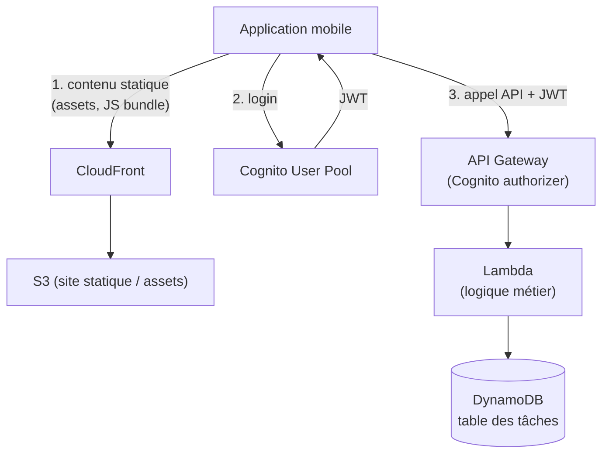
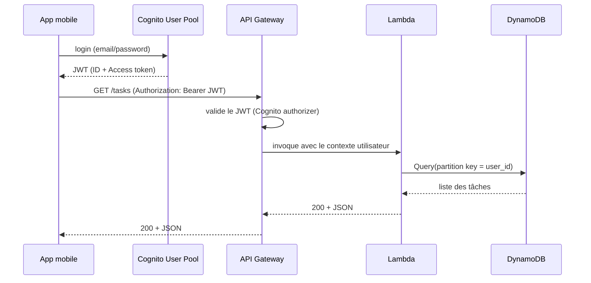
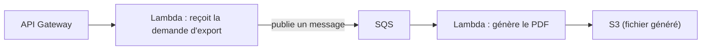

# Assembler les briques : une appli mobile 100 % serverless

L'examen adore décrire une application mobile ou web simple et demander l'architecture **serverless** adaptée. Prenons un cas type : **MyTodoList**, une application mobile de gestion de tâches avec comptes utilisateurs.

## Pourquoi chaque brique, précisément

- **S3 + CloudFront** : hébergement du contenu statique (assets de l'application, éventuellement un front web) — durable, scalable sans serveur, mis en cache au plus près de l'utilisateur par CloudFront. Aucun serveur à faire tourner en continu pour du contenu qui ne change pas à chaque requête.
- **Cognito User Pool** : gère l'inscription/connexion des utilisateurs, émet un **JWT** après authentification — l'application n'a **aucun** code d'authentification à écrire ni de mot de passe à stocker elle-même.
- **API Gateway** avec un **autorizer Cognito** : valide le JWT à chaque appel **avant** même d'invoquer Lambda — la fonction métier n'a pas à revérifier l'identité, seulement à faire confiance au contexte transmis par API Gateway (ex. l'identifiant utilisateur extrait du token).
- **Lambda** : exécute la logique métier (créer/lire/modifier une tâche) à la demande, sans serveur à maintenir, facturé à l'exécution — adapté à un trafic irrégulier typique d'une petite application.
- **DynamoDB** : stockage clé-valeur, latence faible et prévisible, scalabilité automatique (On-Demand recommandé tant que le trafic n'est pas stabilisé/prévisible) — la **partition key** typique ici serait un `user_id` (chaque utilisateur ne lit/écrit que ses propres tâches, bonne distribution de charge entre utilisateurs).

## Le flux d'authentification en détail

> 🎯 **Piège d'examen —** dans ce schéma, c'est **Cognito** qui authentifie, **API Gateway** qui vérifie le token à chaque requête (sans que Lambda ait à le refaire), et **DynamoDB** qui isole naturellement les données par utilisateur via la partition key. Un énoncé qui demande « comment restreindre l'accès aux données de chaque utilisateur à ses seules tâches » pointe vers un bon choix de **partition key**, pas vers une nouvelle brique d'infrastructure.

## Étendre l'architecture : traitement asynchrone

Si l'application doit aussi traiter des tâches lourdes en arrière-plan (ex. générer un export PDF de la liste de tâches), le réflexe serverless est de **découpler** ce traitement du chemin synchrone de l'API — en réutilisant les briques du module précédent :

La requête API répond **immédiatement** (le traitement long est délégué à un consommateur asynchrone), et le worker (ici une seconde Lambda déclenchée par SQS) traite le fond sans bloquer l'utilisateur.

## À retenir

- Contenu statique → S3 + CloudFront. Authentification → Cognito User Pool (JWT). Vérification du token → API Gateway (authorizer), pas dans le code métier.
- Logique métier à la demande → Lambda. Données → DynamoDB, avec une partition key alignée sur le pattern d'accès (souvent l'identifiant utilisateur).
- Un traitement long ne doit pas bloquer la requête API : le découpler via SQS/SNS (module précédent) vers une Lambda de traitement asynchrone.
