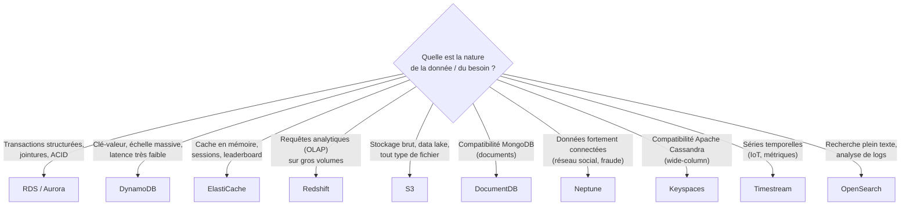

# Une base par besoin, pas une base pour tout

L'examen SAA-C03 aime décrire un besoin métier précis et demander **quel service de données** y répond le mieux. Il n'existe pas de « meilleure base » dans l'absolu — seulement la base la plus adaptée à un **modèle d'accès** et une **contrainte** donnés. Ce module rassemble le raisonnement à avoir, service par service.

## Le tableau décisionnel

| Service | Modèle | Cas d'usage typique |
|---|---|---|
| **RDS / Aurora** | relationnel (SQL), transactions ACID | applications avec schéma structuré, besoin de jointures complexes, transactions financières |
| **DynamoDB** | clé-valeur / document, NoSQL | échelle massive, latence à un chiffre de milliseconde, schéma flexible, pas de jointures nécessaires (ex. panier e-commerce, profils utilisateurs) |
| **ElastiCache** (Redis/Memcached) | cache en mémoire | réduire la charge sur une base primaire, sessions utilisateur, classements en temps réel (leaderboard) |
| **Redshift** | entrepôt de données (OLAP), colonne | requêtes analytiques complexes sur de très gros volumes historiques, reporting BI |
| **S3** | stockage objet | data lake, fichiers de toute nature, archivage, source pour Athena/Redshift Spectrum/EMR |
| **DocumentDB** | document, compatible **MongoDB** | migration d'une application déjà construite sur MongoDB, sans réécrire les requêtes |
| **Neptune** | graphe | données **fortement connectées** : réseaux sociaux, moteurs de recommandation, détection de fraude, graphes de connaissances |
| **Keyspaces** | wide-column, compatible **Apache Cassandra** | migration d'une application déjà construite sur Cassandra |
| **Timestream** | séries temporelles | données **horodatées à très haute fréquence** : capteurs IoT, métriques applicatives, suivi d'usage dans le temps |
| **OpenSearch** | recherche & analytics quasi temps réel | recherche **plein texte** (catalogue produit, autocomplétion), analyse de logs et de métriques (dashboards opérationnels) |

## Les distinctions les plus testées

> 🎯 **Piège d'examen —** un scénario décrivant un **réseau social** demandant « quels sont les amis d'amis d'un utilisateur » ou un système de **détection de fraude** basé sur des relations entre comptes pointe systématiquement vers **Neptune** (base de graphe) — une base relationnelle classique gérerait très mal ce type de requête fortement relationnelle à plusieurs sauts.

> 🎯 **Piège d'examen —** « recherche plein texte dans un catalogue produit » ou « tableau de bord d'analyse de logs applicatifs en quasi temps réel » pointe vers **OpenSearch** — ni Athena (interrogation ponctuelle de fichiers S3), ni Redshift (analytique structuré sur schéma défini), ne sont conçus pour de la recherche plein texte performante.

> 🎯 **Piège d'examen —** « données de capteurs IoT, des millions de points par seconde, horodatés, avec des requêtes du type évolution dans le temps » pointe vers **Timestream** — DynamoDB pourrait techniquement stocker ces données mais sans les fonctions d'agrégation temporelle natives et l'optimisation de coût propres à une base **time-series**.

> 🎯 **Piège d'examen —** « l'application utilise déjà MongoDB / Apache Cassandra et l'équipe veut migrer vers AWS **sans réécrire les requêtes** » pointe vers **DocumentDB** (compatible MongoDB) ou **Keyspaces** (compatible Cassandra) respectivement — pas vers DynamoDB, qui a sa propre API malgré des similitudes de modèle.

> 🎯 **Piège d'examen —** ne pas confondre **RDS/Aurora** (transactions structurées, jointures, cohérence forte — le choix par défaut pour une application métier classique) et **DynamoDB** (quand l'échelle ou la latence prime sur la richesse des requêtes, et que le modèle d'accès est connu à l'avance et simple).

## À retenir

- Structuré + transactions + jointures → RDS/Aurora. Échelle massive + faible latence + schéma simple → DynamoDB.
- Cache → ElastiCache. Analytique gros volume → Redshift. Data lake brut → S3.
- Compatibilité MongoDB → DocumentDB. Compatibilité Cassandra → Keyspaces. Données en graphe → Neptune. Séries temporelles → Timestream. Recherche plein texte / logs → OpenSearch.
- La question de l'examen porte presque toujours sur **le modèle d'accès** décrit dans l'énoncé, pas sur le volume seul.
