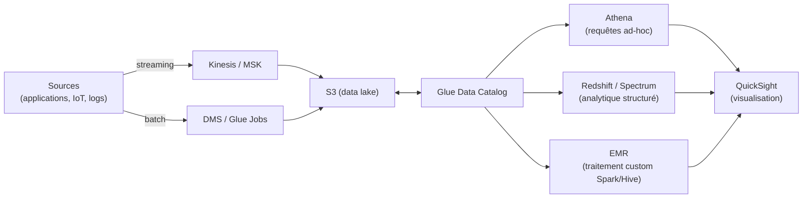

# Un pipeline big data type sur AWS

**Ingestion** (streaming ou batch) → **stockage** dans un data lake **S3** → **catalogue** de métadonnées (**Glue Data Catalog**) → **requête** (Athena, Redshift, EMR selon le besoin) → **visualisation** (QuickSight).

## Athena : requêter S3 en SQL, sans infrastructure

**Athena** exécute des requêtes **SQL standard** directement sur des fichiers stockés dans **S3**, sans cluster à provisionner. Facturation **à la donnée scannée** (par volume de données lues pour répondre à la requête, indépendamment du temps d'exécution).

### Optimisations qui réduisent concrètement la facture

- **Partitionnement** : organiser les données en S3 par clé logique (typiquement une date : `s3://bucket/table/year=2026/month=07/`). Une requête filtrant sur cette clé (`WHERE year = 2026`) ne scanne **que** les partitions concernées, au lieu de l'ensemble des données.
- **Format colonne (Parquet/ORC)** plutôt que CSV/JSON : une requête qui ne sélectionne que 3 colonnes sur 50 ne lit, avec un format colonne, **que ces 3 colonnes** — contre la totalité de chaque ligne avec un format texte brut.
- **Compression** : réduit encore le volume physique scanné.

> 🎯 **Piège d'examen —** une facture Athena qui explose n'est presque jamais un problème de « mauvais service choisi », mais un problème d'**absence de partitionnement** et/ou de **format non-colonne**. La réponse attendue à « comment réduire le coût des requêtes Athena » est quasi systématiquement : **partitionner les données et convertir en Parquet**, avant d'envisager autre chose.

## Glue : catalogue et ETL serverless

**AWS Glue** a deux rôles complémentaires :

- **Data Catalog** : référentiel central de métadonnées (schémas, emplacements, formats) — le **même catalogue** est utilisé par Athena, Redshift Spectrum et EMR, évitant de redéfinir le schéma à chaque outil.
- **Crawlers** : scannent une source de données (S3, RDS…) et **déduisent automatiquement le schéma** pour peupler le Data Catalog.
- **Glue Jobs** : exécutent des scripts ETL **serverless** (Spark sous le capot, Python ou Scala) pour transformer les données (nettoyage, changement de format, agrégation) sans gérer de cluster.

## Redshift : l'entrepôt de données (data warehouse)

**Redshift** est un entrepôt de données **OLAP**, en stockage **colonne**, avec une architecture **MPP** (traitement massivement parallèle) — conçu pour des requêtes analytiques complexes (agrégations, jointures lourdes) sur de très gros volumes de données **structurées**.

- **Redshift Spectrum** permet d'interroger directement des données **dans S3** (sans les charger dans Redshift au préalable), avec le **même SQL** que le reste de l'entrepôt — utile pour croiser des données « chaudes » déjà chargées avec des données « froides » restées dans le data lake, sans ETL préalable.

> 🎯 **Piège d'examen —** ne pas confondre **Athena** (serverless, requêtes ad-hoc ponctuelles, pas de gestion de cluster, pertinent pour de l'exploration ou un usage peu fréquent) et **Redshift** (entrepôt provisionné en continu, optimisé pour des requêtes analytiques **répétées et complexes** à fort volume, avec des utilisateurs BI multiples). Un besoin de **dashboards BI récurrents sur un large historique structuré** pointe vers Redshift ; une requête **ponctuelle sur des logs bruts en S3** pointe vers Athena.

## EMR : quand il faut Spark/Hive « au forfait complet »

**Amazon EMR** fournit des clusters **Hadoop/Spark/Hive/Presto** managés, pour des traitements big data nécessitant le **contrôle et l'écosystème complet** de ces frameworks (au-delà de ce que couvrent les services serverless comme Athena ou Glue). Le stockage peut être découplé du calcul via **EMRFS** (lecture/écriture S3 depuis EMR), et les nœuds de tâche peuvent utiliser des instances **Spot** pour réduire le coût des traitements tolérants à l'interruption.

## QuickSight et Lake Formation

- **QuickSight** : service de **BI et visualisation** serverless — tableaux de bord interactifs, moteur en mémoire **SPICE** pour des requêtes rapides, fonctionnalités de ML intégrées (détection d'anomalies, prévisions).
- **Lake Formation** : simplifie la construction d'un data lake sécurisé sur S3, en centralisant les **permissions fines** (au niveau table, colonne, voire ligne) partagées par Athena, Redshift Spectrum, EMR et Glue — construit au-dessus du Glue Data Catalog.

## MSK vs Kinesis

| | Amazon MSK | Kinesis Data Streams |
|---|---|---|
| Nature | **Apache Kafka managé** (protocole/API Kafka standard) | service de streaming propriétaire AWS |
| Quand le choisir | migration d'un existant déjà bâti sur Kafka, besoin de l'écosystème Kafka (Kafka Connect, Kafka Streams), portabilité multi-cloud | nouvelle application AWS-native, priorité à la simplicité opérationnelle et à l'intégration native avec les autres services AWS |
| Effort opérationnel | plus élevé (plus de paramètres à gérer, même managé) | plus simple (shards, scaling plus direct) |

## À retenir

- Pipeline type : ingestion (Kinesis/MSK ou batch) → S3 (data lake) → Glue Data Catalog → requête (Athena/Redshift/EMR) → QuickSight.
- Athena = requêtes SQL serverless sur S3, facturé au volume scanné — optimiser via **partitionnement + Parquet**.
- Glue = catalogue central de métadonnées + ETL serverless. Redshift = entrepôt OLAP MPP pour requêtes récurrentes lourdes ; Spectrum interroge S3 sans ETL préalable.
- EMR = Hadoop/Spark/Hive au forfait complet, quand le besoin dépasse les services serverless.
- Lake Formation = permissions fines centralisées sur le data lake. MSK = Kafka managé (migration/écosystème) ; Kinesis = plus simple, AWS-natif.
