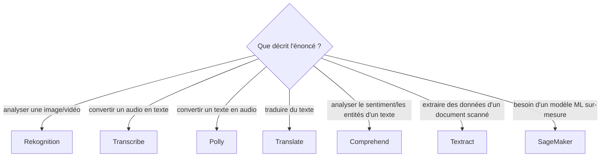

# Les services d'IA/ML : reconnaître le bon nom, pas maîtriser le ML

Le SAA-C03 ne demande **pas** de compétences en Machine Learning : il teste uniquement la capacité à associer un **besoin métier décrit en une phrase** au **service managé** correspondant. Voici l'essentiel, service par service.

| Service | En une ligne |
|---|---|
| **Rekognition** | analyse d'**images et vidéos** : détection d'objets/scènes, reconnaissance faciale, modération de contenu |
| **Transcribe** | **parole vers texte** (speech-to-text) — sous-titrage, transcription d'appels |
| **Polly** | **texte vers parole** (text-to-speech) — voix synthétique pour une application |
| **Translate** | **traduction** automatique entre langues |
| **Comprehend** | **traitement du langage naturel (NLP)** : analyse de sentiment, extraction d'entités nommées, extraction de phrases clés dans du texte |
| **Textract** | extraction de **texte et de données structurées** (formulaires, tableaux) depuis des documents scannés — un OCR « augmenté », conscient de la structure du document |
| **SageMaker** | plateforme complète pour **construire, entraîner et déployer des modèles ML personnalisés** — pour les cas où aucun service pré-entraîné ne convient |

## Le réflexe à l'examen

> 🎯 **Piège d'examen —** l'énoncé décrit presque toujours l'**entrée** et la **sortie** attendues (« un document scanné en entrée, des champs structurés en sortie » → Textract ; « un texte en entrée, une tonalité positive/négative en sortie » → Comprehend). Repérer ce couple entrée/sortie suffit à éliminer les distracteurs sans connaître le détail technique du service.

> 🎯 **Piège d'examen —** ne pas confondre **Textract** (extraction de données depuis un document existant, avec sa mise en forme — formulaires, tableaux) et **Rekognition** (analyse de contenu visuel générique — objets, visages, scènes) : un scénario de « numériser des factures et en extraire les montants » pointe vers **Textract**, pas Rekognition.

## À retenir

- Rekognition = image/vidéo. Transcribe = audio → texte. Polly = texte → audio. Translate = traduction.
- Comprehend = NLP (sentiment, entités). Textract = extraction structurée de documents scannés.
- SageMaker = seule option quand un modèle **personnalisé** est nécessaire — sinon privilégier le service pré-entraîné correspondant au besoin décrit.
