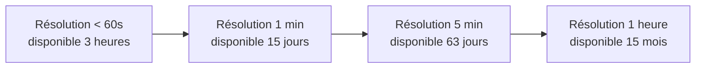
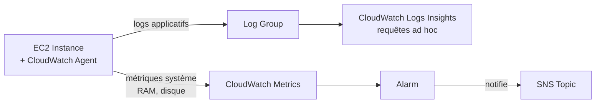

# CloudWatch — l'observabilité native d'AWS

**CloudWatch** est le service natif de supervision d'AWS : il collecte des **métriques** (chiffres dans le temps), des **logs** (texte), déclenche des **alarmes**, et peut réagir à des **événements** (via EventBridge, leçon suivante). Presque tous les services AWS publient automatiquement des métriques CloudWatch.

> **Repère —** pense CloudWatch comme la stack Prometheus + Grafana + Alertmanager que tu utilises peut-être déjà, mais **managée et branchée nativement** sur tous les services AWS sans rien configurer.

## Métriques : standard, detailed, custom

Chaque métrique appartient à un **namespace** (ex. `AWS/EC2`), possède des **dimensions** (ex. `InstanceId=i-0123...`) et des points dans le temps.

| Type | Fréquence | Coût | Exemple |
|---|---|---|---|
| **Standard monitoring** | 5 minutes | Gratuit | CPUUtilization EC2 par défaut |
| **Detailed monitoring** | 1 minute | Payant (EC2) | activé explicitement sur l'instance |
| **High-resolution custom metric** | jusqu'à 1 seconde | Payant | métrique applicative envoyée par `PutMetricData` |

```bash
# Publish a custom application metric (e.g. number of orders processed)
aws cloudwatch put-metric-data \
  --namespace "MyApp/Orders" \
  --metric-name OrdersProcessed \
  --value 42 \
  --unit Count
```

> 🎯 **Piège d'examen —** pour EC2, AWS fournit par défaut des métriques **hyperviseur** (CPU, réseau, disque I/O au niveau du volume). Mais **la RAM utilisée et l'espace disque restant à l'intérieur de l'OS ne sont JAMAIS envoyés par défaut** — AWS ne regarde pas dans ton système d'exploitation. Il faut installer et configurer le **CloudWatch Agent unifié** sur l'instance pour obtenir ces métriques (et pousser des logs applicatifs).

## Rétention des métriques : la résolution se dégrade avec le temps



Une donnée à haute résolution n'est **pas conservée indéfiniment à cette résolution** : CloudWatch l'agrège progressivement en points de plus en plus espacés, jusqu'à 15 mois d'historique en résolution horaire.

## Logs : agent, groups, streams, Logs Insights

- **Log group** — un conteneur logique (souvent 1 par application/service).
- **Log stream** — une séquence d'événements dans le temps (souvent 1 par instance/tâche).
- **CloudWatch Agent unifié** — à installer sur EC2/on-premises pour envoyer logs applicatifs **et** métriques système (RAM, disque) — remplace l'ancien « CloudWatch Logs agent » historique.



**CloudWatch Logs Insights** permet d'interroger les logs avec un langage de requête dédié (pas du SQL) :

```
fields @timestamp, @message
| filter @message like /ERROR/
| sort @timestamp desc
| limit 20
```

## Alarms : réagir à une métrique

Une **alarm** surveille une métrique et bascule entre trois états : `OK`, `ALARM`, `INSUFFICIENT_DATA` (pas encore assez de données, ou métrique momentanément indisponible — ce n'est **pas** un état d'erreur).

Actions déclenchables par une alarm :

| Cible | Usage typique |
|---|---|
| **SNS Topic** | notifier une équipe (email, SMS, webhook) |
| **Auto Scaling** | ajouter/retirer des instances (scaling policy) |
| **Action EC2** | reboot, stop, terminate, ou **recover** (relance l'instance sur un nouveau matériel physique en cas de défaillance hardware, en conservant l'IP privée/publique et les métadonnées) |

> 🎯 **Piège d'examen —** l'action **« Recover »** d'une alarm EC2 ne fonctionne que sur des instances avec stockage EBS (pas instance store), et sert spécifiquement à réagir à une **défaillance hardware sous-jacente** détectée par le status check système — pas à un simple pic de CPU.

## Composite alarms : réduire le bruit

Une **composite alarm** combine plusieurs alarms simples avec des opérateurs logiques (`AND`, `OR`, `NOT`) pour ne déclencher une notification que si une **combinaison** de conditions est vraie — utile pour éviter les faux positifs (ex. n'alerter que si CPU haut **ET** latence élevée en même temps, pas l'un ou l'autre isolément).

## À retenir

- Standard = 5 min gratuit ; detailed = 1 min payant ; custom = jusqu'à 1 s, envoyé via `PutMetricData`.
- **RAM et disque interne ne remontent jamais par défaut** : il faut le CloudWatch Agent.
- La résolution d'une métrique se dégrade avec le temps (3h → 15 jours → 63 jours → 15 mois).
- Logs Insights = requêtes ad hoc sur les logs ; Alarm = réaction automatisée (SNS, Auto Scaling, action EC2) ; Composite Alarm = combine plusieurs alarms pour réduire le bruit.
