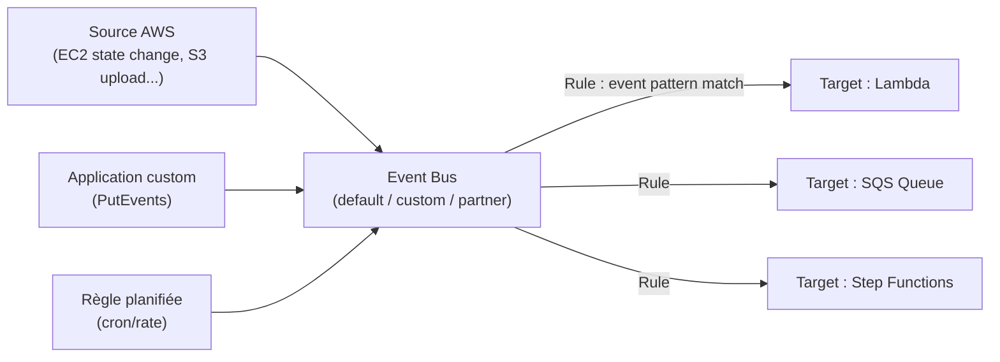
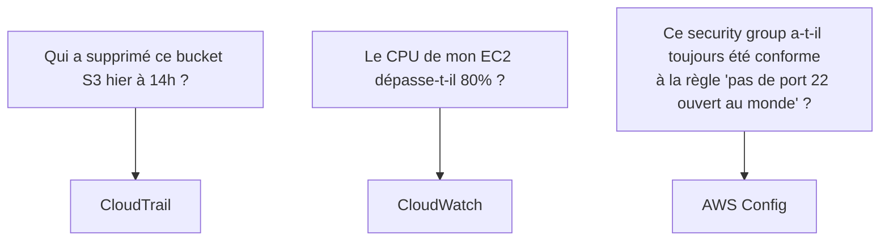

# Événements, audit et conformité

Trois services répondent à trois questions **différentes**, et l'examen adore les confondre volontairement dans ses énoncés. Avant de les comparer, voyons **EventBridge**, qui orchestre la réaction automatique aux événements AWS.

## EventBridge : le bus d'événements

**EventBridge** (anciennement CloudWatch Events) reçoit des événements (changement d'état d'une ressource AWS, événement applicatif custom, événement d'un partenaire SaaS) et les route vers des **cibles**, selon des **règles** de filtrage.

- **Event bus** — le canal de circulation des événements : un bus **default** (événements AWS natifs), des bus **custom** (événements applicatifs), et des bus **partner** (intégrations SaaS tierces, ex. Zendesk, Datadog).
- **Rule** — un filtre (`event pattern`, en JSON) qui matche certains événements et les envoie vers une ou plusieurs **targets** (Lambda, SQS, SNS, Step Functions, Kinesis...).
- **Règle planifiée** — équivalent d'un cron (`rate(5 minutes)` ou `cron(0 12 * * ? *)`) pour déclencher une cible périodiquement, sans attendre un événement externe.

Cas d'usage classique d'automatisation : un objet uploadé sur S3 déclenche un événement → une règle EventBridge matche cet événement → une fonction Lambda de traitement d'image est invoquée, sans aucun serveur à gérer.

> 🎯 **Piège d'examen —** EventBridge réagit à des **événements** (quelque chose qui *se passe*, en quasi temps réel). Ne pas confondre avec CloudWatch Alarms, qui réagit à un **seuil de métrique franchi** (quelque chose qui *dépasse une valeur*).

## Le tableau d'examen : CloudTrail vs CloudWatch vs Config

C'est l'un des tableaux les plus rentables du SAA-C03 : trois services de gouvernance, trois questions distinctes.

| Question posée | Service | Ce qu'il enregistre |
|---|---|---|
| **Qui a fait quoi** (audit des appels API) | **CloudTrail** | chaque appel API du compte : identité de l'appelant, action, ressource ciblée, IP source, horodatage |
| **Que se passe-t-il** (performance, état en temps réel) | **CloudWatch** | métriques, logs applicatifs, alarmes sur des seuils |
| **Est-ce conforme** (état de configuration dans le temps) | **AWS Config** | historique des changements de configuration d'une ressource + évaluation de conformité contre des règles |

> 🎯 **Piège d'examen —** un scénario mentionnant « un security group a été modifié pour ouvrir un port non autorisé, je veux savoir **qui** a fait ce changement **et** être alerté **automatiquement** si un security group redevient non conforme demain » demande **les deux** : CloudTrail pour l'identité de l'auteur du changement, **AWS Config** (avec une rule + remediation) pour la détection de non-conformité continue. Ce n'est presque jamais un seul des trois services qui répond à un scénario complet.

## CloudTrail en détail

- **Event history** (dans la console) — les **90 derniers jours** de *management events*, consultable gratuitement, sans configuration.
- **Trail** — à créer explicitement pour une rétention **au-delà de 90 jours** : livre les logs en continu vers un bucket **S3** (et optionnellement CloudWatch Logs pour des alertes en temps réel).
- **Management events** (par défaut activés) — opérations de gestion (créer un IAM user, lancer une instance...) vs **Data events** (à activer explicitement, plus coûteux) — opérations sur les données elles-mêmes (`GetObject`/`PutObject` sur S3, invocations Lambda).
- **Trail multi-région** — recommandé pour capturer l'activité de **toutes les régions** du compte depuis un seul endroit.

> 🎯 **Piège d'examen —** sans trail créé, CloudTrail ne conserve les événements que **90 jours** et uniquement les management events. Un audit de conformité qui exige une rétention **d'un an** implique de créer un trail vers S3 (+ éventuellement des règles de cycle de vie S3 ou une copie vers Glacier).

## AWS Config

**Config** enregistre l'historique de **configuration** de chaque ressource supportée (un security group avait telle règle à telle date, un bucket S3 était public entre telle et telle date...) et évalue en continu la conformité contre des **Config rules** :

- **Rules managées** (fournies par AWS, ex. `s3-bucket-public-read-prohibited`) ou **rules custom** (Lambda).
- **Remediation** — une action de correction automatique peut être associée à une rule (via un document SSM Automation), pour corriger une ressource non conforme sans intervention humaine.
- **Aggregator** — agrège la conformité de plusieurs comptes/régions dans une vue centralisée.

## X-Ray, en une ligne

**X-Ray** trace une requête de bout en bout à travers une architecture distribuée (microservices, Lambda...) et construit une **service map** — utile pour localiser où une requête ralentit ou échoue dans une chaîne d'appels.

## À retenir

- EventBridge réagit à des **événements** (bus + rules + targets), CloudWatch Alarms réagit à des **seuils de métrique**.
- CloudTrail = **qui** a fait quoi (API) ; CloudWatch = **que se passe-t-il** (perf/état) ; Config = **est-ce conforme** (historique de configuration).
- CloudTrail sans trail = 90 jours de management events seulement ; un trail vers S3 permet une rétention longue et les data events.
- Config = compliance + remediation automatique ; X-Ray = tracing distribué (service map).
