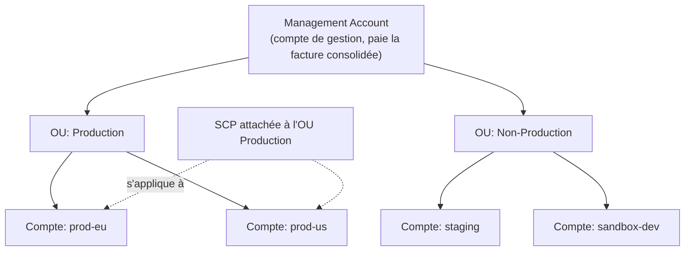
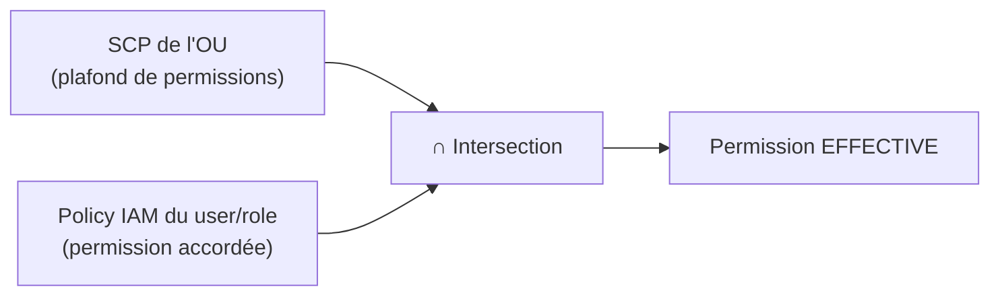

# Gérer plusieurs comptes AWS comme un seul

Une entreprise sérieuse n'a presque jamais **un seul** compte AWS : elle sépare prod/staging/dev, ou les équipes, en comptes distincts (isolation forte des permissions et de la facturation). **AWS Organizations** gère cette flotte de comptes depuis un seul endroit.

> **Repère —** Organizations, c'est un peu comme un monorepo avec des workspaces isolés : chaque compte membre est complètement étanche (son propre IAM, son propre VPC), mais un « compte racine » applique des règles globales à tous les workspaces.

## Structure : management account, OUs, member accounts

- **Management account** — le compte racine de l'organisation, celui qui paie la facture **consolidée** de tous les comptes membres.
- **OU (Organizational Unit)** — un dossier logique regroupant des comptes (souvent par environnement ou par équipe), organisable en hiérarchie.
- **Member account** — un compte AWS normal, mais rattaché à l'organisation.

## Consolidated billing

- Une **seule facture** pour tous les comptes membres.
- Les **remises de volume** (ex. paliers de tarif dégressif S3, EC2) sont calculées sur l'**usage cumulé** de tous les comptes — un petit compte bénéficie donc des remises obtenues grâce au volume des gros comptes.
- Les **Reserved Instances** et **Savings Plans** achetés dans un compte peuvent bénéficier automatiquement à d'autres comptes de l'organisation ayant un usage correspondant (partage activable/désactivable).

## SCP (Service Control Policies) : un plafond, jamais un plancher

Une **SCP** est une policy attachée à une OU ou à un compte membre qui définit les **permissions maximales** possibles pour ce compte — c'est un **garde-fou**, pas une source de permission.

> 🎯 **Piège d'examen —** **une SCP ne donne JAMAIS de permission à elle seule.** Un `Allow` dans une SCP ne fait qu'*autoriser que* l'IAM du compte accorde cette permission — il faut **toujours** qu'une policy IAM (identity-based) accorde explicitement l'action pour qu'un utilisateur puisse réellement l'exécuter. L'accès effectif est l'**intersection** entre ce que la SCP autorise et ce que la policy IAM autorise.

Cas d'usage typique d'une SCP : interdire à **tous** les comptes d'une OU « Sandbox » de lancer des instances hors `eu-west-3`, ou interdire la désactivation de CloudTrail, même à un administrateur du compte membre.

> 🎯 **Piège d'examen —** les SCP **ne s'appliquent jamais au management account lui-même** — seulement aux comptes membres. Un admin du management account garde donc toujours ses pleins pouvoirs, quelles que soient les SCP définies.

## IAM Identity Center, Directory Services et Control Tower — un aperçu multi-compte complet en leçon 4 et ci-dessous

**Control Tower** automatise la mise en place d'un environnement multi-comptes conforme aux bonnes pratiques (« landing zone ») : il **s'appuie sur** Organizations, IAM Identity Center, Config et CloudTrail pour provisionner automatiquement de nouveaux comptes conformes (via un **Account Factory**) et appliquer des **guardrails** :

| Type de guardrail | Rôle | Basé sur |
|---|---|---|
| **Préventif** | empêche une action non conforme (ex. interdire de désactiver CloudTrail) | SCP |
| **Détectif** | détecte une non-conformité après coup et alerte | AWS Config rules |

> 🎯 **Piège d'examen —** Control Tower n'est **pas** un remplaçant d'Organizations, c'est une **surcouche** qui automatise sa mise en place avec des bonnes pratiques prêtes à l'emploi (landing zone). Une question qui oppose les deux comme des alternatives concurrentes est mal posée — Control Tower **utilise** Organizations en interne.

## À retenir

- Organizations = management account + OUs + member accounts, avec facturation **consolidée** et partage des remises de volume/RI/Savings Plans.
- **SCP = plafond de permissions, jamais une source de permission** — l'accès effectif est l'intersection SCP ∩ policy IAM.
- Les SCP ne s'appliquent jamais au management account.
- Control Tower = landing zone automatisée au-dessus d'Organizations, avec guardrails préventifs (SCP) et détectifs (Config).
