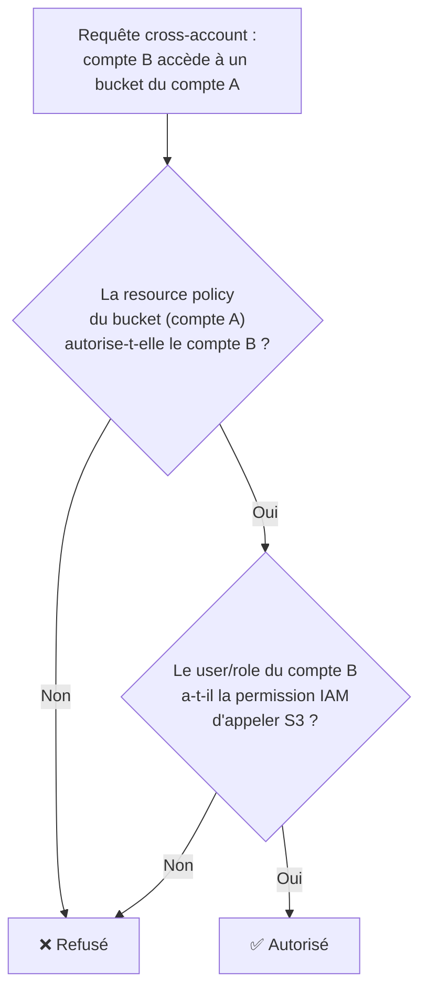

# Au-delà des bases IAM

La leçon d'introduction couvrait users, groups, policies et roles. Ici, on ajoute les nuances que l'examen SAA-C03 attend d'un profil senior : quel type de policy utiliser dans quel contexte, comment plafonner les permissions déléguées, et comment brancher un annuaire d'entreprise existant.

## Identity-based, resource-based, roles : qui attache quoi, où

| Type de policy | Attachée à | Exemple | Particularité |
|---|---|---|---|
| **Identity-based** | user, group, role | policy IAM classique donnant `s3:GetObject` | définit ce qu'**une identité** peut faire |
| **Resource-based** | la ressource elle-même | bucket policy S3, key policy KMS, policy de queue SQS | définit **qui** (quel principal, même d'un autre compte) peut agir **sur cette ressource**, sans que ce principal ait besoin d'endosser un role |
| **Role** | une identité empruntable (STS) | EC2 instance role, cross-account role | permissions **temporaires**, endossées explicitement (`AssumeRole`) |

> 🎯 **Piège d'examen —** pour donner l'accès à un bucket S3 à un compte AWS **tiers**, deux approches valides existent : (1) une **resource-based policy** (bucket policy) autorisant directement le principal du compte tiers — pas besoin qu'il endosse un role ; (2) un **IAM Role** cross-account que le compte tiers doit endosser via `AssumeRole`. La resource-based policy est plus simple pour un accès direct et continu ; le role est préférable quand on veut des credentials **temporaires** et un contrôle plus fin (durée de session, MFA obligatoire pour l'assume).

### Logique d'évaluation, cross-account inclus

Pour un accès **dans le même compte**, une action est autorisée si la policy identity-based **OU** la resource-based policy l'autorise (union), sauf Deny explicite qui gagne toujours. Pour un accès **cross-account**, il faut que **les deux côtés** autorisent : la resource-based policy du compte propriétaire **ET** une permission côté compte appelant (identity-based policy ou role assumé).

## Permission boundaries : déléguer sans perdre le contrôle

Une **permission boundary** est une policy managée qu'on attache à un **user ou un role** pour plafonner ses permissions maximales possibles — même si une policy identity-based lui accorde davantage.

Cas d'usage typique : un lead technique a le droit de créer des IAM roles pour son équipe, mais l'entreprise veut garantir qu'aucun de ces roles créés ne pourra jamais dépasser un certain périmètre (ex. jamais d'accès IAM ou Organizations) — même si le lead, par erreur ou malveillance, attache une policy `AdministratorAccess` au role qu'il crée.

> 🎯 **Piège d'examen —** ne pas confondre **permission boundary** (s'applique à un **user/role**, définit son plafond individuel) et **SCP** (s'applique à un **compte/OU entier**, définit le plafond de tout le compte). Permission boundary = intersection au niveau d'une identité IAM ; SCP = intersection au niveau du compte tout entier.

## Condition keys utiles à l'examen

Les conditions restreignent une policy à un contexte précis :

| Condition key | Usage |
|---|---|
| `aws:PrincipalOrgID` | n'autoriser l'accès qu'aux principaux appartenant à **ta** AWS Organization (utile en resource-based policy pour éviter qu'un compte externe accède à une ressource, même si son ARN est correctement référencé par erreur) |
| `aws:SourceIp` | restreindre à une plage d'IP source |
| `aws:MultiFactorAuthPresent` | exiger que la session ait été authentifiée avec MFA |
| `aws:RequestedRegion` | restreindre les actions à une région donnée |

## IAM Identity Center (ex AWS SSO)

**IAM Identity Center** centralise l'authentification pour **tous les comptes** d'une Organization (et des applications SaaS tierces compatibles SAML) depuis un point d'entrée unique : un utilisateur se connecte **une fois**, puis choisit le compte et le **permission set** (rôle) avec lequel travailler.

- Peut utiliser un **annuaire intégré**, ou se fédérer à un fournisseur d'identité externe (Active Directory via AWS Managed Microsoft AD, Azure AD, Okta...).
- **Permission sets** — des modèles de permissions réutilisables, appliqués automatiquement comme des roles IAM dans chaque compte cible.

> 🎯 **Piège d'examen —** IAM Identity Center **remplace le besoin de créer un user IAM par personne et par compte** : un identifiant unique donne accès à N comptes avec le bon niveau de permission par compte, sans multiplier les credentials.

## Directory Services : le piège Managed AD vs AD Connector

Trois options pour connecter/héberger un Active Directory sur AWS — l'examen aime tester la nuance entre les deux principales :

| Option | Ce que c'est | Où vivent les objets AD |
|---|---|---|
| **AWS Managed Microsoft AD** | un **véritable Active Directory** entièrement géré par AWS, dans le cloud | dans AWS — fonctionne **de façon autonome**, avec ou sans lien vers un AD on-premises (trust relationship en option) |
| **AD Connector** | un simple **proxy/redirecteur** de requêtes d'authentification | **rien** n'est stocké côté AWS — chaque requête est redirigée vers l'AD **on-premises** existant |
| **Simple AD** | un annuaire compatible AD basique, autonome, sans trust possible | dans AWS, fonctionnalités limitées (pas de MFA, pas de trust relationship) |

> 🎯 **Piège d'examen —** **AD Connector ne fonctionne pas si la connexion réseau vers l'on-premises (VPN/Direct Connect) tombe** — car il ne stocke strictement rien, il ne fait que rediriger. **Managed AD**, lui, continue de fonctionner de façon autonome même en cas de coupure du lien on-premises, puisque c'est une réplique complète et fonctionnelle dans le cloud. Un scénario qui demande une continuité de service même en cas de coupure réseau avec l'on-premises attend **Managed AD**, pas AD Connector.

## À retenir

- Identity-based (sur l'identité) vs resource-based (sur la ressource, permet le cross-account sans role) vs role (identité empruntable temporaire).
- Cross-account : il faut l'autorisation des **deux côtés** (resource policy + permission IAM côté appelant).
- Permission boundary = plafond **par identité** ; SCP = plafond **par compte/OU**. Ne pas les confondre.
- IAM Identity Center = SSO centralisé multi-comptes ; Managed AD = AD autonome dans le cloud ; AD Connector = simple proxy, dépendant du lien vers l'on-premises.
