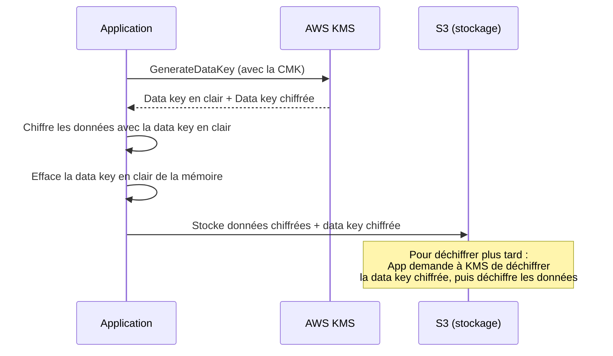

# Chiffrer : au repos, en transit, et la clé qui chiffre la clé

Le chiffrement revient dans presque tous les services AWS (S3, EBS, RDS...). Avant de détailler KMS, il faut trois notions de base solides.

## Encryption 101

| Notion | Définition |
|---|---|
| **At rest** | les données chiffrées **sur le disque** (EBS, S3, snapshots RDS...) — protège contre un accès physique ou un vol de support. |
| **In transit** | les données chiffrées **pendant le transport réseau** (TLS/HTTPS entre client et service, ou entre services) — protège contre l'interception réseau. |
| **Envelope encryption** | le principe utilisé par KMS : une **clé de données** (data key) chiffre les données elles-mêmes ; cette clé de données est elle-même chiffrée par une **clé maître** (qui ne quitte jamais KMS). |

> **Repère —** l'envelope encryption ressemble à un coffre-fort (les données) fermé avec une clé (la data key), elle-même enfermée dans un second coffre plus petit (chiffrée par la clé maître KMS). Chiffrer un gros volume de données directement avec la clé maître serait lent et exposerait trop cette clé critique — on ne chiffre que de petites clés de données avec elle.



## KMS : les types de clés

| Type de clé | Qui la gère | Rotation | Coût |
|---|---|---|---|
| **AWS owned key** | AWS, invisible dans ton compte | gérée par AWS | gratuite |
| **AWS managed key** (ex. `aws/s3`) | AWS, visible dans ton compte (alias `aws/<service>`) | rotation automatique **annuelle**, imposée | gratuite |
| **Customer managed key (CMK)** | toi | rotation automatique **annuelle** activable, ou rotation manuelle | payante (par clé + par appel API) |

> 🎯 **Piège d'examen —** seule une **customer managed key** permet de définir une **key policy** personnalisée (qui peut l'utiliser, dans quelles conditions), de la **désactiver**, de contrôler précisément sa **rotation**, ou de la **partager cross-account**. Une AWS managed key ne s'exporte pas et ne se partage pas entre comptes.

## Key policy : le contrôle d'accès d'une clé KMS

Une clé KMS a sa **propre policy** (resource-based), en plus des policies IAM classiques des users qui veulent l'utiliser — les deux doivent autoriser l'action (comme pour toute resource-based policy, voir module précédent).

```json
{
  "Version": "2012-10-17",
  "Statement": [
    {
      "Sid": "AllowKeyAdministration",
      "Effect": "Allow",
      "Principal": { "AWS": "arn:aws:iam::111122223333:role/KeyAdmin" },
      "Action": ["kms:Create*", "kms:Describe*", "kms:Enable*", "kms:Disable*"],
      "Resource": "*"
    }
  ]
}
```

## Multi-Region Keys

Une **multi-region key** est une CMK répliquée dans plusieurs régions, partageant le **même identifiant de clé** — utile pour déchiffrer dans une autre région des données chiffrées ailleurs (ex. réplication S3 cross-region de données chiffrées, ou reprise après sinistre d'une base chiffrée) **sans re-chiffrer** les données au passage.

> 🎯 **Piège d'examen —** les clés multi-région **ne sont pas** la même clé physique partagée entre régions : ce sont des clés **liées**, chacune indépendante mais partageant le même keying material — si l'une est désactivée, cela n'affecte pas nécessairement les autres, il faut gérer chaque réplique.

## Le piège du throttling S3 + KMS

Chaque appel `GetObject`/`PutObject` sur un objet S3 chiffré avec une **CMK** (SSE-KMS) déclenche un appel à l'API KMS (`Decrypt`/`GenerateDataKey`) — et l'API KMS a des **quotas par seconde**, partagés par compte et par région.

> 🎯 **Piège d'examen —** une application à fort trafic qui lit en masse des objets S3 chiffrés avec une **CMK personnalisée** peut se heurter à des erreurs de **throttling KMS** (`ThrottlingException`), même si S3 lui-même n'est pas limité. Solutions attendues : demander une **augmentation de quota** KMS, ou réduire la fréquence d'appels KMS (mise en cache des data keys côté client), ou utiliser **SSE-S3** (clé gérée par S3, sans passer par l'API KMS visible) si la conformité ne demande pas explicitement une CMK.

## Partager une AMI ou un snapshot chiffré cross-account

Une AMI ou un snapshot EBS **chiffré avec une CMK** ne peut pas être simplement rendu public ou partagé comme un snapshot non chiffré :

1. Il faut **partager la CMK elle-même** (via sa key policy) avec le compte cible.
2. Il faut aussi autoriser explicitement le compte cible sur le snapshot/l'AMI (permissions de partage classiques).
3. Le compte cible peut alors copier le snapshot/l'AMI — cette copie peut être re-chiffrée avec **sa propre CMK** dans son compte.

> 🎯 **Piège d'examen —** partager uniquement le snapshot sans partager l'accès à la CMK utilisée pour le chiffrer **échoue** : le compte destinataire n'aura pas le droit de déchiffrer les données, même s'il voit le snapshot.

## À retenir

- Envelope encryption : une data key chiffre les données, une clé maître (KMS) chiffre la data key.
- AWS owned (invisible) < AWS managed (visible, rotation annuelle imposée) < Customer managed (contrôle total, key policy, cross-account, coût).
- Multi-region key : clés liées entre régions, pas une seule clé physique partagée.
- Fort trafic + CMK + S3 = risque de throttling KMS ; partager un snapshot chiffré exige de partager **aussi** la CMK.
