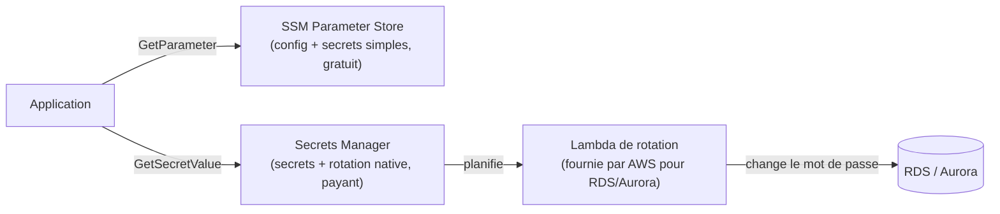

# Ne jamais coder un secret en dur

Un mot de passe de base de données, une clé d'API tierce, un certificat TLS : autant d'éléments qui ne doivent **jamais** vivre en dur dans du code ou une variable d'environnement non protégée. AWS propose plusieurs services complémentaires selon la nature du secret.

## SSM Parameter Store vs Secrets Manager — le comparatif d'examen

| Critère | **SSM Parameter Store** | **Secrets Manager** |
|---|---|---|
| **Usage typique** | configuration + secrets simples (chaînes, chemins hiérarchiques `/app/prod/db-host`) | secrets nécessitant une **rotation automatique native** (credentials de base de données) |
| **Rotation automatique** | ❌ non native (scriptable soi-même via Lambda + EventBridge) | ✅ native, intégrée avec RDS, Aurora, DocumentDB, Redshift (rotation planifiée sans code à écrire) |
| **Coût** | **gratuit** (tier standard) ; payant seulement en tier avancé (paramètres plus gros, policies) | **payant** par secret stocké + par appel API |
| **Versionning** | oui (historique des versions d'un paramètre) | oui (versions avec labels `AWSCURRENT`/`AWSPREVIOUS`) |
| **Intégration cross-service** | large (n'importe quelle chaîne de config) | ciblée sécurité (secrets applicatifs, credentials) |

> 🎯 **Piège d'examen —** un scénario demandant une rotation **automatique native** de mots de passe RDS **sans écrire de code de rotation soi-même** attend **Secrets Manager**. Un scénario qui ne demande que du stockage de configuration/secrets simples avec un **budget serré** attend **SSM Parameter Store** (gratuit en tier standard). Parameter Store *peut* techniquement gérer un secret, mais sans rotation native — il faudrait écrire et planifier soi-même une Lambda de rotation.

## ACM (AWS Certificate Manager)

**ACM** fournit et gère des certificats TLS/SSL :

- **Certificats publics** — émis gratuitement par AWS, utilisables sur ALB, CloudFront, API Gateway. **Renouvellement automatique** tant que le certificat reste attaché à une ressource AWS validée (validation DNS recommandée : renouvellement invisible).
- **Certificats privés** (via ACM Private CA, payant séparément) — pour une PKI interne d'entreprise.

> 🎯 **Piège d'examen —** un certificat ACM **ne peut pas être exporté** (sa clé privée ne sort jamais d'AWS) — il ne peut être utilisé que sur des ressources AWS intégrées (ALB, CloudFront, API Gateway...), **pas** installé manuellement sur une instance EC2 nue ou un serveur on-premises.

## CloudHSM : quand KMS ne suffit pas

**CloudHSM** fournit un module matériel de sécurité (**Hardware Security Module**) **dédié et single-tenant** — contrairement à KMS qui est un service **multi-tenant** managé (les clés KMS reposent aussi sur du HSM en interne, mais partagé entre clients, avec l'accès orchestré par AWS).

> 🎯 **Piège d'examen —** choisir **CloudHSM** plutôt que KMS quand une exigence de conformité impose :
> - un HSM **dédié single-tenant** (isolation physique complète, pas de partage d'infrastructure) ;
> - une certification **FIPS 140-2 niveau 3** (KMS ne garantit que le niveau 2 sur ses endpoints standards) ;
> - un contrôle **total et direct** sur le matériel cryptographique, y compris pour des cas où même AWS ne doit pas pouvoir intervenir sur les clés.
>
> En dehors de ces exigences précises, KMS reste le choix par défaut : plus simple, moins cher, intégré nativement partout.

## À retenir

- Secrets Manager = secrets **avec rotation native** (payant) ; SSM Parameter Store = config/secrets **sans rotation native** (gratuit en standard).
- ACM = certificats TLS gratuits, renouvellement automatique, **non exportables**, réservés aux ressources AWS intégrées.
- CloudHSM = HSM **dédié single-tenant**, pour des exigences de conformité (FIPS 140-2 niveau 3) que KMS multi-tenant ne couvre pas.
