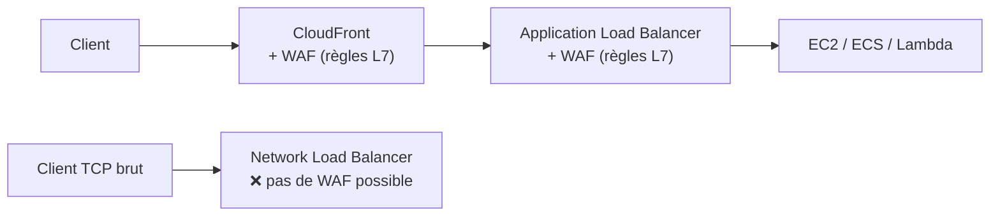
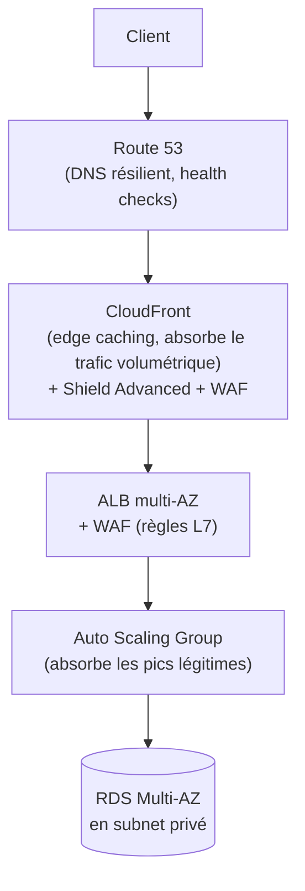

# Se protéger des attaques avant qu'elles n'atteignent l'application

Deux familles d'attaques distinctes, deux services distincts : **WAF** filtre le trafic applicatif (couche 7) selon des règles ; **Shield** protège contre les attaques volumétriques par déni de service (DDoS), plutôt couches 3/4.

## WAF (Web Application Firewall) : filtrer au niveau applicatif

**WAF** inspecte les requêtes HTTP/HTTPS (couche 7) et bloque/autorise/compte selon des **règles** : signatures d'injection SQL, XSS, listes d'IP, limitation de débit (rate-based rule), géo-restriction, règles managées AWS (protections courantes prêtes à l'emploi).

### Où attacher WAF — le piège de placement

| Cible | WAF utilisable ? |
|---|---|
| **Application Load Balancer (ALB)** | ✅ oui |
| **API Gateway** | ✅ oui |
| **CloudFront** | ✅ oui |
| **Network Load Balancer (NLB)** | ❌ **non** |

> 🎯 **Piège d'examen —** WAF opère en **couche 7 (HTTP)**. Le **NLB** opère en **couche 4 (TCP/UDP)** — il ne comprend pas le HTTP, donc **WAF ne peut pas s'y attacher**. Si une architecture utilise un NLB et a besoin d'un filtrage applicatif, il faut soit repasser par un ALB en aval, soit protéger la couche applicative autrement (WAF sur CloudFront devant, par exemple).

## Shield Standard vs Shield Advanced

| | **Shield Standard** | **Shield Advanced** |
|---|---|---|
| **Coût** | gratuit, activé automatiquement pour tous les comptes | payant (abonnement) |
| **Protection** | attaques DDoS courantes (couches 3/4) | protection renforcée + **couche 7**, détection avancée |
| **Visibilité** | aucune, automatique et invisible | tableau de bord détaillé, notifications d'attaque en cours |
| **Support** | aucun | accès au **DDoS Response Team (DRT)** 24/7 |
| **Garantie financière** | non | **remboursement** des coûts de scaling engendrés par une attaque DDoS (Auto Scaling, data transfer...) |

> 🎯 **Piège d'examen —** Shield Standard protège **déjà** tout compte AWS gratuitement contre les attaques DDoS les plus communes — il n'y a rien à activer. Un scénario qui demande une protection DDoS renforcée avec **support dédié**, **visibilité en temps réel** et **remboursement des coûts** liés à une attaque pointe vers **Shield Advanced**, pas Standard.

## Firewall Manager

**Firewall Manager** centralise et déploie des règles **WAF**, **Shield Advanced** et **security groups** à travers **plusieurs comptes** d'une AWS Organization — un administrateur central définit une politique de sécurité une fois, appliquée automatiquement à tous les comptes membres (y compris les nouveaux comptes créés ensuite).

> 🎯 **Piège d'examen —** Firewall Manager **exige** AWS Organizations (multi-comptes) — pour un compte unique, on configure WAF/Shield Advanced directement, sans Firewall Manager.

## Architecture DDoS-resilient de référence

Principes clés de cette architecture de référence :

- **CloudFront en frontal** — absorbe une grande partie du trafic volumétrique au niveau des edge locations, avant même d'atteindre l'origine.
- **WAF** attaché à CloudFront et à l'ALB — filtre les attaques applicatives à plusieurs niveaux.
- **Auto Scaling** — absorbe les pics de trafic légitimes qui passent le filtrage.
- **Ressources sensibles (RDS) en subnet privé**, jamais exposées directement à Internet.

## À retenir

- WAF = filtrage **couche 7**, attachable à ALB/API Gateway/CloudFront, **jamais** à un NLB (couche 4).
- Shield Standard = gratuit, automatique, couches 3/4. Shield Advanced = payant, couche 7 incluse, support DRT, remboursement des coûts de scaling.
- Firewall Manager = déploiement centralisé de règles WAF/Shield/SG sur plusieurs comptes (nécessite Organizations).
- Architecture DDoS-resilient type : Route 53 → CloudFront (+Shield+WAF) → ALB (+WAF) → Auto Scaling → ressources en subnet privé.
