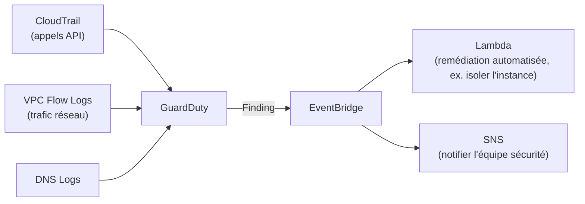

# Trois services de détection, trois périmètres différents

WAF et Shield **bloquent** ou **filtrent** activement. GuardDuty, Inspector et Macie, eux, **détectent et alertent** — ils ne bloquent rien tout seuls. C'est le piège d'examen n°1 de cette leçon.

## GuardDuty : la détection intelligente de menaces

**GuardDuty** analyse en continu des sources multiples — **CloudTrail** (activité API), **VPC Flow Logs** (trafic réseau), **DNS logs**, journaux EKS — et applique du machine learning + des flux de threat intelligence pour détecter des comportements suspects : appel API depuis une IP connue comme malveillante, instance EC2 qui communique avec un serveur de command-and-control, reconnaissance de credentials IAM compromis (comportement anormal soudain).

> 🎯 **Piège d'examen —** **GuardDuty ne bloque et ne corrige rien par lui-même** — c'est un service de **détection**, pas de prévention. Pour agir automatiquement sur un *finding* GuardDuty (isoler une instance compromise, révoquer des credentials), il faut brancher **EventBridge** en aval, qui déclenche une Lambda de remédiation. Une question qui présente GuardDuty comme bloquant nativement une attaque décrit une architecture incomplète.

## Inspector : scanner les vulnérabilités

**Inspector** scanne automatiquement et en continu :

- les instances **EC2** (vulnérabilités du système d'exploitation et des paquets installés, via l'agent SSM) ;
- les images **ECR** (vulnérabilités des couches de conteneurs, au push et en continu) ;
- le code des fonctions **Lambda** (dépendances vulnérables).

Il fournit un **score de risque** par vulnérabilité détectée (CVE), pour prioriser les correctifs.

> 🎯 **Piège d'examen —** Inspector **détecte** des vulnérabilités **connues** (CVE) dans des ressources existantes — il ne détecte pas un comportement suspect en cours d'exploitation (c'est le rôle de GuardDuty) et ne corrige rien automatiquement (les patchs restent à appliquer, éventuellement via Systems Manager Patch Manager).

## Macie : protéger les données sensibles dans S3

**Macie** utilise le machine learning pour **découvrir et classifier automatiquement** des données sensibles stockées dans S3 (numéros de carte bancaire, données personnelles/PII, identifiants de santé...), et alerte si un bucket contenant ce type de données devient **public** ou est partagé de façon inattendue.

> 🎯 **Piège d'examen —** Macie est **scopé à S3** — ce n'est pas un scanner de bases de données RDS ni de disques EBS. Un scénario qui demande de repérer des PII **dans un bucket S3** attend Macie ; un scénario qui parle de vulnérabilités logicielles sur EC2/ECR/Lambda attend Inspector ; un scénario qui parle de comportement réseau/API suspect attend GuardDuty.

## Le tableau de synthèse

| Service | Analyse | Détecte | Bloque tout seul ? |
|---|---|---|---|
| **GuardDuty** | CloudTrail, VPC Flow Logs, DNS logs | comportement/activité suspecte (menace active) | ❌ non (nécessite EventBridge + Lambda) |
| **Inspector** | EC2, ECR, Lambda | vulnérabilités connues (CVE) | ❌ non (patch à appliquer séparément) |
| **Macie** | buckets S3 | données sensibles exposées/mal classifiées | ❌ non (alerte seulement) |

## À retenir

- Les trois services **détectent**, aucun ne **bloque** nativement — la remédiation automatique passe toujours par EventBridge + Lambda (ou une action manuelle).
- GuardDuty = menaces/comportements suspects (compte, réseau, API). Inspector = vulnérabilités logicielles connues (EC2/ECR/Lambda). Macie = données sensibles exposées dans S3.
- Ne pas confondre « détection intelligente » (GuardDuty) et « prévention » (WAF/Shield/Security Groups) — un même scénario d'examen combine souvent les deux familles.
