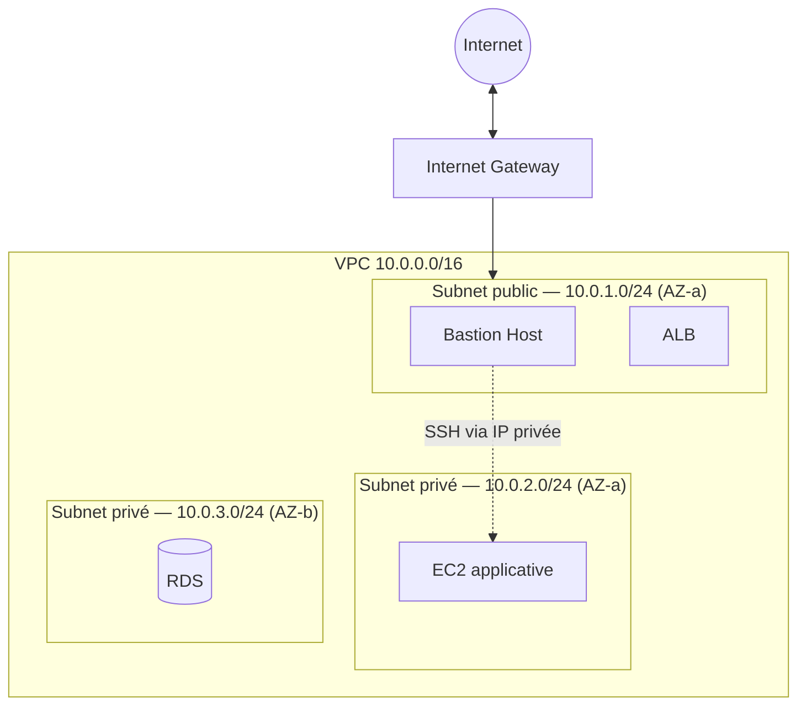
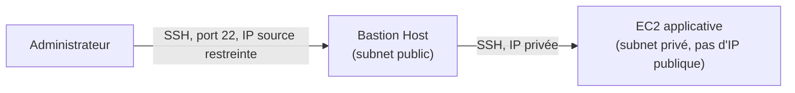
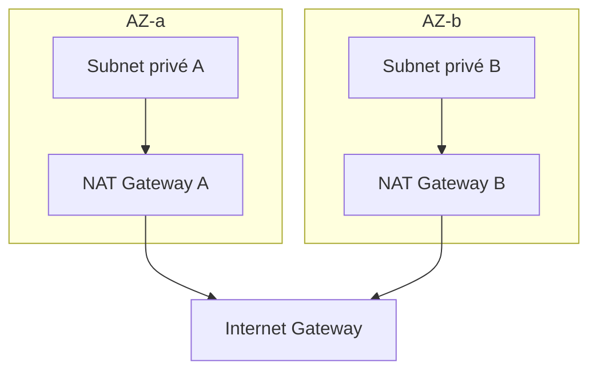

# Le réseau AWS : le module le plus lourd de l'examen

Le **VPC (Virtual Private Cloud)** est le réseau privé isolé dans lequel vivent la quasi-totalité des ressources AWS (EC2, RDS, ELB...). C'est le module réseau le plus dense du SAA-C03 — on prend le temps de poser les bases proprement avant les pièges plus subtils des leçons suivantes.

> **Repère —** un VPC ressemble à un réseau Docker `bridge` que tu créerais pour isoler des conteneurs, sauf qu'il vit à l'échelle d'une **région AWS entière**, avec ses propres sous-réseaux, routes et passerelles.

## CIDR et adressage IP

Un VPC se définit par un bloc **CIDR** (Classless Inter-Domain Routing), ex. `10.0.0.0/16` — le `/16` indique que les 16 premiers bits sont fixes (le réseau), laissant 16 bits pour les hôtes (65 536 adresses possibles).

| Plage privée (RFC 1918) | Utilisation typique |
|---|---|
| `10.0.0.0/8` | grands réseaux d'entreprise |
| `172.16.0.0/12` | réseaux moyens |
| `192.168.0.0/16` | petits réseaux (souvent la box internet à la maison) |

> 🎯 **Piège d'examen —** AWS **réserve 5 adresses IP** dans chaque subnet (les 4 premières + la dernière), non attribuables à une instance : par exemple dans `10.0.1.0/24`, les adresses `10.0.1.0` (adresse réseau), `10.0.1.1` (routeur VPC), `10.0.1.2` (DNS), `10.0.1.3` (réservée pour usage futur) et `10.0.1.255` (broadcast, non utilisé mais réservé) sont indisponibles. Un `/24` (256 adresses théoriques) n'offre donc que **251 adresses utilisables**.

## VPC, subnets : public ou privé, c'est la route qui décide

Un VPC se découpe en **subnets**, chacun rattaché à **une seule Availability Zone**. Un subnet n'est « public » ou « privé » que par la **route** qu'on lui associe — rien d'autre ne le détermine.

> 🎯 **Piège d'examen —** un subnet est **public** si et seulement si sa **route table** contient une route vers un **Internet Gateway** (`0.0.0.0/0 → igw-xxxx`). Ce n'est **ni** la présence d'une IP publique sur une instance, **ni** le nom donné au subnet qui en fait un subnet public — uniquement la route table.

## Route table et Internet Gateway (IGW)

- **Route table** — la table de routage associée à un subnet (un subnet = une seule route table active à la fois, mais une route table peut être associée à plusieurs subnets).
- **Internet Gateway (IGW)** — la passerelle qui permet la communication **bidirectionnelle** entre le VPC et Internet ; un VPC n'en a **qu'un seul**, attaché au VPC (pas à un subnet en particulier).

## Bastion host : accéder à un subnet privé en SSH

Un **bastion host** (ou *jump box*) est une instance placée dans un **subnet public**, exposée avec un accès SSH restreint (idéalement par IP source), qui sert de rebond pour atteindre des instances en **subnet privé** sans jamais leur donner d'IP publique.

> 🎯 **Piège d'examen —** le security group du bastion doit autoriser le SSH **seulement** depuis les IP de l'équipe (jamais `0.0.0.0/0`), et le security group des instances privées doit autoriser le SSH **seulement depuis le security group du bastion** (référence de SG à SG), pas depuis une plage IP.

## NAT Gateway vs NAT Instance

Une instance en subnet **privé** n'a pas d'IGW accessible directement, mais peut avoir besoin de sortir vers Internet (télécharger une mise à jour, appeler une API tierce) **sans être joignable depuis Internet**. C'est le rôle du NAT.

| | **NAT Gateway** | **NAT Instance** |
|---|---|---|
| **Gestion** | entièrement managée par AWS | une EC2 classique à administrer soi-même |
| **Haute disponibilité** | dans **une seule AZ** — il faut **une NAT Gateway par AZ** pour la résilience | dépend d'un Auto Scaling Group ou d'un script de failover manuel |
| **Bande passante** | jusqu'à 100 Gbps, scaling automatique | limitée par le type d'instance choisi |
| **Coût** | facturé à l'heure + par Go transféré | coût de l'instance EC2 uniquement |
| **Security Group** | n'en a pas (géré par AWS) | oui, à configurer |

> 🎯 **Piège d'examen —** une **NAT Gateway est liée à une seule AZ** : si cette AZ tombe, tous les subnets privés qui dépendent d'elle perdent leur accès sortant, **même si leurs instances tournent dans une autre AZ**. La bonne pratique de résilience est de déployer **une NAT Gateway par AZ**, chaque subnet privé routant vers la NAT Gateway de **sa propre** AZ.

## À retenir

- Un `/24` réserve toujours 5 IP (AWS), pas 256 utilisables mais 251.
- Un subnet est public **uniquement** si sa route table pointe vers un IGW — jamais par convention de nommage ou présence d'IP publique.
- Bastion host = rebond SSH en subnet public ; règle de sécurité : SG à SG, jamais d'IP source ouverte.
- NAT Gateway = managée, mais **limitée à une AZ** — il en faut une par AZ pour la résilience ; NAT Instance = auto-gérée, moins scalable.
